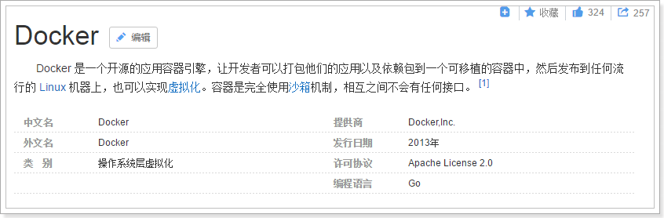
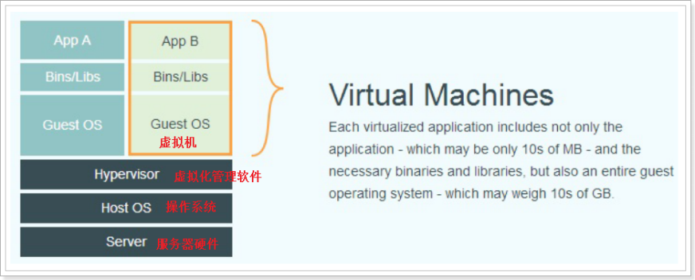
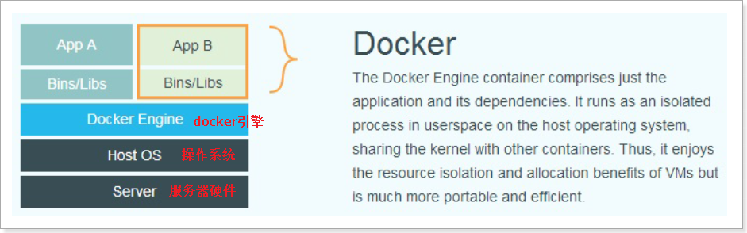
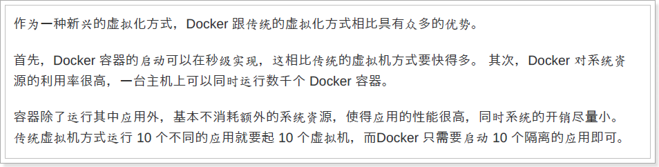
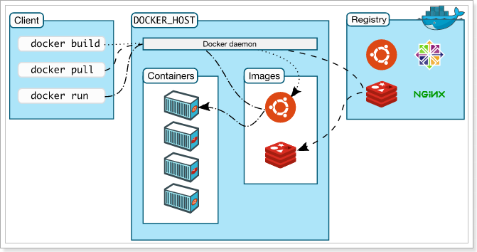

# 2.了解docker
## 2.1.思考

我们之前是如何将项目发布到Linux服务器的？
大致步骤如下：

1. 安装jdk
2. 安装tomcat
3. 将项目war包上传到tomcat的webapps下
4. 修改配置文件
5. 启动tomcat

这样看似没问题，其实我们想想，发一台机器还好，这几步就完成了，如果我们要将这个项目发布到N多台机器，那么我们是否需要在每个机器上都进行相同的步骤，并且要进行环境兼容性的测试。

再来看一个例子，我们现在想部署使用一个成熟的产品，这个产品是用go语言开发的，我该如何部署？go语言运行的环境怎么装？这个项目又该如何部署？

还有，一台linux机器上装了很多软件，部署了很多项目，相互之间有干扰怎么办？

如果有一项技术，可以解决以上问题或者是更多的问题，是不是很爽？  那就是Docker（容器）技术。

## docker简介

## 虚拟化和docker的对比

虚拟化：

docker:

docker的优势在于可以直接使用主机操作系统的资源进行虚拟化。

## 为什么要使用docker？

## 架构

- Docker daemon（Docker进程）：
Docker进程是部署在linux操作系统上，负责支撑Docker Container的运行以及本地Image的管理。

- Docker client：
用户不直接操作Docker daemon，用户通过Docker client访问Docker，Docker client提供pull、run等操作命令。

- Docker Image：
Docker 镜像就是一个只读的模板。
例如：一个镜像可以包含一个完整的 ubuntu 操作系统环境，里面仅安装了 Apache 或用户需要的其它应用程序。
镜像可以用来创建 Docker 容器。
Docker 提供了一个很简单的机制来创建镜像或者更新现有的镜像，用户甚至可以直接从其他人那里下载一个已经做好的镜像来直接使用。

- Docker Container：
Docker 利用容器来运行应用。容器是从镜像创建的运行实例。它可以被启动、开始、停止、删除。每个容器都是相互隔离的、保证安全的平台。可以把容器看做是一个简易版的 Linux 环境（包括root用户权限、进程空间、用户空间和网络空间等）和运行在其中的应用程序。

- Docker Registry：
仓库分为公开仓库（Public）和私有仓库（Private）两种形式
最大的公开仓库是 Docker Hub，存放了数量庞大的镜像供用户下载。
用户也可以在本地网络内创建一个私有仓库。
当用户创建了自己的镜像之后就可以使用 push 命令将它上传到公有或者私有仓库，这样下次在另外一台机器上使用这个镜像时候，只需要从仓库上 pull 下来就可以了。

# 参考文献

- [Docker的三大核心组件：镜像，容器与仓库](https://juejin.im/post/5d57c1b5f265da03dc076ba6)

