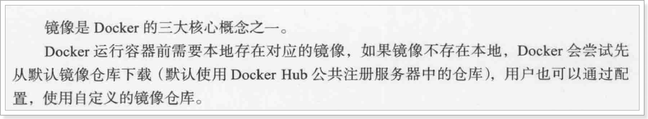
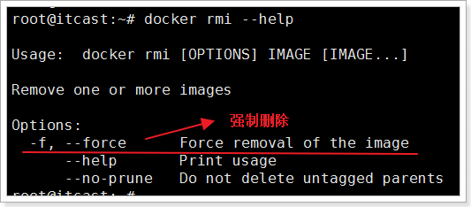
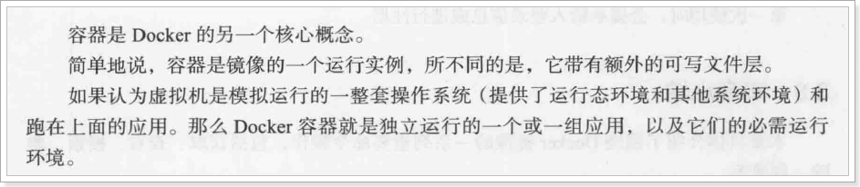
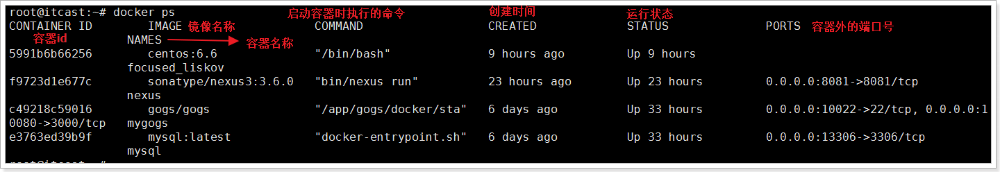
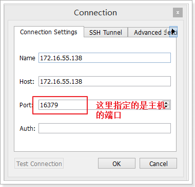
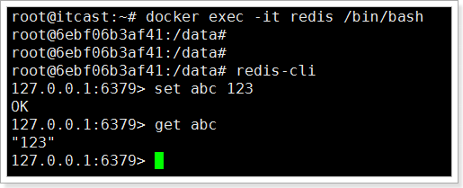

# 安装docker
我们可以在Centos或者Ubuntu下安装docker，要注意的是，centos6对docker支持的不好，使用docker建议升级到centos7。

docker官方建议使用Ubuntu系统，兼容性更好一些。所以，我们使用Ubuntu系统来学习docker。

Ubuntu系统的安装参考《VMware Workstation 中安装 Ubuntu16.04 虚拟机.docx》

在课前资料中已经提供了“Ubuntu16-64-镜像”，我们直接导入即可学习，该镜像中包含安装了lrzsz、jdk1.8、docker 1.12并且将所有的应用升级到最新。


## 3.1.centos7
直接通过yum安装即可：
yum install -y docker

centos6下docker兼容性不好，建议装centos7

# docker使用

## 镜像


### 镜像加速

在国内通过docker官方的仓库进行下载镜像是比较慢，这个时候就需要使用加速器了。

在国内，阿里云、163都提供了docker仓库，但是阿里云还提供了加速功能。所以，我们选用阿里云的加速。 163的仓库地址：https://c.163.com/hub#/m/home/

使用阿里云器，需要到阿里云进行注册，获取到自己专属的加速地址，当然也可以使用我的加速地址。（使用加速是无需登录的，所以可以公用）

### docker pull

```
docker pull redis // 默认拉取最新版本
docker pull redis:3	// 拉取版本为3的redis
```

### docker images

使用docker images 可以看到本地的镜像列表：

### docker rmi 

删除镜像通过命令docker rmi 镜像id完成，需要注意的是，删除镜像前，要删除所有使用到该镜像的容器。

-f参数是强制删除，如果有正在运行的容器使用了该镜像，那么该镜像是不会真正的删除的。





### docker search

```
docker search redis
```

## 容器



### docker ps

通过docker ps命令查看正在运行的容器列表，需要查询所有的容器需要加-a参数：

```
docker ps	//查看运行中的容器
docker ps -a	//查看所有的容器
```


### docker create

```
root@itcast:~# docker create --help

Usage:	docker create [OPTIONS] IMAGE [COMMAND] [ARG...]

Create a new container

Options:
      --add-host value              Add a custom host-to-IP mapping (host:ip) (default [])
  -a, --attach value                Attach to STDIN, STDOUT or STDERR (default [])
      --blkio-weight value          Block IO (relative weight), between 10 and 1000
      --blkio-weight-device value   Block IO weight (relative device weight) (default [])
      --cap-add value               Add Linux capabilities (default [])
      --cap-drop value              Drop Linux capabilities (default [])
      --cgroup-parent string        Optional parent cgroup for the container
      --cidfile string              Write the container ID to the file
      --cpu-percent int             CPU percent (Windows only)
      --cpu-period int              Limit CPU CFS (Completely Fair Scheduler) period
      --cpu-quota int               Limit CPU CFS (Completely Fair Scheduler) quota
  -c, --cpu-shares int              CPU shares (relative weight)
      --cpuset-cpus string          CPUs in which to allow execution (0-3, 0,1)
      --cpuset-mems string          MEMs in which to allow execution (0-3, 0,1)
      --device value                Add a host device to the container (default [])
      --device-read-bps value       Limit read rate (bytes per second) from a device (default [])
      --device-read-iops value      Limit read rate (IO per second) from a device (default [])
      --device-write-bps value      Limit write rate (bytes per second) to a device (default [])
      --device-write-iops value     Limit write rate (IO per second) to a device (default [])
      --disable-content-trust       Skip image verification (default true)
      --dns value                   Set custom DNS servers (default [])
      --dns-opt value               Set DNS options (default [])
      --dns-search value            Set custom DNS search domains (default [])
      --entrypoint string           Overwrite the default ENTRYPOINT of the image
  -e, --env value                   Set environment variables (default [])
      --env-file value              Read in a file of environment variables (default [])
      --expose value                Expose a port or a range of ports (default [])
      --group-add value             Add additional groups to join (default [])
      --health-cmd string           Command to run to check health
      --health-interval duration    Time between running the check
      --health-retries int          Consecutive failures needed to report unhealthy
      --health-timeout duration     Maximum time to allow one check to run
      --help                        Print usage
  -h, --hostname string             Container host name
  -i, --interactive                 Keep STDIN open even if not attached 打开容器的标准输入
      --io-maxbandwidth string      Maximum IO bandwidth limit for the system drive (Windows only)
      --io-maxiops uint             Maximum IOps limit for the system drive (Windows only)
      --ip string                   Container IPv4 address (e.g. 172.30.100.104)
      --ip6 string                  Container IPv6 address (e.g. 2001:db8::33)
      --ipc string                  IPC namespace to use
      --isolation string            Container isolation technology
      --kernel-memory string        Kernel memory limit
  -l, --label value                 Set meta data on a container (default [])
      --label-file value            Read in a line delimited file of labels (default [])
      --link value                  Add link to another container (default [])
      --link-local-ip value         Container IPv4/IPv6 link-local addresses (default [])
      --log-driver string           Logging driver for the container
      --log-opt value               Log driver options (default [])
      --mac-address string          Container MAC address (e.g. 92:d0:c6:0a:29:33)
  -m, --memory string               Memory limit
      --memory-reservation string   Memory soft limit
      --memory-swap string          Swap limit equal to memory plus swap: '-1' to enable unlimited swap
      --memory-swappiness int       Tune container memory swappiness (0 to 100) (default -1)
      --name string                 Assign a name to the container  指定容器的名称
      --network string              Connect a container to a network (default "default")
      --network-alias value         Add network-scoped alias for the container (default [])
      --no-healthcheck              Disable any container-specified HEALTHCHECK
      --oom-kill-disable            Disable OOM Killer
      --oom-score-adj int           Tune host's OOM preferences (-1000 to 1000)
      --pid string                  PID namespace to use
      --pids-limit int              Tune container pids limit (set -1 for unlimited)
      --privileged                  Give extended privileges to this container
  -p, --publish value               Publish a container's port(s) to the host (default []) 
		  指定端口，如：docker create -p 16399:6379 redis:3.0，其中16379是主机端口，6379是容器对外端口，二者对应起来
  -P, --publish-all                 Publish all exposed ports to random ports 映射一个随机端口
      --read-only                   Mount the container's root filesystem as read only
      --restart string              Restart policy to apply when a container exits (default "no")
      --runtime string              Runtime to use for this container
      --security-opt value          Security Options (default [])
      --shm-size string             Size of /dev/shm, default value is 64MB
      --stop-signal string          Signal to stop a container, SIGTERM by default (default "SIGTERM")
      --storage-opt value           Storage driver options for the container (default [])
      --sysctl value                Sysctl options (default map[])
      --tmpfs value                 Mount a tmpfs directory (default [])
  -t, --tty                         Allocate a pseudo-TTY 让Docke分配一个伪端（pseudo-tt）并绑定到容器的标准输入上
      --ulimit value                Ulimit options (default [])
  -u, --user string                 Username or UID (format: <name|uid>[:<group|gid>])
      --userns string               User namespace to use
      --uts string                  UTS namespace to use
  -v, --volume value                Bind mount a volume (default [])
      --volume-driver string        Optional volume driver for the container
      --volumes-from value          Mount volumes from the specified container(s) (default [])
  -w, --workdir string              Working directory inside the container
```

例子：

```
docker create -p 16379:6379 --name redis redis:3.0
xxxxxxxxxxx

查看容器列表：
docker ps -a
```


### docker start name/id
用法：docker start 容器名或容器id

```
启动容器：
docker start 6e #指定容器的id，只要输入前几位即可
```

通过客户端进行测试：


至此，第一个docker容器就创建并且已经启动可用了。

### docker stop name/id

停止容器有2种方式：

1. docker stop 容器名或容器id
2. docker kill 容器名或容器id


### docker run

上面通过docker create创建了容器，然后通过docker start来启动容器，其实这种做法并不常用。

更常用的是docker run命令，这个命令的意思是创建并且启动容器。

用法：

```
docker run --help
```

使用：

```
创建并且运行一个redis容器，它的端口是16380。

docker run -p 16380:6379 --name redis2 redis:3.0

发现，这个容器已经创建并且运行，但是，它并没有在后台运行，当按下 control + c时，该容器将停止。

为了让容器在后台运行，需要添加参数 -d。

docker run -p 16380:6379 -d --name redis2 redis:3.0


报错，说redis2这个名字的容器已经存在，需要我们删除906的容器或者给新容器重命名。我们重命名试试。

docker run -p 16380:6379 -d --name redis3 redis:3.0
```

### docker rm

通过命令docker rm 删除容器，删除正在运行的容器添加 -f 参数。

案例：
docker rm redis2

删除名为redis2的容器。

### 进入容器
有些时候我们需要进入容器内，做一些操作，比如，修改配置文件等。

进入容器，通过命令 docker exec 完成。

```
root@itcast:~# docker exec --help

Usage:	docker exec [OPTIONS] CONTAINER COMMAND [ARG...]

Run a command in a running container

  -d, --detach         Detached mode: run command in the background
  --detach-keys        Override the key sequence for detaching a container
  --help               Print usage
  -i, --interactive    Keep STDIN open even if not attached
  --privileged         Give extended privileges to the command
  -t, --tty            Allocate a pseudo-TTY
  -u, --user           Username or UID (format: <name|uid>[:<group|gid>])
```

案例：进入redis容器，。

docker exec -it redis /bin/bash



control + d 退出容器。

### 5.8.查看日志
通过命令docker logs -f 容器名或id

## 仓库

todo 

# 参考文献
- [Docker使用阿里云docker镜像加速](https://www.cnblogs.com/zhxshseu/p/5970a5a763c8fe2b01cd2eb63a8622b2.html)

1. 