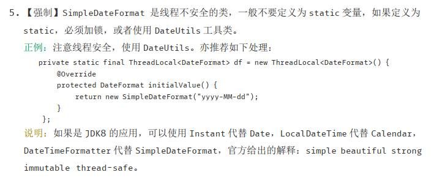
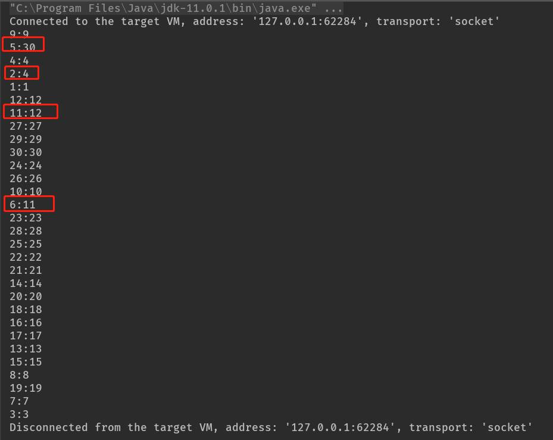
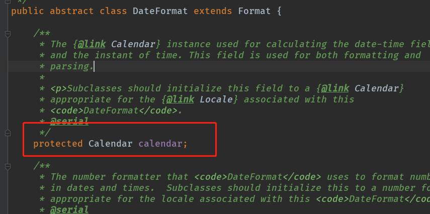
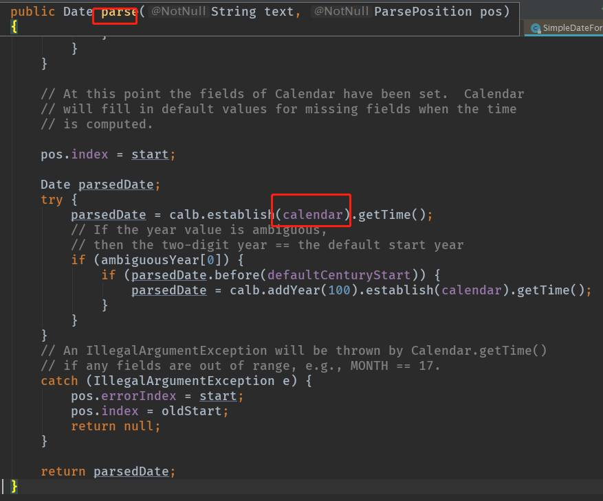

# 前言
在阿里Java开发规约中，有强制性的提到SimpleDateFormat 是线程不安全的类 ，在使用的时候应当注意线程安全问题，如下：



其实之前已经介绍过使用JDK1.8的DateTimeFormatter 和LocalDateTime来处理时间了，还在用[SimpleDateFormat？Java8都发布N年了，转LocalDateTime吧](https://link.juejin.im/?target=%3Chttps%3A%2F%2Fwww.toutiao.com%2Fi6687925831928381966%2F%3E)。今天，就来说说SimpleDateFormat的线程安全问题。


# SimpleDateFormat是非线程安全的
时间处理，基本所有项目上都是需要使用到的，往往很多初学者会把SimpleDateFormat定义为static类型，然后在进行时间转化的时候没有做加锁处理。如下：

```
public class Main {

    private final static SimpleDateFormat SDFT = new SimpleDateFormat("yyyy-MM-dd HH:mm:ss");

    public static void main(String[] args) throws ParseException {
        System.out.println(SDFT.parse("2019-05-29 12:12:12"));
    }

}
```
当然，本代码直接运行是没有问题的。但是，当此SDFT实例应用到多线程环境下的时候，就会出现致命的问题。假设有如下代码：

```
public class Main {

    private static SimpleDateFormat SDFT = new SimpleDateFormat("yyyy-MM-dd");

    public static void main(String[] args) {
        for (int i = 1; i < 31; i++) {
            int ii = i;
            new Thread(() -> {
                Date date = null;
                try {
                    String s = "2019-05-" + ii;
                    date = SDFT.parse(s);
                    System.out.println("" + ii + ":" + date.getDate());
                } catch (ParseException e) {
                    e.printStackTrace();
                }
            }).start();
        }
    }

}

```

此代码的意思是创建30个线程，去转化不同的时间字符串，然后做打印输出，运行结果：



（运行此代码也有可能出现由线程安全问题引起的异常）

根据“预期结果”，两边的数字应该是相等的，为何这里输出不相等呢？通过DateFormat源码可以查看：





因为SimpleDateFormat定义为了共享的，所以其类里的属性calendar也是多个线程共享的，这就造成了线程安全问题。

# 解决方案

## 方案一：加锁处理
如本文例子，可以通过加锁来保证线程安全：

```
public class Main {

    private static SimpleDateFormat SDFT = new SimpleDateFormat("yyyy-MM-dd");

    public static void main(String[] args) {
        for (int i = 1; i < 31; i++) {
            int ii = i;
            new Thread(() -> {
                Date date = null;
                try {
                    String s = "2019-05-" + ii;
                    synchronized (Main.class) {
                        date = SDFT.parse(s);
                    }
                    System.out.println("" + ii + ":" + date.getDate());
                } catch (ParseException e) {
                    e.printStackTrace();
                }
            }).start();
        }
    }

}

```
输出：

```
4:4
3:3
1:1
2:2
29:29
28:28
27:27
26:26
30:30
25:25
23:23
21:21
20:20
22:22
18:18
24:24
19:19
17:17
16:16
14:14
15:15
12:12
13:13
10:10
11:11
9:9
7:7
6:6
5:5
8:8
```

## 代码方案二：每次都创建SimpleDateFormat实例
代码改造如下：

```
public static void main(String[] args) {
        for (int i = 1; i < 31; i++) {
            int ii = i;
            new Thread(() -> {
                Date date = null;
                try {
                    String s = "2019-05-" + ii;
                    date = new SimpleDateFormat("yyyy-MM-dd").parse(s);
                    System.out.println("" + ii + ":" + date.getDate());
                } catch (ParseException e) {
                    e.printStackTrace();
                }
            }).start();
        }
    }
```
    
每次使用SimpleDateFormat的时候，都去创建一个SimpleDateFormat实例，保证SimpleDateFormat实例不被共享。

## 方案三：使用LocalThread
这是阿里Java规约里提到的解决方法之一，之所以可以使用LocalThread来解决此问题，代码改造如下：

```
public class Main {

    private static final ThreadLocal<SimpleDateFormat> threadLocal = new ThreadLocal<SimpleDateFormat>() {
        @Override
        protected SimpleDateFormat initialValue() {
            return new SimpleDateFormat("yyyy-MM-dd");
        }
    };

    public static void main(String[] args) {
        for (int i = 1; i < 31; i++) {
            int ii = i;
            new Thread(() -> {
                Date date = null;
                try {
                    String s = "2019-05-" + ii;
                    date = threadLocal.get().parse(s);
                    System.out.println("" + ii + ":" + date.getDate());
                } catch (ParseException e) {
                    e.printStackTrace();
                }
            }).start();
        }
    }

}
```

运行结果如下：

```
22:22
2:2
24:24
15:15
17:17
16:16
29:29
9:9
30:30
3:3
4:4
5:5
12:12
8:8
20:20
26:26
21:21
28:28
19:19
27:27
18:18
1:1
14:14
25:25
11:11
13:13
7:7
6:6
23:23
10:10
```

## 解决方法四：java8DateTimeFormatter

使用JDK1.8提供的DateTimeFormatter来处理时间，这里就不赘述了，可以参考我之前的文章。


# 参考文献

- [为什么阿里Java规约要求谨慎使用SimpleDateFormat](https://juejin.im/post/5d08f6465188250a8b1fd6e7)