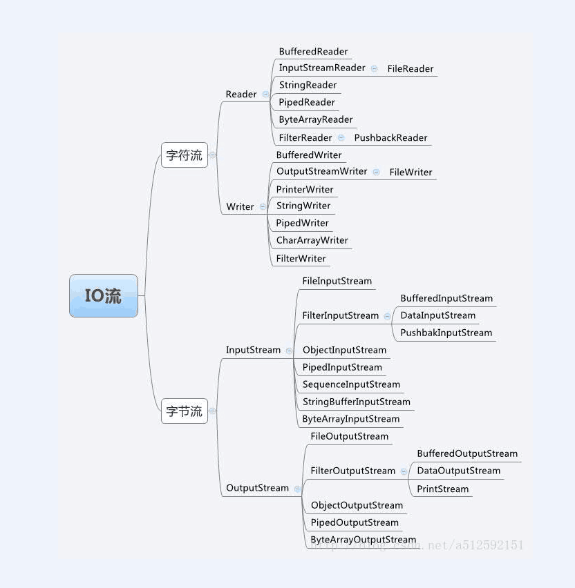

# 流的概念和作用
学习Java IO，不得不提到的就是JavaIO流。

流是一组有顺序的，有起点和终点的字节集合，是对数据传输的总称或抽象。即数据在两设备间的传输称为流，流的本质是数据传输，根据数据传输特性将流抽象为各种类，方便更直观的进行数据操作。

# IO流的分类

- 根据处理数据类型的不同分为：字符流和字节流

- 根据数据流向不同分为：输入流和输出流

## 字符流和字节流
字符流的由来： 因为数据编码的不同，而有了对字符进行高效操作的流对象。本质其实就是基于字节流读取时，去查了指定的码表。字节流和字符流的区别：

（1）读写单位不同：字节流以字节（8bit）为单位，字符流以字符为单位，根据码表映射字符，一次可能读多个字节。

（2）处理对象不同：字节流能处理所有类型的数据（如图片、avi等），而字符流只能处理字符类型的数据。

（3）字节流在操作的时候本身是不会用到缓冲区的，是文件本身的直接操作的；而字符流在操作的时候下后是会用到缓冲区的，是通过缓冲区来操作文件，我们将在下面验证这一点。

结论：优先选用字节流。首先因为硬盘上的所有文件都是以字节的形式进行传输或者保存的，包括图片等内容。但是字符只是在内存中才会形成的，所以在开发中，字节流使用广泛。

## 输入流和输出流
对输入流只能进行读操作，对输出流只能进行写操作，程序中需要根据待传输数据的不同特性而使用不同的流。

# IO流API
io流类图

> 注：java的输入流主要是InputStream和Reader作为基类，而输出流则是主要由outputStream和Writer作为基类。它们都是一些抽象基类，无法直接创建实例。

## 流的原理浅析:

    java Io流共涉及40多个类，这些类看上去很杂乱，但实际上很有规则，而且彼此之间存在非常紧密的联系， Java Io流的40多个类都是从如下4个抽象类基类中派生出来的。

- InputStream/Reader: 所有的输入流的基类，前者是字节输入流，后者是字符输入流。
- OutputStream/Writer: 所有输出流的基类，前者是字节输出流，后者是字符输出流。

# 参考文献
- [java IO流详解](https://www.cnblogs.com/QQ846300233/p/6046388.html)
- [java IO流的概念理解
](https://blog.csdn.net/czz1141979570/article/details/80098194)

