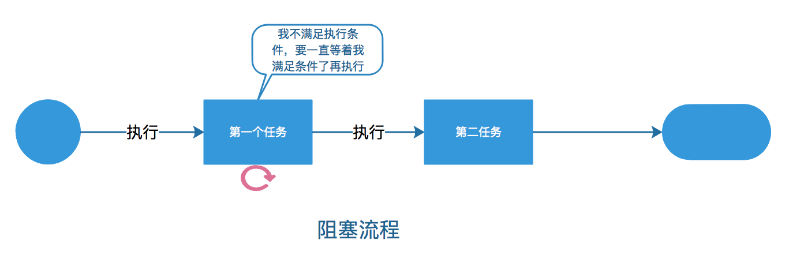
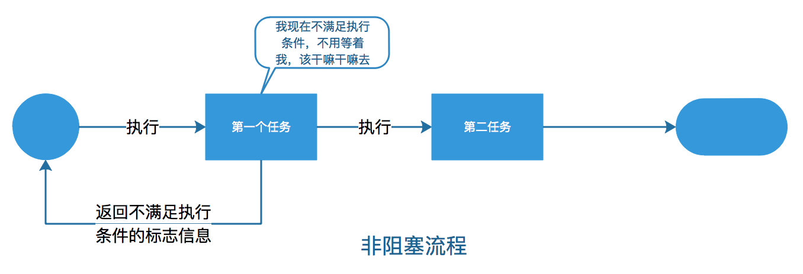
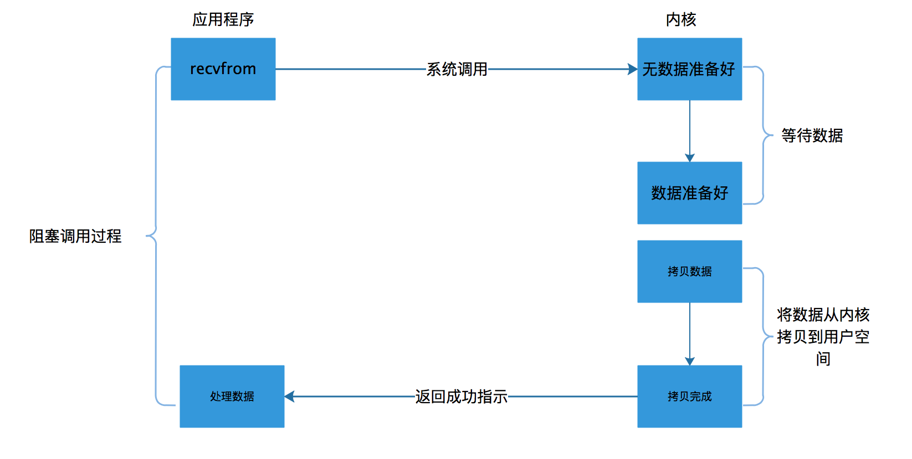
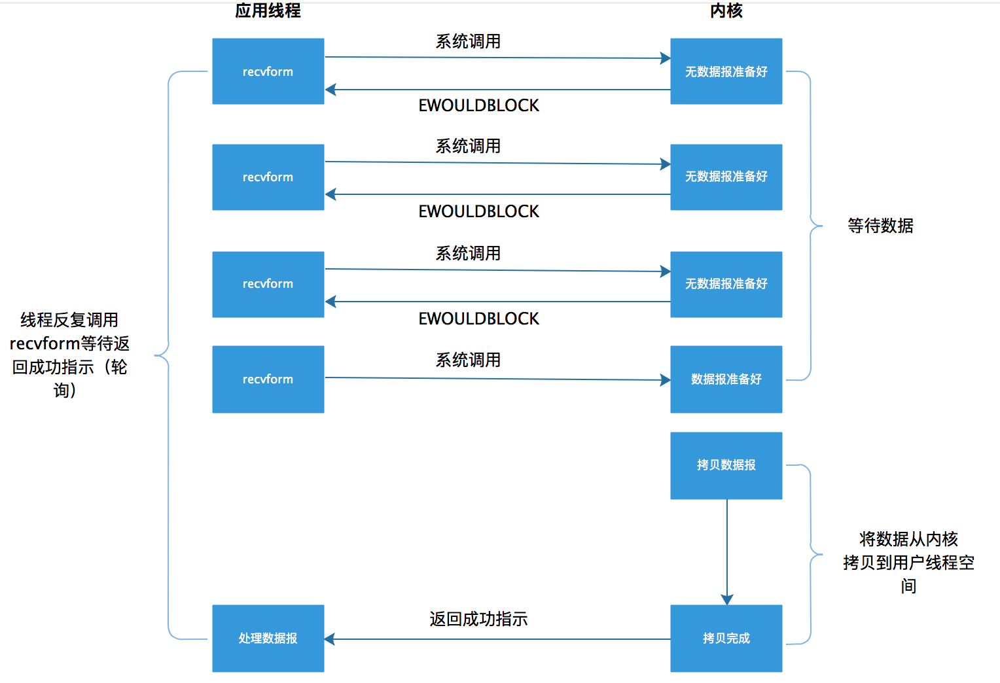

# 一、NIO

自己以前在Java NIO这块儿，一直都是比较薄弱的，以前还因为这点知识而错失了一个机会。所以最近打算好好学习一下这部分内容，我想应该也会有朋友像我一样，一直想闹明白这块儿内容。但是一直无从下手，每次被问到什么NIO，BIO，AIO就慌，下面我们先从一些基本概念来慢慢了解NIO这部分内容。

## 同步与异步
同步和异步是比较好理解的，网上也有好多解释。下面我通过个人的理解来解释这两个概念可能会通俗一些，希望能更好理解。

同步就是多个任务或事件在执行时需要按顺序逐个执行，如果排在顺序前面的任务或事件在执行的时候，排在后面的任务或事件就需要等待前面的执行完后才可以执行，这些任务或事件是不能并行执行的。同步执行任务可以被设计为可靠的任务序列，前后两个任务可以保持一致才算整个任务结束。

异步是多个任务或事件可以同时并行执行，前面的任务不会导致后面的任务的等待。因为是多个任务同时进行的，所以每个任务之间不产生相互的依赖，所以无法保证可靠性。

虽然上面的异步用了三个线程来实现了，但是并不代表多线程就是异步，这是两个概念，多线程只是实现异步的一种方式。而异步是一种处理模式，除了多线程还可以有其他的方式来实现。

在生活中的例子我们在打电话的时候就相当于同步，只有对方接通了才算任务执行成功。而发短信则是异步，短信发送后并不依赖接收者是否接收成功。

## 阻塞与非阻塞

阻塞是指当有任务在执行时，会发出一个请求操作，如果该请求操作需要的条件不满足的话，那么就会一直等待，直到条件满足后，才继续执行后面的其他工作。

非阻塞是指当有任务在执行时，会发出一个请求操作，如果该请求操作需要的条件不满足的话，会立即返回一个标志信息告知条件不满足，而不会一直在等待下去。

阻塞

非阻塞

有的人总是把同步、异步，与阻塞、非阻塞， 这两组概念给理解混了，但是其实这是两组完全不同的概念。

同步与异步这组概念的重点在于，前面的任务是否会导致整个流程的等待。

阻塞与非阻塞这组概念的重点在于，如果操作请求不满足条件是否会返回一个标志信息告知不满足条件。

其实理解阻塞与非阻塞可以从我们通常所接触的线程阻塞来理解，当出现慢任务的时候，线程会发生阻塞，cpu会等待慢任务执行完成后再执行后续的任务。而非阻塞线程在执行这个慢任务的时候，会去做其他事情，当慢任务执行完成后，再去执行后面的任务。非阻塞虽然看似可以明显提高效率，但是系统的线程切换也是会造成时间损耗，所以需要合理利用。

## 同步IO与异步IO

同步IO是指，当一个线程在执行IO操作时，该线程在IO操作完成前，是会被阻塞的。

异步IO是指，当一个线程在执行IO操作时，该线程并不会被阻塞。 

IO操作其实是有一个过程的，我们拿网络IO为例，一个网络IO主要会涉及到两个对象，一个是调用这个IO得线程，另一个是系统内核。当一个read操作发生时，会经历两个阶段。

- 1、等待数据准备就绪。
- 2、将数据从内核拷贝到调用调用这个IO得线程中。

IO模型的区别主要都在这两个阶段上面所以很重要，我们所说的同步与异步的区别，在于第二个阶段中，将数据从内核拷贝到线程（或进程）中，如果被阻塞了就同步，没有被阻塞就是异步。被阻塞了说明该阶段的操作是依赖用户线程的，而没有被阻塞说明不依赖用户线程，而依赖内核，所以异步是需要操作系统内核支持的。

## 阻塞IO与非阻塞

IO上面我们在介绍同步IO与非同步IO的时候说到，同步与不同步的区别在IO操作的第二个阶段，这节我们说的阻塞IO与非阻塞IO则是发生在IO操作第一个阶段的。

阻塞IO是指当一个线程发起IO操作请求时，系统内核会去查看要操作的数据是否就绪，当是阻塞IO时，发现要操作是数据没有就绪，就会一直等待下去，直到数据准备就绪；当是非阻塞IO时如果数据没有准备好，就会返回一个标识信息告诉调用线程，当前操作数据没有准备就绪。当数据准备就绪后才会执行第一阶段。

其实阻塞IO与非阻塞IO的关键区别在于，是等待执行，还是说立即返回一个通知标识。当数据没有准备好时就等待执行，而当立即返回一个通知标识时，线程会根据标识知道现在数据是个什么情况，如果没有准备好，那么线程会再次发起请求，知道数据准备好后立即执行。

## 两种方式的组合

虽然异步和非阻塞能够提升I/O的性能，但是也会带来一些额外的性能成本，例如：会增加线程数量，从而增加CPU的消耗，同时也会导致程序设计复杂度的上升。如果设计的不合理反而会导致性能下降，在实际设计时要分解应用场景总和评估。

下面这个表格就列出了同步异步与阻塞非阻塞组合起来的性能分析。

# Java NIO之理解I/O模型（二）

上一篇文章讲解了I/O模型的一些基本概念，包括同步与异步，阻塞与非阻塞，同步IO与异步IO，阻塞IO与非阻塞IO。这次一起来了解一下现有的几种IO模型，以及高效IO的两种设计模式，也都是属于IO模型的基础知识。

> UNIX下可用的五种I/O模型

根据UNIX网络编程对IO模型的分类，UNIX提供了5种IO模型，下面分别来介绍一下。

## 阻塞I/O模型

最常见的一种IO模型，之前介绍过，一个read操作是分两个阶段的，第一个阶段是，等待数据准备就绪，第二个阶段是将数据拷贝到调用这个IO的线程中。阻塞是发生在第一个阶段的，当数据没有准备好时，会一直阻塞用户线程，当数据就绪后再将数据拷贝到线程中，并返回结果给用户线程。

大致过程如下图。

其实，大部分的socket接口都是典型的阻塞型。所谓阻塞型的接口是指系统调用（一般是IO接口）不返回调用结果并让当前线程一直阻塞，只有当该系统调用获得结果或者超时出错时才返回。

通过介绍了阻塞IO，我们很容易就会发现它的问题，那就是阻塞会是用户线程无法进行任何运算和请求。一般我们的处理这种问题的情况是使用多线程，每个链接创建一个线程，或是使用线程池来管理线程，或许可以缓解部分压力，但是不能解决所有问题。多线程模型可以方便高效的解决小规模的服务请求，但面对大规模的服务请求，多线程模型也会遇到瓶颈，可以用非阻塞接口来尝试解决这个问题。

## 非阻塞I/O模型

非阻塞IO模型是这样一个过程，当应用程序发起一个read操作时，并不会阻塞，而是立刻会收到一个结果。应用程序的线程发现返回结果是一个error时，它就知道数据还没有准备好，于是它可以再次发送read操作。一旦数据准备好了，并且又再次收到了用户线程的请求，那么它马上就将数据拷贝到了用户内存，然后返回。

这样的一个过程，其实是需要用户线程不断的去询问系统是否准备好了数据，这样就会一直占用CPU资源。但是这种模型是在只专门提供某种功能的系统才有。

大致过程如下：

### 多路I/O复用模型 

在介绍多路复用I/O时就要先简单说明一下，select函数和poll函数。

> select函数

select函数允许进程指示内核等待多个事件中的任何一个事件发生，并且只在有一个或多个事件发生或经历一段指定的时间后才唤醒它。

- 举个例子，我们可以调用select，告知内核仅在下列情况发生时才返回：
- 集合 {1,4,5} 中的任何描述符准备好读；
- 集合 {2,7} 中的任何描述符准备好写；
- 集合 {1,4} 中的任何描述符有异常条件待处理；
- 已经经历10.2秒；

也就是说，我们调用select告知内核对哪些描述符（读、写或异常条件）感兴趣以及等待多长时间。

# 参考文献
- [Java NIO之理解I/O模型（一）](https://juejin.im/post/5d6e98d8e51d45620064bba5)
- [Java NIO之理解I/O模型（二）](https://juejin.im/post/5d87b1afe51d4561d044cda4)

