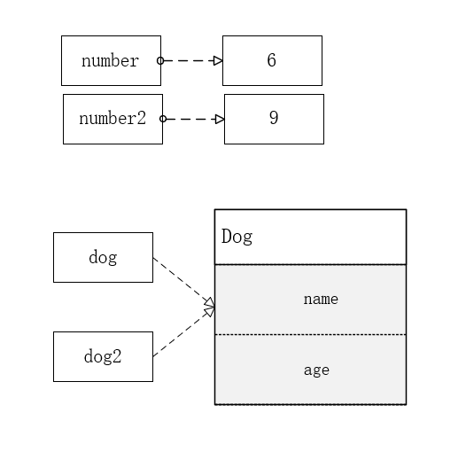
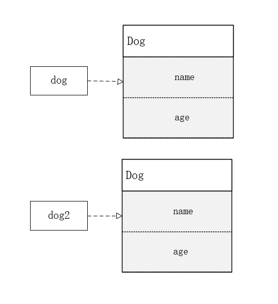

# 引入问题

在开始学习深克隆和浅克隆之前，我们先来看下面代码，有什么问题？

```
class CloneTest {
    public static void main(String[] args) throws CloneNotSupportedException {
        // 等号赋值（ 基本类型）
        int number = 6;
        int number2 = number;
        // 修改 number2 的值
        number2 = 9;
        System.out.println("number：" + number);
        System.out.println("number2：" + number2);
        // 等号赋值（对象）
        Dog dog = new Dog();
        dog.name = "旺财";
        dog.age = 5;
        Dog dog2 = dog;
        // 修改 dog2 的值
        dog2.name = "大黄";
        dog2.age = 3;
        System.out.println(dog.name + "，" + dog.age + "岁");
        System.out.println(dog2.name + "，" + dog2.age + "岁");
    }
}

```
程序执行结果：

```
number：6
number2：9
大黄，3岁
大黄，3岁

```

可以看出，如果使用等号复制时，对于值类型来说，彼此之间的修改操作是相对独立的，而对于引用类型来说，因为复制的是引用对象的内存地址，所以修改其中一个值，另一个值也会跟着变化，原理如下图所示：



因此为了防止这种问题的发生，就要使用对象克隆来解决引用类型复制的问题。

# 一、浅克隆
浅克隆的默认实现方法是 clone()，实现代码如下：

```
class CloneTest {
    public static void main(String[] args) throws CloneNotSupportedException {
        Dog dog = new Dog();
        dog.name = "旺财";
        dog.age = 5;
        // 克隆
        Dog dog3 = (Dog) dog.clone();
        dog3.name = "小白";
        dog3.age = 2;
        System.out.println(dog.name + "，" + dog.age + "岁");
        System.out.println(dog3.name + "，" + dog3.age + "岁");
    }
}
class Dog implements Cloneable {
    public String name;
    public int age;
    @Override
    protected Object clone() throws CloneNotSupportedException {
        return super.clone();
    }
}

```

程序执行结果：

```
旺财，5岁
小白，2岁

```
可以看出使用克隆就可以解决引用类型复制的问题了，原理如下图所示：



以上这种复制方式叫做浅克隆。 浅克隆的实现条件：需要克隆的对象必须实现 Cloneable 接口，并重写 clone() 方法，即可实现对此对象的克隆。 然而使用浅克隆也会存在一个问题，请参考以下代码。

```
class CloneTest {
    public static void main(String[] args) throws CloneNotSupportedException {
        DogChild dogChild = new DogChild();
        dogChild.name = "二狗";
        Dog dog4 = new Dog();
        dog4.name = "大黄";
        dog4.dogChild = dogChild;
        Dog dog5 = (Dog) dog4.clone();
        dog5.name = "旺财";
        dog5.dogChild.name = "狗二";
        System.out.println("dog name 4："+dog4.name);
        System.out.println("dog name 5："+dog5.name);
        System.out.println("dog child name 4："+dog4.dogChild.name);
        System.out.println("dog child name 5："+dog5.dogChild.name);
    }
}
class Dog implements Cloneable {
    public String name;
    public DogChild dogChild;
    @Override
    protected Object clone() throws CloneNotSupportedException {
        return super.clone();
    }
}
class DogChild {
    public String name;
}

```

程序执行结果：


```
dog name 4：大黄
dog name 5：旺财
dog child name 4：狗二
dog child name 5：狗二

```
也就是说浅克隆，只会复制对象的值类型，而不会复制对象的引用类型。原因如下图所示：

要处理引用类型不被复制的问题，就要使用到深克隆。

# 二、深克隆
定义：深克隆就是复制整个对象信息，包含值类型和引用类型。
深克隆的实现方式通常包含以下两种。

* 序列化实现深克隆：先将原对象序列化到内存的字节流中，再从字节流中反序列化出刚刚存储的对象，这个新对象和原对象就不存在任何地址上的共享，这样就实现了深克隆。
* 所有引用类型都实现克隆：要复制对象的所有引用类型都要实现克隆，所有对象都是复制的新对象，从而实现了深克隆。

## 深克隆实现方式一：序列化
实现思路：先将要拷贝对象写入到内存中的字节流中，然后再从这个字节流中读出刚刚存储的信息，作为一个新对象返回，那么这个新对象和原对象就不存在任何地址上的共享，自然实现了深拷贝。请参考以下代码：


```
class CloneTest {
    public static void main(String[] args) throws CloneNotSupportedException {
        BirdChild birdChild = new BirdChild();
        birdChild.name = "小小鸟";
        Bird bird = new Bird();
        bird.name = "小鸟";
        bird.birdChild = birdChild;
        // 使用序列化克隆对象
        Bird bird2 = CloneUtils.clone(bird);
        bird2.name = "黄雀";
        bird2.birdChild.name = "小黄雀";
        System.out.println("bird name:" + bird.name);
        System.out.println("bird child name:" + bird.birdChild.name);
        System.out.println("bird name 2:" + bird2.name);
        System.out.println("bird child name 2:" + bird2.birdChild.name);
    }
}
class CloneUtils {
    public static <T extends Serializable> T clone(T obj) {
        T cloneObj = null;
        try {
            //写入字节流
            ByteArrayOutputStream bo = new ByteArrayOutputStream();
            ObjectOutputStream oos = new ObjectOutputStream(bo);
            oos.writeObject(obj);
            oos.close();
            //分配内存,写入原始对象,生成新对象
            ByteArrayInputStream bi = new ByteArrayInputStream(bo.toByteArray());//获取上面的输出字节流
            ObjectInputStream oi = new ObjectInputStream(bi);
            //返回生成的新对象
            cloneObj = (T) oi.readObject();
            oi.close();
        } catch (Exception e) {
            e.printStackTrace();
        }
        return cloneObj;
    }
}

```
程序执行结果：

```
bird name:小鸟
bird child name:小小鸟
bird name 2:黄雀
bird child name 2:小黄雀

```

## 深克隆实现方式二：所有引用类型都实现克隆

```
class SerializableTest {
    public static void main(String[] args) throws IOException, ClassNotFoundException {
    ParrotChild parrotChild = new ParrotChild();
        parrotChild.name = "小鹦鹉";
        Parrot parrot = new Parrot();
        parrot.name = "大鹦鹉";
        parrot.parrotChild = parrotChild;
        // 克隆
        Parrot parrot2 = (Parrot) parrot.clone();
        parrot2.name = "老鹦鹉";
        parrot2.parrotChild.name = "少鹦鹉";
        System.out.println("parrot name:" + parrot.name);
        System.out.println("parrot child name:" + parrot.parrotChild.name);
        System.out.println("parrot name 2:" + parrot2.name);
        System.out.println("parrot child name 2:" + parrot2.parrotChild.name);
    }
 }
class Parrot implements Cloneable {
    public String name;
    public ParrotChild parrotChild;
    @Override
    protected Object clone() throws CloneNotSupportedException {
        Parrot bird = (Parrot) super.clone();
        bird.parrotChild = (ParrotChild) parrotChild.clone();
        return bird;
    }
}
class ParrotChild implements Cloneable {
    public String name;
    @Override
    protected Object clone() throws CloneNotSupportedException {
        return super.clone();
    }
}

```

程序执行结果：

```
parrot name:大鹦鹉
parrot child name:小鹦鹉
parrot name 2:老鹦鹉
parrot child name 2:少鹦鹉

```


# 参考文献

- [深浅克隆面试题汇总——附详细答案](https://juejin.im/post/5d8185e8f265da03d55e8cc7)