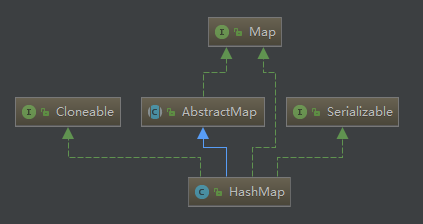
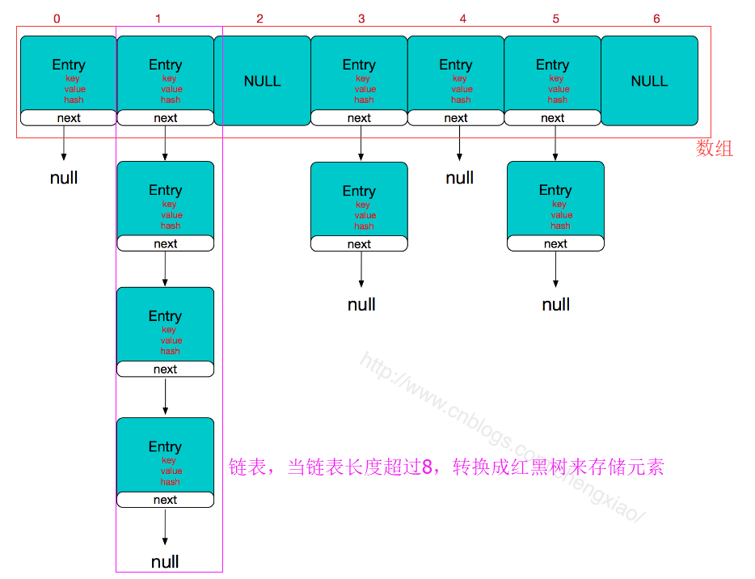
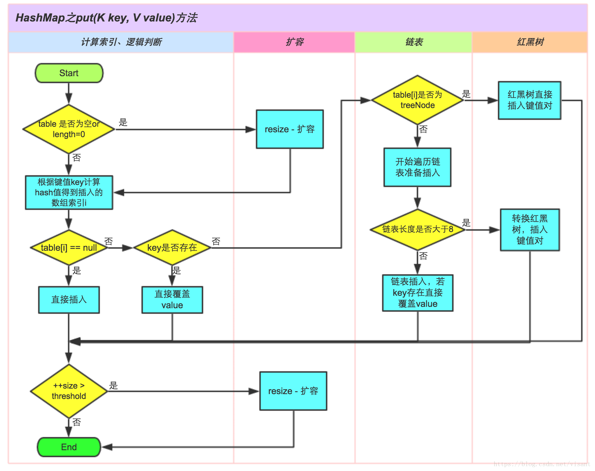
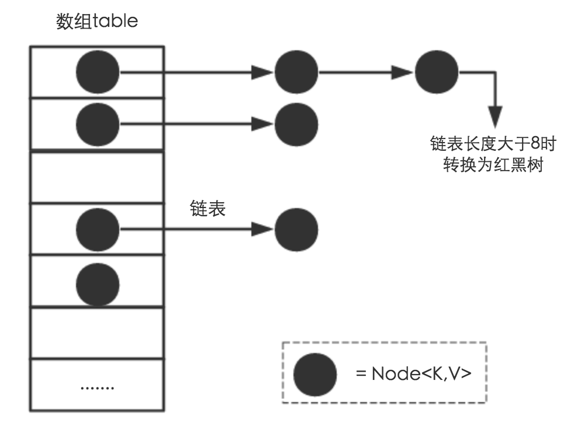

# 前言

HashMap：它根据键的hashCode值存储数据，大多数情况下可以直接定位到它的值，因而访问的时间复杂度为常数级，但遍历的顺序却是无序的。 HashMap最多只允许一个key为null，允许多个key的value值为null。HashMap非线程安全，即任一时刻可以有多个线程同时写HashMap，可能会导致数据的不一致。如果需要满足线程安全，可以使用ConcurrentHashMap。以下是它的类关系图：



# HashMap底层原理

## 底层结构

HashMap是由数组+链表+红黑树组成的。数组是主体，存放的是Entry对象（Entry有四个属性：key、value、hash、next），向数组的某个位置插入一个entry对象的时候，如果发生哈希冲突，就把那个位置的entry对象作为头结点，指向要插入的entry对象，形成一个单向链表。但是链表不擅长查询，所以链表越少，HashMap的性能越好。在JDK1.8里引入了红黑树，当链表长度超过8的时候，就转换成红黑树来存储元素，提高HashMap的性能。



## 实现原理：

先用key通过哈希函数计算出一个数组索引，如果索引位置没有元素就直接放进去，如果有元素，若key相同就直接替换，若key不相同就遍历索引位置的链表，把元素插入链表。如果链表长度大于8，就转换成红黑树来存储元素。



# 存储结构
从数据结构实现来讲，HashMap是数组+链表+红黑树（JDK1.8增加了红黑树部分）实现的


这里需要讲明白两个问题：数据底层具体存储的是什么？这样的存储方式有什么优点呢？

(1) 从源码可知，HashMap类中有一个非常重要的字段，就是 Node[] table，即哈希桶数组，明显它是一个Node的数组。

我们先来看看Node是什么。

```
static class Node implements Map.Entry<K,V> {
        final int hash;
        final K key;
        V value;
        Node next;//指向链表的下一个node

        Node(int hash, K key, V value, Node next) { ... }
        public final K getKey(){ ... }
        public final V getValue() { ... }
        public final String toString() { ... }
        public final int hashCode() { ... }
        public final V setValue(V newValue) { ... }
        public final boolean equals(Object o) { ... }
}
```

Node是HashMap的一个内部类，实现了Map.Entry接口，本质是就是一个映射(键值对)。上图中的每个黑色圆点就是一个Node对象。

(2) HashMap就是使用哈希表来存储的。哈希表为解决冲突，可以采用开放地址法和链地址法等来解决问题，**Java中HashMap采用了链地址法。**

链地址法，简单来说，就是数组加链表的结合。在每个数组元素上都有一个链表结构，当数据被Hash后，得到数组下标，把数据放在对应下标元素的链表上（具体内容下文会说到）。

在理解Hash和扩容流程之前，我们得先了解下HashMap的几个字段。从HashMap的默认构造函数源码可知，构造函数就是对下面几个字段进行初始化，源码如下：

```
int threshold;             // 所能容纳的key-value对极限 
final float loadFactor;    // 负载因子
int modCount;  
int size;
```

- threshold

	首先，Node[] table的初始化长度length(默认值是16)，Load factor为负载因子(默认值是0.75)，threshold是HashMap所能容纳的最大数据量的Node(键值对)个数。threshold = length * Load factor。也就是说，在数组定义好长度之后，负载因子越大，所能容纳的键值对个数越多。

- loadFactor

	结合负载因子的定义公式可知，threshold就是在此Load factor和length(数组长度)对应下允许的最大元素数目，超过这个数目就重新resize(扩容)，扩容后的HashMap容量是之前容量的两倍。

- size

	默认的负载因子0.75是对空间和时间效率的一个平衡选择。size这个字段其实很好理解，就是HashMap中实际存在的键值对数量。注意和table的长度length、容纳最大键值对数量threshold的区别。

- modCount
	
	modCount字段主要用来记录HashMap内部结构发生变化的次数，主要用于迭代的快速失败。强调一点，内部结构发生变化指的是结构发生变化，例如put新键值对，但是某个key对应的value值被覆盖不属于结构变化。

**注：**
这里存在一个问题，即使负载因子和Hash算法设计的再合理，也免不了会出现拉链过长的情况，一旦出现拉链过长，则会严重影响HashMap的性能。于是，在JDK1.8版本中，对数据结构做了进一步的优化，引入了红黑树。而当链表长度太长（默认超过8）时，链表就转换为红黑树，利用红黑树快速增删改查的特点提高HashMap的性能，其中会用到红黑树的插入、删除、查找等算法。

todo 


# 参考文献
- [源码分析——HashMap](https://juejin.im/post/5d0058fce51d45773e418a5d)