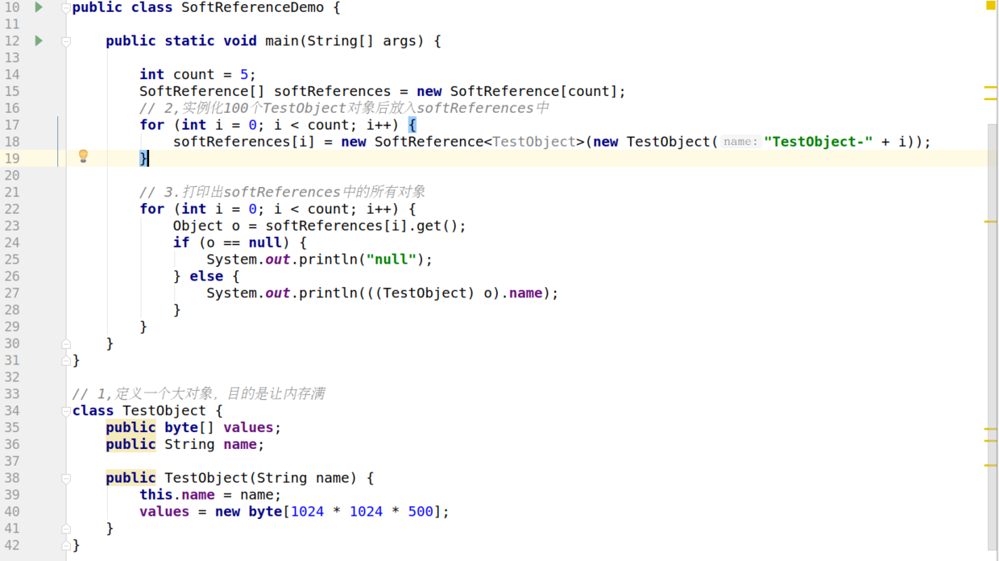
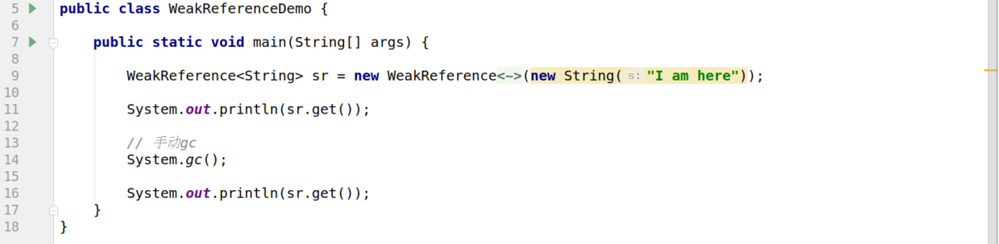
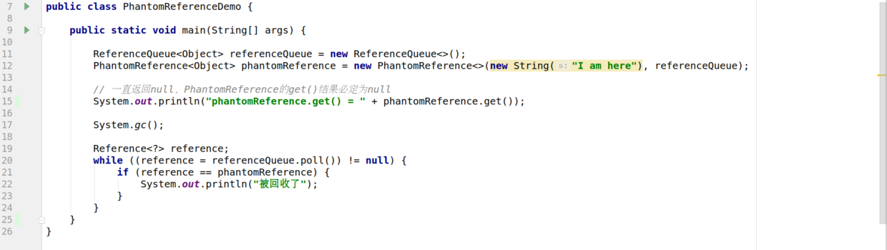
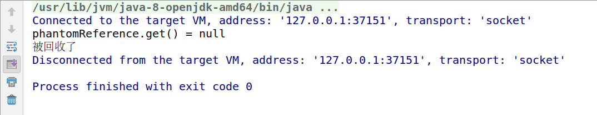

# 引用是什么
【划重点】在Java中引用包括：

- FinalReference 强引用
- SoftReference 软引用
- WeakReference 弱引用
- PhantomReference 虚引用

那么为什么会提供这四种引用呢，主要原因有：

- 方便Jvm进行垃圾回收
- 方便开发人员使用，开发人员可以灵活的决定某些对象的生命周期

# FinalReference 强引用
类似于 Object o = new Object() 这类的引用，创建一个对象后，该引用会被保存在JVM栈中，而且只要强引用存在，垃圾回收器就不会回收掉被引用的对象。

## 日常使用

强引用的例子比比皆是，因为在日常开发中我们是会经常去new一个对象的，而该new出来的对象便是强引用的，也就是说只要该引用存在，垃圾回收器就不会回收掉。
【划重点：JVM怎么知道引用在不在？】

# SoftReference 软引用
软引用关联的对象，在内存不够的情况下，会把这些软引用关联的对象列入垃圾回收范围中，然后进行回收，也就是说软引用并非是完全安全的，在内存不够的情况下是会被垃圾回收器回收掉的。

使用



通过注释便可以知道，我这里实例化了多个大对象，然后放入softReferences数组中，之后便遍历打印出其中的对象的命名，打印结果如下

```
null
null
null
null
TestObject-4
```
可以通过结果看出，前面四个对象因为内存不够而被垃圾回收器回收了。

## 日常使用
在我司的项目中，部分是使用软引用来保存从数据库中取出的数据，具体是做了一个中间层的封装，该中间层的作用就是在get出数据的时候会去判断数据是否为null，如果是为null再次从数据库读取，读取后再放入软引用的集合中，这样的做法是可以避免内存溢出。


# WeakReference 弱引用
弱引用比软引用更弱，被弱引用关联的对象只能存活到发生下一次垃圾回收之前，也就是说当发生GC时，无论当前内存是否足够，都会被回收掉。

## demo


代码很简短，就是先构建一个弱引用对象，然后在gc前先打印出来证明它存在过，之后手动调用gc，再次打印，可以看出已经没了。运行结果如下

```
I am here
null
```

# PhantomReference 虚引用
虚引用和上面不同的地方在于，一个对象是否有虚引用的存在，完全不会对其生存时间构成如何影响，并且也无法通过虚引用来获取一个对象的实例，也就是说跟没有引用与之关联一样，在任何时候都可能被垃圾回收器回收。
那么这样就很容易产生疑问了，虚引用的作用又是什么呢？

作用就是能在这个对象被收集器回收时收到一个系统通知，实现追踪垃圾收集器的回收动作，比如在对象被回收的时候，会调用该对象的finalize方法。

在给出相关demo前，要先介绍一个

## ReferenceQueue 引用队列
ReferenceQueue 引用其实也可以归纳为引用中的一员，可以和上述三种引用类型组合使用【软引用、弱引用、虚引用】。
那么它有何作呢？
在创建Reference时，手动将Queue注册到Reference中，而当该Reference所引用的对象被垃圾收集器回收时，JVM会将该Reference放到该队列中，而我们便可以对该队列做些其他业务，相当于一种通知机制。

### 给出demo



可以从demo中看出队列的用法，运行打印结果如下



我们可以从结果中看到先是从引用中get出来的对象为null，证明上面说的无法通过虚引用来获取一个对象的实例，并且在回收后会被放入队列中。


# 参考文献
- [连引用都答不上，凭什么说你是Java服务端开发](https://juejin.im/post/5d06de9d51882559ee6f4212)


