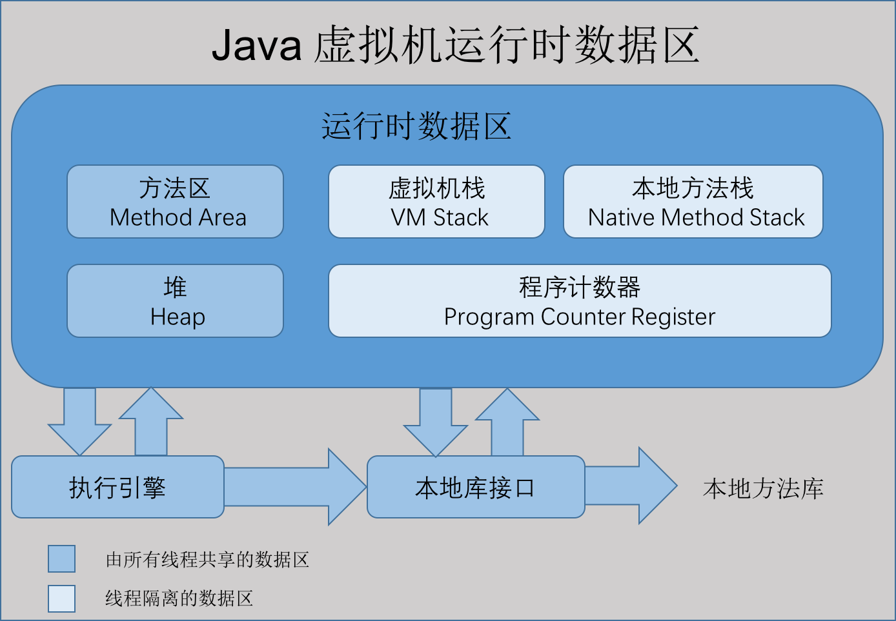
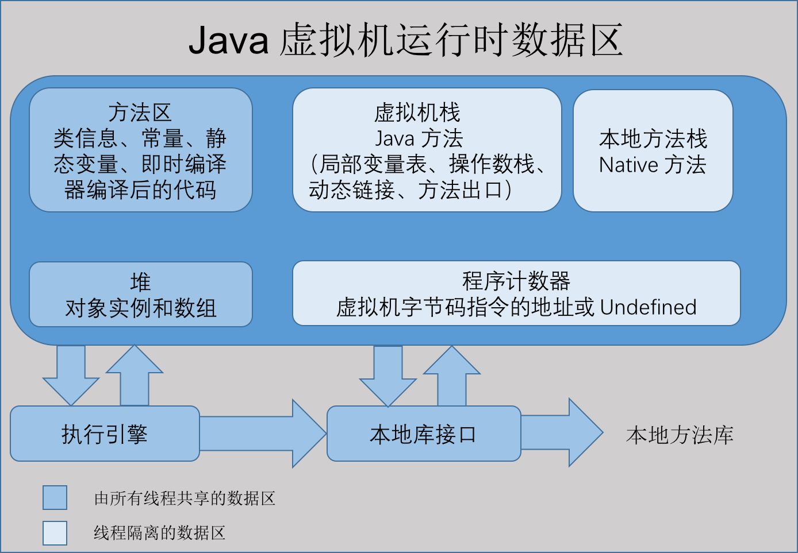

# java内存结构

根据《Java 虚拟机规范(Java SE 7 版)》规定，Java 虚拟机所管理的内存如下图所示。

## 堆
java堆是java虚拟机所管理的内存中最大的一块，是被所有线程`共享的一块内存区域`，在虚拟机启动时创建。此内存区域的唯一目的就是存放对象实例，这一点在Java虚拟机规范中的描述是：`所有的对象实例以及数组都要在堆上分配`。

java堆是`垃圾收集器管理的主要区域`，因此也被成为“GC堆”（Garbage Collected Heap）。从内存回收角度来看java堆可分为：`新生代和老生代`（当然还有更细致的划分，在下一章会讲到）。从内存分配的角度看，线程共享的Java堆中可能划分出多个线程私有的分配缓冲区（Thread Local Allocation Buffer，TLAB）。无论怎么划分，都与存放内容无关，无论哪个区域，存储的都是对象实例，进一步的划分都是为了更好的回收内存，或者更快的分配内存。
根据Java虚拟机规范的规定，java堆可以处于物理上不连续的内存空间中。当前主流的虚拟机都是可扩展的（`通过 -Xmx 和 -Xms 控制`）。如果堆中没有内存完成实例分配，并且堆也无法再扩展时，将会抛出OutOfMemoryError异常。

## Java虚拟机栈
java虚拟机也是`线程私有的`，它的生命周期和线程相同。虚拟机栈描述的是Java方法执行的内存模型：每个方法在执行的同时都会创建一个栈帧（Stack Frame）用于`存储局部变量表、操作数栈`、动态链接、方法出口等信息。

咱们常说的堆内存、栈内存中，栈内存指的就是虚拟机栈。局部变量表`存放了编译期可知的各种基本数据类型`（8个基本数据类型）、`对象引用`（地址指针）、returnAddress类型。
局部变量表所需的内存空间在`编译期间完成分配`。在运行期间不会改变局部变量表的大小。
这个区域规定了两种异常状态：如果线程请求的栈深度大于虚拟机所允许的深度，则抛出`StackOverflowError`异常；如果虚拟机栈可以动态扩展，在扩展是无法申请到足够的内存，就会抛出`OutOfMemoryError`异常。

## 本地方法栈
本地方法栈与虚拟机栈所发挥作用非常相似，它们之间的区别不过是虚拟机栈为虚拟机执行Java方法（也就是字节码）服务，而本地方法栈则为虚拟机使用到的`native方法服务`。本地方法栈也是抛出两个异常。

## 方法区（Method Area）
方法区与java堆一样，是各个`线程共享的内存区域`，它用于存储已被虚拟机加载的`类信息、常量、静态变量`、即时编译器编译后的代码等数据。它有个别命叫Non-Heap（非堆）。当方法区无法满足内存分配需求时，抛出`OutOfMemoryError`异常。

## 直接内存（Direct Memory）
　直接内存不是虚拟机运行时数据区的一部分，也不是java虚拟机规范中定义的内存区域。但这部分区域也呗频繁使用，而且也可能导致OutOfMemoryError异常
　
在JDK1.4中新加入的NIO（New Input/Output）类，引入了一种基于通道（Channel）与缓冲区（Buffer）的I/O方式，它可以使用Native函数库直接分配堆外内存，然后通过一个存储在java堆中的DirectByteBuffer对象作为这块内存的引用进行操作。

## 运行时常量池（Runtime Constant Pool）
　`运行时常量池是方法区的一部分`。Class文件中除了有类的版本、字段、方法、接口等描述信息外，还有一项信息是常量池，用于存放编译期生成的各种字面量和符号引用，这部分内容将在加载后进入方法区的运行时常量池中存放。
　

## 程序计数器（Program Counter Register）
程序计数器是一块较小的内存空间，它可以看作是当前线程所执行的字节码的行号指示器。
由于Java虚拟机的多线程是通过线程轮流切换并分配处理器执行时间的方式来实现的，一个处理器都只会执行一条线程中的指令。因此，为了线程切换后能恢复到正确的执行位置，每条线程都有一个独立的程序计数器，各个线程之间计数器互不影响，独立存储。称之为“线程私有”的内存。程序计数器内存区域是虚拟机中唯一`没有规定OutOfMemoryError情况的区域`。

## 执行引擎
虚拟机核心的组件就是执行引擎，它负责执行虚拟机的字节码，一般户先进行编译成机器码后执行。

# HotSpot 虚拟机对象探秘
## 对象创建

- 遇到 new 指令时，首先检查这个指令的参数是否能在常量池中定位到一个类的符号引用，并且检查这个符号引用代表的类是否已经被加载、解析和初始化过。如果没有，执行相应的类加载。类加载检查通过之后，为新

- 对象分配内存(内存大小在类加载完成后便可确认)。在堆的空闲内存中划分一块区域(‘指针碰撞-内存规整’或‘空闲列表-内存交错’的分配方式)。前面讲的每个线程在堆中都会有私有的分配缓冲区(TLAB)，这样可以很大程度避免在并发情况下频繁创建对象造成的线程不安全。

- 内存空间分配完成后会初始化为 0(不包括对象头)，接下来就是填充对象头，把对象是哪个类的实例、如何才能找到类的元数据信息、对象的哈希码、对象的 GC 分代年龄等信息存入对象头。
- 执行 new 指令后执行 init 方法后才算一份真正可用的对象创建完成。

## 对象的内存布局

在 HotSpot 虚拟机中，分为 3 块区域：对象头(Header)、实例数据(Instance Data)和对齐填充(Padding)

- 对象头(Header)：包含两部分，
	- 第一部分用于存储对象自身的运行时数据，如哈希码、GC 分代年龄、锁状态标志、线程持有的锁、偏向线程 ID、偏向时间戳等，32 位虚拟机占 32 bit，64 位虚拟机占 64 bit。官方称为 ‘Mark Word’。
	- 第二部分是类型指针，即对象指向它的类的元数据指针，虚拟机通过这个指针确定这个对象是哪个类的实例。另外，如果是 Java 数组，对象头中还必须有一块用于记录数组长度的数据，因为普通对象可以通过 Java 对象元数据确定大小，而数组对象不可以。
- 实例数据(Instance Data)：程序代码中所定义的各种类型的字段内容(包含父类继承下来的和子类中定义的)。
- 对齐填充(Padding)：不是必然需要，主要是占位，保证对象大小是某个字节的整数倍。

# 参看文献

- [重读 JVM](https://juejin.im/post/59ad4cd56fb9a02477075780)

