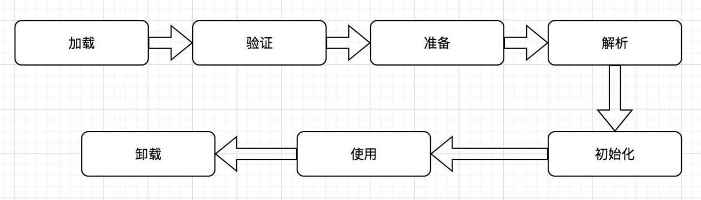

虚拟机把描述类的数据从Class文件加载到内存，并对数据进行校验、转换解析和初始化，最终形成可以被虚拟机直接使用的Java类型，这就是虚拟机的类加载机制。
在Java语言里，类型的加载、连接和初始化过程都是在程序运行期间完成的，这种策略虽然会令类加载时稍微增加一些性能开销，但是会为Java应用程序提供高度的灵活性，Java的动态扩展特性就是依赖运行期动态加载和动态连接这个特点实现的。

# 类加载的时机
类从被加载到虚拟机内存中开始，到卸载出内存为止，它的整个生命周期包括：加载（Loading）、验证（Verification）、准备（Preparation）、解析（Resolution）、初始化（Initialization）、使用（Using）和卸载（Unloading）7个阶段。其中验证、准备、解析3个部分统称为连接（Linking）。这7个阶段发生的顺序如图所示：


加载、验证、准备、初始化和卸载这5个阶段的顺序是确定的，类的加载过程必须按照这种顺序按部就班地开始，而解析阶段则不一定：它在某些情况下可以在初始化阶段之后再开始，这是为了支持Java语言的运行时绑定。

1、 遇到new、getstatic、setstatic或invokestatic这4条字节码指令时，如果类没有进行初始化，则需要先触发其初始化。生成这4条指令的最常见的Java代码场景是：使用new关键字实例化对象的时候、读取或设置一个类的静态子段（被final修饰、已在编译期把结果放入常量池的静态子段除外）的时候，以及调用一个类的静态方法的时机。
2、 使用java.lang.reflect包的方法对类进行反射调用的时候，如果类没有进行过初始化，则需要先触发其初始化。
3、当初始化一个类的时候，如果发现其父类还没有进行初始化，则需要先触发其父类的初始化。
4、当虚拟机启动时，用户需要指定一个要执行的主类（包含main()方法的那个类），虚拟机会先初始化这个主类。
5、当使用JDK 1.7的动态语言支持时，如果一个java.lang.invoke.MethodHandle实例最后的解析结果
REF_getStatic、REF_putStatic、REF_invokeStatic的方法句柄，并且这个方法句柄所对应的类没有进行初始化，则需要先触发其初始化。
这5种场景中的行为称为对一个类进行主动引用，除此之外，所有引用类的方法都不会触发初始化，称为被动引用。

注：接口也有初始化过程，但是一个接口在初始化时，并不要要求其父接口全部都完成了初始化，只有在真正使用到父接口的时候（如引用接口中定义的常量）才会初始化。

# 类加载的过程
Java虚拟机类加载的全过程是加载、验证、准备、解析和初始化这5个阶段所执行的具体动作。
## 加载
在加载阶段，虚拟机需要完成以下3件事情：
1）通过一个类的全限定名来获取定义此类的二进制字节流；
2）将这个字节流所代表的静态存储结构转化为方法区的运行时数据结构；
3）在内存中生成一个代表这个类的java.lang.Class对象，作为方法区这个类的各种数据的访问入口；
数组类本身不通过类加载器创建，它是由Java虚拟机直接创建的。但数组类与类加载器仍然有很密切的关系，因为数组类的元素类型最终是要靠类加载器去创建。

## 验证
验证是连接阶段的第一步，这一阶段的目的是为了确保Class文件的字节流中包含的信息符合当前虚拟机的要求，并且不会危害虚拟机自身的安全。
从整体上来看，验证阶段大致上会完成下面4个阶段的校验动作：文件格式验证、元数据验证、字节码验证、符号引用验证。
## 准备
准备阶段正式为类变量分配内存并设置类变量初始值的阶段，这些变量所使用的内存都将在方法区中进行分配。首先，这个时候进行内存分配的仅包括类变量（被static修饰的变量），而不包括实例变量，实例变量将会在对象实例化时随着对象一起分配在Java堆中；其次，这里所说的初始值“通常情况”下是数据类型的零值。
如果类子段的字段属性表中存在ConstantValue属性，那在准备阶段变量value就会被初始化为ConstantValue属性所指定的值。

## 解析
解析阶段是虚拟机将常量池内的符号引用替换为直接引用的过程。


- 符号引用
符号引用以一组符号来描述所引用的目标，符号可以是任何形式的字面量，只要使用时无歧义地定位到目标即可。符号引用与虚拟机实现的内存布局无关，引用的目标并不一定已经加载到内存中。各种虚拟机实现的内存布局可以各不相同，但是它们能接受的符号引用必须都是一致的，因为符号引用的字面量形式明确定义在Java虚拟机规范的Class文件格式中。


- 直接引用
直接引用可以是直接指向目标的指针、相对偏移量或一个能间接定位到目标的句柄。直接引用是和虚拟机实现的内存布局相关的，同一个符号引用在不同虚拟机实例上翻译出来的直接引用一般不会相同。如果有了直接引用，那引用的目标必定已经在内存中存在。

## 初始化
在初始化阶段，才真正开始执行类中定义的Java程序代码，根据程序员通过程序制定的主观计划去初始化类变量和其他资源。或者可以从另外一个角度来表达：初始化阶段是执行类构造器< clinit >()方法的过程。
< clinit >()方法是由编译器自动收集类中的所有类变量的赋值动作和静态语句块中的语句合并产生的，编辑器收集的顺序是由语句在源文件中出现的顺序所决定的，静态语句块中只能访问到定义在静态语句块之前的变量，定义在它之后的变量可以赋值，但不能访问。
< clinit  >()方法执行过程中一些可能会影响程序运行行为的特点和细节：

1、< clinit >()方法与类的构造函数不同，它不需要显式地调用父类构造函数，虚拟机会保证在子类的< clinit >()方法执行之前，父类的< clinit >()方法已经执行完毕。因此在虚拟机中第一个被执行的< clinit >()方法的类肯定是java.lang.Object。
2、< clinit >()方法对类和接口来说并不是必需的，如果一个类中没有静态语句块，也没有对变量的赋值操作，那么编译器可以不为这个类生成< clinit >()方法。
3、接口中不能使用静态语句块，但仍然有变量初始化的赋值操作，因此接口与类一样都会生成< clinit >()方法。但接口与类不同的是，执行接口的< clinit >()方法不需要先执行父接口的< clinit >()方法，只有当父接口中定义的使用时，父接口才会初始化。另外，接口的实现类在初始化也一样不会执行接口的< clinit >()方法。
4、虚拟机会保证一个类的< clinit >()方法在多线程环境中被正确地加锁、同步，如果多个线程同时去初始化一个类，那么只会有一个线程去执行这个类的< clinit >()方法，其他线程都需要阻塞等待，直到活动线程执行< clinit >()方法完毕。

# 类加载器
虚拟机设计团队把类加载阶段中的“通过一个类的全限定名来获取描述此类的二进制字节流”这个动作放到Java虚拟机外部去实现，以便让应用程序自己决定如何去获取所需要的类。实现这个动作的代码模块称为“类加载器”。
## 类与类加载器
类加载器虽然只用于实现类的加载动作，但它在Java程序中起到的作用远远不限于类加载阶段。对于任意一个类，都需要由加载它的类加载器和这个类本身一同确立其在Java虚拟机中的唯一性，每一个类加载器，都拥有一个独立的类名称空间。
比较两个类是否“相等”，只有在这两个类是由同一个类加载器加载的前提下才有意义，否则，即使这两个类来源于同一个Class文件，被同一个虚拟机加载，只要加载它们的类加载器不同，那这两个类就必定不相等。

## 双亲委派模型
从Java虚拟机的角度来讲，只存在两种不同的类加载器：一种是启动加载器（Bootstrap ClassLoader），这个类加载器使用C++语言，是虚拟机自身的一部分；另外一种就是所有其他的类加载器，这些类加载器都由Java语言实现，独立于虚拟机外部，并且全部都继承自抽象类java.lang.ClassLoader。
从Java开发人员的角度来看，绝大部分Java程序都会使用到以下3种系统提供的类加载器。

- 启动类加载器（Bootstrap ClassLoader）
负责将存在${JAVA_HOME}\lib目录中的，或者是被-Xbootclasspath所指定的路径中，并且是虚拟机识别的类库加载到虚拟机内存中。
启动类加载器无法被Java程序直接引用。

- 扩展类加载器（Extension Classloader）
负责加载${JAVA_HOME}\lib\ext目录中的，或者是被java.ext.dirs系统变量所指定的所有类库。

- 应用程序加载器（Application Classloader）
负责加载用户类路径（classpath）上所指定的类库，如果应用程序没有子定义过自己的类加载器，一般情况下这个是程序中默认的类加载器。

类加载器的双亲委派模型并不是一个强制性的约束模型，而是Java设计者推荐给开发者的一种类加载器实现方式。其工作过程是：如果一个类加载器收到了类加载的请求，它首先不会自己去尝试加载这个类，而是把这个请求委派给父类加载器去完成，每一个层次的类加载器都是如此，因此所有的加载请求最终都应该传送到顶层的启动类加载器中，只有当父加载器反馈自己无法完成这个加载请求时，子加载器才会尝试自己去加载。
实现双亲委派的代码都集中在java.lang.ClassLoader的loadClass()方法中，代码如下：

```
protected Class<?> loadClass(String name, boolean resolve)
    throws ClassNotFoundException
{
    synchronized (getClassLoadingLock(name)) {
        // 首先，检查请求的类是否已经被加载过
        Class<?> c = findLoadedClass(name);
        if (c == null) {
            long t0 = System.nanoTime();
            try {
                // 如果存在父加载器，则委托其父加载器加载请求的类;否则由启动类加载器加载。
                if (parent != null) {
                    c = parent.loadClass(name, false);
                } else {
                    c = findBootstrapClassOrNull(name);
                }
            } catch (ClassNotFoundException e) {
                
            }
            if (c == null) {
                long t1 = System.nanoTime();
                // 在父类无法加载的时候，再调用本身的findClass方法来进行加载
                c = findClass(name);
            }
        }
        if (resolve) {
            resolveClass(c);
        }
        return c;
    }
}
```


# 参考

- [JVM-类加载机制](https://juejin.im/post/5a5e02e451882573473dc5fb)