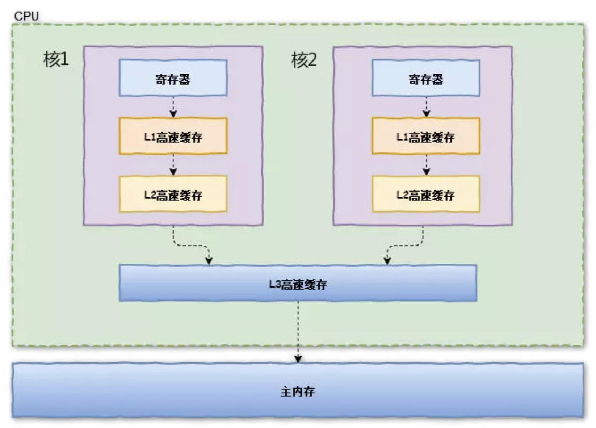

# 一、并发的起源
为了提高计算机处理数据的速度。现代的计算机都支持多任务处理。在32位windows操作系统中 ,多任务处理是指系统可同时运行多个进程，而每个进程也可同时执行多个线程。一个线程是指程序的一条执行路径，它在系统指定的时间片中完成特定的功能。系统不停地在多个线程之间切换，由于时间很短，看上去多个线程在同时运行。或者对于在线程序可并行执行同时服务于多个用户称为多任务处理。

# 二、物理计算机的内存模型
在理解java内存模型之前，我们先来了解一下，物理计算机的内存模型，其对Java内存模型有着很大的参考意义。
在物理计算机中，我们需要处理的数据都在内存中，处理器处理数据，需要从内存中获取相应的数据，然后存入内存中，为了提高计算机的处理速度（读取数据，存储数据有IO消耗），我们常常会在CPU(处理器)中加入高速缓存（Cache Memory），也就是将数据缓存到处理器中，当处理器处理完数据后，再将处理的数据结果存储在内存中。

具体如下图所示：

当CPU（处理器）要读取一个数据时，首先从一级缓存中查找，如果没有找到再从二级缓存中查找，如果还是没有就从三级缓存或内存中查找。一般来说，每级缓存的命中率大概都在80%左右，也就是说全部数据量的80%都可以在一级缓存中找到，只剩下20%的总数据量才需要从二级缓存、三级缓存或内存中读取。
# 一致性协议

todo

# Java内存模型

todo 

出现线程安全的问题一般是因为`主内存和工作内存数据不一致性`和`重排序`导致的，而解决线程安全的问题最重要的就是理解这两种问题是怎么来的，那么，理解它们的核心在于理解java内存模型（`JMM`）。

# 重排序

todo 

# happen-before

todo 

# 参考文献

- [Java内存模型以及happens-before规则](https://juejin.im/post/5ae6d309518825673123fd0e)
- [Java并发编程之Java内存模型](https://www.jianshu.com/p/355b91f7baa8)