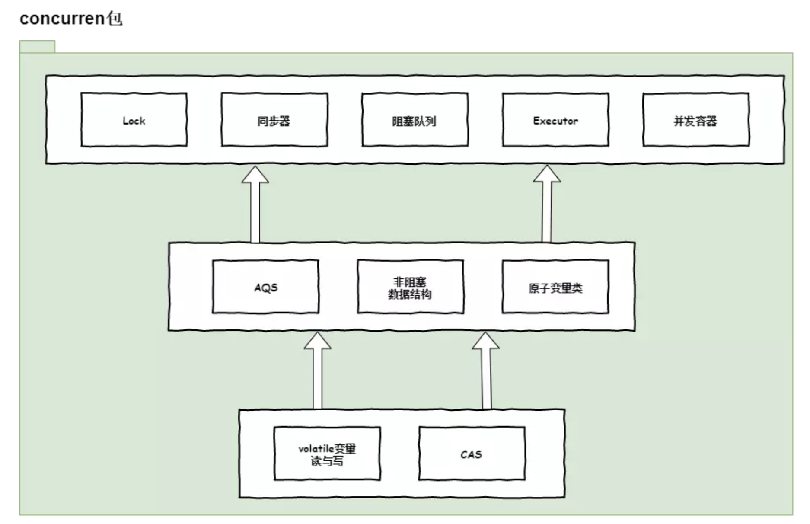
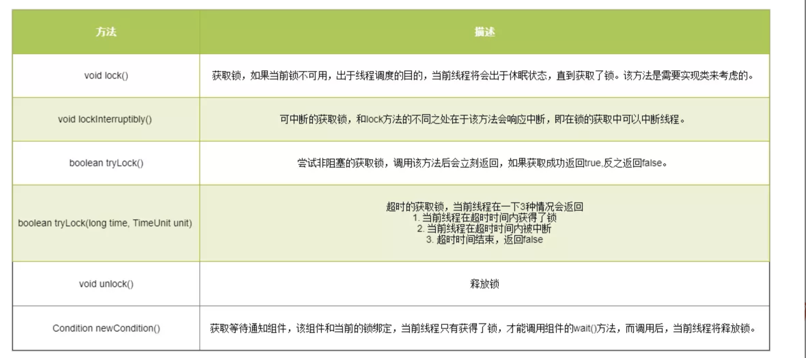

# concurrent包的设计
要了解Java为我们提供的基于Lock接口（以及相关实现类）实现的锁功能，我们首先要看一下整个concurrent包下的设计。具体设计如下所示：


在上图中，我们大致可以看出courrent包下的整体结构。整个包大致分为了三层。

* 高层：Lock、同步器、阻塞队列等。
* 中层：AQS(AbstractQueuedSynchronizer)、非阻塞数据结构、原子变量类。
* 底层：volatile变量的读/写、CAS操作。


其中每个层中的依赖关系也很明显，AQS，非阻塞数据结构和原子变量类（java.util.concurrent.atomic包中的类），都是基于底层实现，而高层类又依赖中层这些基础类。特别需要注意的是于Lock接口（以及相关实现类）相关的锁功能在整个高层中起着非常重要的重要。虽然没有直接在图中表述Lock接口在高层中的关系，但是在高层中我们所罗列的同步器、阻塞队列、并发容器等，或多或少都依赖或使用其Lock接口（以及相关实现类）实现的锁功能。

所以了解Lock接口以及相关实现类，对我们认识整个Java并发的机制与设计起着尤为重要的作用。


# Lock接口


关于Lock接口中涉及到的方法具体如下：（建议直接在PC端查看，手机上有可能看的不是很清楚）



从上表中，我们就可以得出使用Lock接口实现的锁机制与使用传统的synchronized的区别

1. 尝试非阻塞地获取锁：当线程尝试获取锁，如果这一时刻锁没有被其他线程获取到，则成功获取并持有锁。
2. 能被中断的获取锁：与synchronized不同，获取到锁的线程能够响应中断，当获取到锁的线程被中断时，中断异常会被抛出，同时锁也会被释放。
3. 超时获取锁：在指定的截止时间之前获取锁，如果截止时间到了任然无法获取到锁，则返回。

## Lock简单使用与注意事项
其中Lock的使用方式也很简单，具体代码如下所示：

```
Lock lock = ....;具体实现类
lock.lock();
try {

} finally {
	lock.unlock();//建议在finally中释放锁
}
```
当锁定和解锁发生在不同的范围时，一定要注意确保在持有锁时执行的所有代码都受到try-finally或try-catch的保护，以确保在必要时释放锁。不要将获取锁的过程写在try块中，因为如果在获取锁（自定义锁的实现）时发生了异常，异常抛出的同时，也会导致锁无故释放（因为一旦发生异常，就会走finally语句，如果这个异常（可能是用户自定义异常，用户可以自己处理）需要线程1来处理，但是接着执行了lock.unlock()语句导致了锁的释放。那么其他线程就可以操作共享资源。有可能破坏程序的执行结果）。

# ReentrantLock的内部实现
看完了AQS中的底层同步机制，我们来简单分析一下之前介绍过的ReentrantLock的实现原理。先回顾一下这个显式锁的典型使用方式：

```
Lock lock = new ReentrantLock();
lock.lock();
try {
    加锁后的代码
} finally {
    lock.unlock();     
}
```

ReentrantLock首先是一个显式锁，它实现了Lock接口。可能你已经忘记了Lock接口长啥样了，我们再回顾一遍：


```

public interface Lock {
    void lock();
    void lockInterruptibly() throws InterruptedException;
    boolean tryLock();
    boolean tryLock(long time, TimeUnit unit) throws InterruptedException;
    void unlock();
    Condition newCondition();
}
```

复制代码其实ReentrantLock内部定义了一个AQS的子类来辅助它实现锁的功能，由于ReentrantLock是工作在独占模式下的，所以它的lock方法其实是调用AQS对象的aquire方法去获取同步状态，unlock方法其实是调用AQS对象的release方法去释放同步状态，这些大家已经很熟了，就不再赘述了，我们大致看一下ReentrantLock的代码：

```

public class ReentrantLock implements Lock {

    private final Sync sync;    //AQS子类对象
    
    abstract static class Sync extends AbstractQueuedSynchronizer { 
        // ... 为节省篇幅，省略其他内容
    }
    
    // ... 为节省篇幅，省略其他内容
}
```

复制代码所以如果我们简简单单写下下边这行代码：

```
Lock lock = new ReentrantLock();
```

复制代码就意味着在内存里创建了一个ReentrantLock对象，一个AQS对象，在AQS对象里维护着同步队列的head节点和tail节点，不过初始状态下由于没有线程去竞争锁，所以同步队列是空的。
