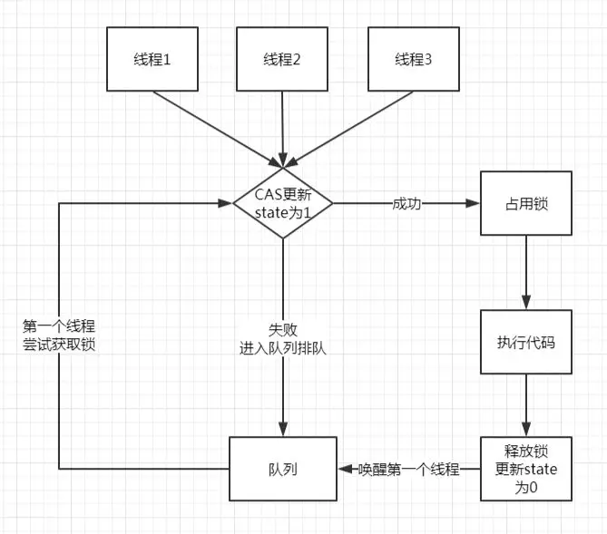
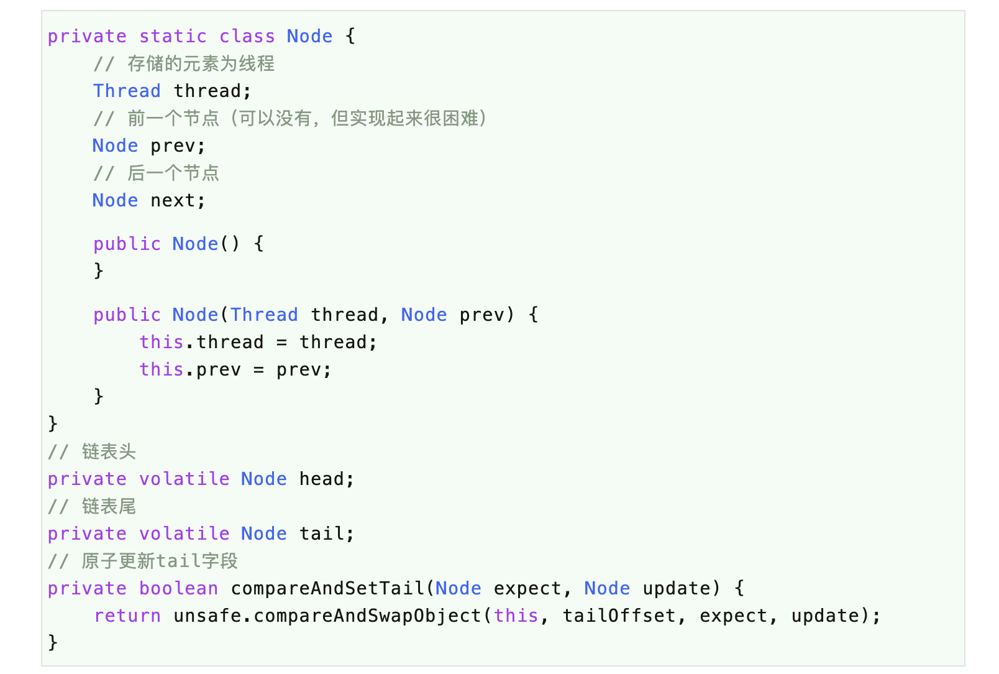
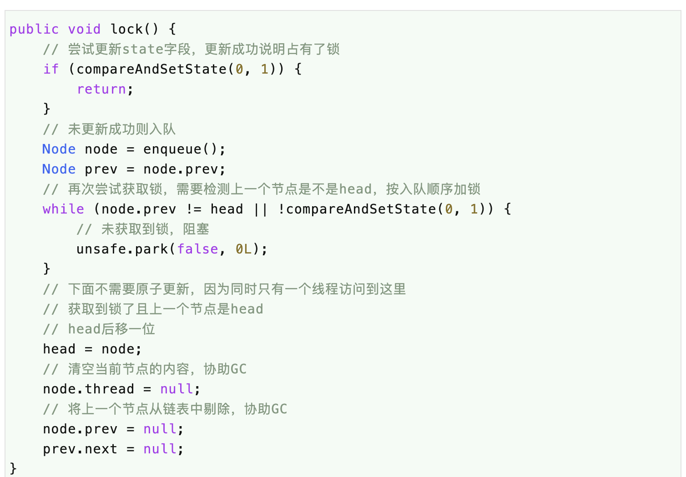
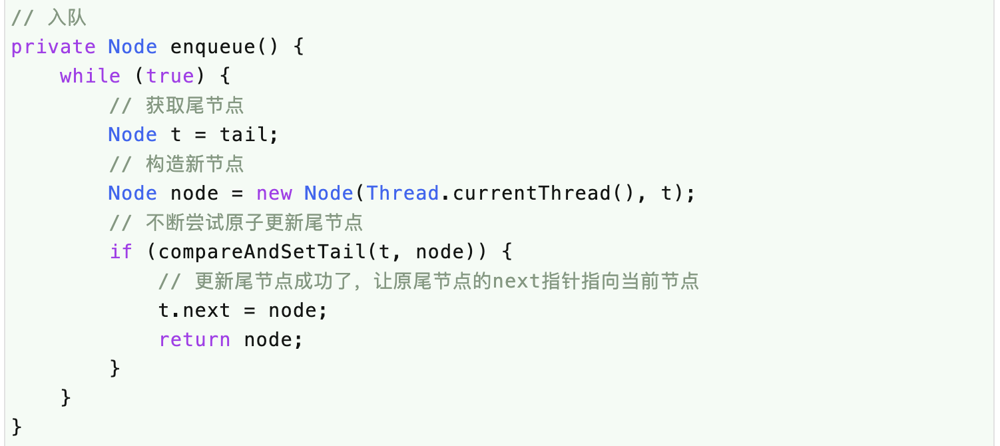
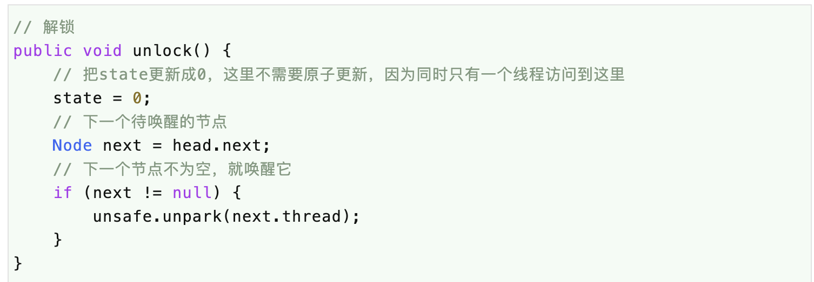
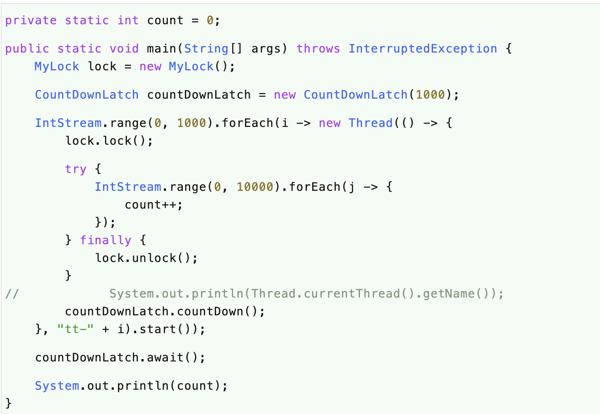

# 问题
（1）自己动手写一个锁需要哪些知识？

（2）自己动手写一个锁到底有多简单？

（3）自己能不能写出来一个完美的锁？

# 简介
本篇文章的目标一是自己动手写一个锁，这个锁的功能很简单，能进行正常的加锁、解锁操作。

本篇文章的目标二是通过自己动手写一个锁，能更好地理解后面章节将要学习的AQS及各种同步器实现的原理。

# 分析
自己动手写一个锁需要准备些什么呢？

首先，在上一章学习synchronized的时候我们说过它的实现原理是更改对象头中的MarkWord，标记为已加锁或未加锁。

但是，我们自己是无法修改对象头信息的，那么我们可不可以用一个变量来代替呢？

比如，这个变量的值为1的时候就说明已加锁，变量值为0的时候就说明未加锁，我觉得可行。

其次，我们要保证多个线程对上面我们定义的变量的争用是可控的，所谓可控即同时只能有一个线程把它的值修改为1，且当它的值为1的时候其它线程不能再修改它的值，这种是不是就是典型的CAS操作，所以我们需要使用Unsafe这个类来做CAS操作。

然后，我们知道在多线程的环境下，多个线程对同一个锁的争用肯定只有一个能成功，那么，其它的线程就要排队，所以我们还需要一个队列。

最后，这些线程排队的时候干嘛呢？它们不能再继续执行自己的程序，那就只能阻塞了，阻塞完了当轮到这个线程的时候还要唤醒，所以我们还需要Unsfae这个类来阻塞（park）和唤醒（unpark）线程。

基于以上四点，我们需要的神器大致有：一个变量、一个队列、执行CAS/park/unpark的Unsafe类。

大概的流程图如下图所示：



# 解决
## 状态
这个变量只支持同时只有一个线程能把它修改为1，所以它修改完了一定要让其它线程可见，因此，这个变量需要使用volatile来修饰。

```
private volatile int state;
```

## CAS
这个变量的修改必须是原子操作，所以我们需要CAS更新它，我们这里使用Unsafe来直接CAS更新int类型的state。

当然，这个变量如果直接使用AtomicInteger也是可以的，不过，既然我们学习了更底层的Unsafe类那就应该用（浪）起来。

```
private boolean compareAndSetState(int expect, int update)
 {    
     return unsafe.compareAndSwapInt(this, stateOffset, expect, update);
}
```

## 一个队列
队列的实现有很多，数组、链表都可以，我们这里采用链表，毕竟链表实现队列相对简单一些，不用考虑扩容等问题。

这个队列的操作很有特点：

放元素的时候都是放到尾部，且可能是多个线程一起放，所以对尾部的操作要CAS更新；

唤醒一个元素的时候从头部开始，但同时只有一个线程在操作，即获得了锁的那个线程，所以对头部的操作不需要CAS去更新。



这个队列很简单，存储的元素是线程，需要有指向下一个待唤醒的节点，前一个节点可有可无，但是没有实现起来很困难，不信学完这篇文章你试试

## 加锁




（1）尝试获取锁，成功了就直接返回；

（2）未获取到锁，就进入队列排队；

（3）入队之后，再次尝试获取锁；

（4）如果不成功，就阻塞；

（5）如果成功了，就把头节点后移一位，并清空当前节点的内容，且与上一个节点断绝关系；

（6）加锁结束；


## 解锁

（1）把state改成0，这里不需要CAS更新，因为现在还在加锁中，只有一个线程去更新，在这句之后就释放了锁；

（2）如果有下一个节点就唤醒它；

（3）唤醒之后就会接着走上面lock()方法的while循环再去尝试获取锁；

（4）唤醒的线程不是百分之百能获取到锁的，因为这里state更新成0的时候就解锁了，之后可能就有线程去尝试加锁了。

## 测试
上面完整的锁的实现就完了，是不是很简单，但是它是不是真的可靠呢，敢不敢来试试？！

直接上测试代码：



运行这段代码的结果是总是打印出10000000（一千万），说明我们的锁是正确的、可靠的、完美的。

# 总结
（1）自己动手写一个锁需要做准备：一个变量、一个队列、Unsafe类。

（2）原子更新变量为1说明获得锁成功；

（3）原子更新变量为1失败说明获得锁失败，进入队列排队；

（4）更新队列尾节点的时候是多线程竞争的，所以要使用原子更新；

（5）更新队列头节点的时候只有一个线程，不存在竞争，所以不需要使用原子更新；

（6）队列节点中的前一个节点prev的使用很巧妙，没有它将很难实现一个锁，只有写过的人才明白，不信你试试^^

# 问题

（1）我们实现的锁支持可重入吗？

答：不可重入，因为我们每次只把state更新为1。如果要支持可重入也很简单，获取锁时检测锁是不是被当前线程占有着，如果是就把state的值加1，释放锁时每次减1即可，减为0时表示锁已释放。

（2）我们实现的锁是公平锁还是非公平锁？

答：非公平锁，因为获取锁的时候我们先尝试了一次，这里并不是严格的排队，所以是非公平锁。

# 参考文献

- [死磕 java同步系列之自己动手写一个锁Lock](https://mp.weixin.qq.com/s/1RU5jh7UcXGtKlae8tusVA)