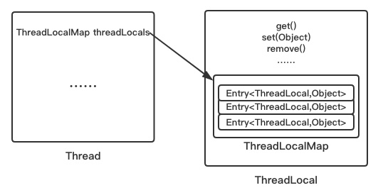

# 什么是ThreadLocal
　　ThreadLocal，很多地方叫做线程本地变量，也有些地方叫做线程本地存储，其实意思差不多。可能很多朋友都知道ThreadLocal为变量在每个线程中都创建了一个副本，那么每个线程可以访问自己内部的副本变量。


# 原理



每一个Thread对象均含有一个ThreadLocalMap类型的成员变量threadLocals，它存储本线程中所有ThreadLocal对象及其对应的值。

# ThreadLocal源码分析
ThreadLocal 是怎样保证其值在各个线程中是独立的呢？下面分析下 ThreadLocal 的实现。

ThreadLocal 是构造函数只是一个简单的无参构造函数，并且没有任何实现。

## ThreadLocal的内部实现
### 1.set(T value) 方法

设置当前线程的线程局部变量的值。

```
//set 方法
public void set(T value) {
      //获取当前线程
      Thread t = Thread.currentThread();
      //实际存储的数据结构类型
      ThreadLocalMap map = getMap(t);
      //如果存在map就直接set，没有则创建map并set
      if (map != null)
          map.set(this, value);
      else
          createMap(t, value);
  }
  
//getMap方法
ThreadLocalMap getMap(Thread t) {
      //thred中维护了一个ThreadLocalMap
      return t.threadLocals;
 }
 
//createMap
void createMap(Thread t, T firstValue) {
      //实例化一个新的ThreadLocalMap，并赋值给线程的成员变量threadLocals
      t.threadLocals = new ThreadLocalMap(this, firstValue);
}
```

在这个方法内部我们看到，首先通过getMap(Thread t)方法获取一个和当前线程相关的ThreadLocalMap，然后将变量的值设置到这个ThreadLocalMap对象中，当然如果获取到的ThreadLocalMap对象为空，就通过createMap方法创建。


线程隔离的秘密，就在于ThreadLocalMap这个类。ThreadLocalMap是ThreadLocal类的一个静态内部类，它实现了键值对的设置和获取（对比Map对象来理解），`每个线程中都有一个独立的ThreadLocalMap副本`，它所存储的值，只能被当前线程读取和修改。ThreadLocal类通过操作每一个线程特有的ThreadLocalMap副本，从而实现了变量访问在不同线程中的隔离。因为每个线程的变量都是自己特有的，完全不会有并发错误。还有一点就是，`ThreadLocalMap存储的键值对中的键是this对象指向的ThreadLocal对象`，而值就是你所设置的对象了。

### 2.get() 方法
该方法返回当前线程所对应的线程局部变量。

```
public T get() {  
    Thread t = Thread.currentThread();  
    ThreadLocalMap map = getMap(t);  
    if (map != null) {  
        ThreadLocalMap.Entry e = map.getEntry(this);  
        if (e != null)  
            return (T)e.value;  
    }  
    return setInitialValue();  
} 
```

### 3.initialValue() 方法
返回该线程局部变量的初始值，该方法是一个protected的方法，显然是为了让子类覆盖而设计的。这个方法是一个延迟调用方法，在线程第1次调用get()或set(Object)时才执行，并且仅执行1次。ThreadLocal中的缺省实现直接返回一个null。

### 4.remove() 方法
将当前线程局部变量的值删除，目的是为了减少内存的占用，该方法是JDK 5.0新增的方法。需要指出的是，当线程结束后，对应该线程的局部变量将自动被垃圾回收，所以显式调用该方法清除线程的局部变量并不是必须的操作，但它可以加快内存回收的速度。

### 5.ThreadLocalMap

```
//Entry为ThreadLocalMap静态内部类，对ThreadLocal的若引用
//同时让ThreadLocal和储值形成key-value的关系
static class Entry extends WeakReference<ThreadLocal<?>> {
    /** The value associated with this ThreadLocal. */
    Object value;

    Entry(ThreadLocal<?> k, Object v) {
           super(k);
            value = v;
    }
}

//ThreadLocalMap构造方法
ThreadLocalMap(ThreadLocal<?> firstKey, Object firstValue) {
        //内部成员数组，INITIAL_CAPACITY值为16的常量
        table = new Entry[INITIAL_CAPACITY];
        //位运算，结果与取模相同，计算出需要存放的位置
        //threadLocalHashCode比较有趣
        int i = firstKey.threadLocalHashCode & (INITIAL_CAPACITY - 1);
        table[i] = new Entry(firstKey, firstValue);
        size = 1;
        setThreshold(INITIAL_CAPACITY);
}
```

通过上面的代码不难看出在实例化ThreadLocalMap时创建了一个长度为16的Entry数组。通过hashCode与length位运算确定出一个索引值i，这个i就是被存储在table数组中的位置。

前面讲过每个线程Thread持有一个ThreadLocalMap类型的实例threadLocals，结合此处的构造方法可以理解成每个线程Thread都持有一个Entry型的数组table，而一切的读取过程都是通过操作这个数组table完成的。


# 内存泄漏的问题

Entry继承自WeakReference<ThreadLocal<?>>，一个Entry由ThreadLocal对象和Object构成。由此可见，Entry的key是ThreadLocal对象，并且是一个弱引用。当没指向key的强引用后，该key就会被垃圾收集器回收。

此时程序员不用再关注指针，只要没有强引用指向Person对象，垃圾收集器每次运行都会自动将该对象释放。

那么，ThreadLocalMap中的key使用弱引用的原因也是如此。当一条线程中的ThreadLocal对象使用完毕，没有强引用指向它的时候，垃圾收集器就会自动回收这个Key，从而达到节约内存的目的。

那么，问题又来了——这会导致内存泄漏问题！

在ThreadLocalMap中，只有key是弱引用，value仍然是一个强引用。当某一条线程中的ThreadLocal使用完毕，没有强引用指向它的时候，这个key指向的对象就会被垃圾收集器回收，从而这个key就变成了null；然而，此时value和value指向的对象之间仍然是强引用关系，只要这种关系不解除，value指向的对象永远不会被垃圾收集器回收，从而导致内存泄漏！

不过不用担心，ThreadLocal提供了这个问题的解决方案。

每次操作set、get、remove操作时，ThreadLocal都会将key为null的Entry删除，从而避免内存泄漏。

那么问题又来了，如果一个线程运行周期较长，而且将一个大对象放入LocalThreadMap后便不再调用set、get、remove方法，此时该仍然可能会导致内存泄漏。

这个问题确实存在，没办法通过ThreadLocal解决，而是需要程序员在完成ThreadLocal的使用后要养成手动调用remove的习惯，从而避免内存泄漏。


# 使用案例和场景


> 场景一 存储sql连接

```
public class ConnectionManager {  
  
    private static ThreadLocal<Connection> connectionHolder = new ThreadLocal<Connection>() {  
        @Override  
        protected Connection initialValue() {  
            Connection conn = null;  
            try {  
                conn = DriverManager.getConnection(  
                        "jdbc:mysql://localhost:3306/test", "username",  
                        "password");  
            } catch (SQLException e) {  
                e.printStackTrace();  
            }  
            return conn;  
        }  
    };  
  
    public static Connection getConnection() {  
        return connectionHolder.get();  
    }  
  
    public static void setConnection(Connection conn) {  
        connectionHolder.set(conn);  
    }  
} 
```

> 场景二、存储session

Web系统Session的存储就是ThreadLocal一个典型的应用场景。

# 总结


　　ThreadLocal是解决线程安全问题一个很好的思路，它通过为每个线程提供一个独立的变量副本解决了变量并发访问的冲突问题。在很多情况下，ThreadLocal比直接使用synchronized同步机制解决线程安全问题更简单，更方便，且结果程序拥有更高的并发性。


# 参考文献
* [Java 之 ThreadLocal 详解](https://juejin.im/post/5965ef1ff265da6c40737292#heading-8)
* [Java并发编程：深入剖析ThreadLocal](https://www.cnblogs.com/dolphin0520/p/3920407.html)
* [深度揭秘ThreadLocal](https://zhuanlan.zhihu.com/p/34494674)
* [ThreadLocal](https://www.jianshu.com/p/3c5d7f09dfbd)