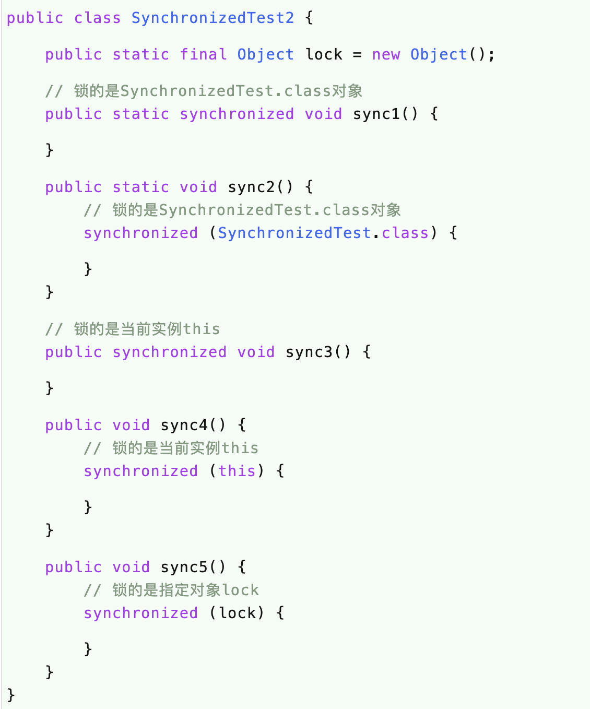

# 问题
（1）synchronized的特性？

（2）synchronized的实现原理？

（3）synchronized是否可重入？

（4）synchronized是否是公平锁？

（5）synchronized的优化？

（6）synchronized的五种使用方式？

# 简介
synchronized关键字是Java里面最基本的同步手段，它经过编译之后，会在同步块的前后分别生成 monitorenter 和 monitorexit 字节码指令，这两个字节码指令都需要一个引用类型的参数来指明要锁定和解锁的对象。

# synchronized的使用方式
通过上面的分析，我们知道synchronized是需要一个引用类型的参数的，而这个引用类型的参数在Java中其实可以分成三大类：类对象、实例对象、普通引用

在方法上使用synchronized的时候要注意，会隐式传参，分为静态方法和非静态方法，静态方法上的隐式参数为当前类对象，非静态方法上的隐式参数为当前实例this。

另外，多个synchronized只有锁的是同一个对象，它们之间的代码才是同步的，这一点在使用synchronized的时候一定要注意。

# 实现原理
## monitorenter 和 monitorexit
在学习Java内存模型的时候，我们介绍过两个指令：lock 和 unlock。

lock，锁定，作用于主内存的变量，它把主内存中的变量标识为一条线程独占状态。

unlock，解锁，作用于主内存的变量，它把锁定的变量释放出来，释放出来的变量才可以被其它线程锁定。

但是这两个指令并没有直接提供给用户使用，而是提供了两个更高层次的指令 monitorenter 和 monitorexit 来隐式地使用 lock 和 unlock 指令。

而 synchronized 就是使用 monitorenter 和 monitorexit 这两个指令来实现的。

根据JVM规范的要求，在执行monitorenter指令的时候，首先要去尝试获取对象的锁，如果这个对象没有被锁定，或者当前线程已经拥有了这个对象的锁，就把锁的计数器加1，相应地，在执行monitorexit的时候会把计数器减1，当计数器减小为0时，锁就释放了。

## 原子性、可见性、有序性
前面讲解Java内存模型的时候我们说过内存模型主要就是用来解决缓存一致性的问题的，而缓存一致性主要包括原子性、可见性、有序性。

那么，synchronized关键字能否保证这三个特性呢？

还是回到Java内存模型上来，synchronized关键字底层是通过monitorenter和monitorexit实现的，而这两个指令又是通过lock和unlock来实现的。

而lock和unlock在Java内存模型中是必须满足下面四条规则的：

（1）一个变量同一时刻只允许一条线程对其进行lock操作，但lock操作可以被同一个线程执行多次，多次执行lock后，只有执行相同次数的unlock操作，变量才能被解锁。

（2）如果对一个变量执行lock操作，将会清空工作内存中此变量的值，在执行引擎使用这个变量前，需要重新执行load或assign操作初始化变量的值；

（3）如果一个变量没有被lock操作锁定，则不允许对其执行unlock操作，也不允许unlock一个其它线程锁定的变量；

（4）对一个变量执行unlock操作之前，必须先把此变量同步回主内存中，即执行store和write操作；

通过规则（1），我们知道对于lock和unlock之间的代码，同一时刻只允许一个线程访问，所以，synchronized是具有原子性的。

通过规则（1）（2）和（4），我们知道每次lock和unlock时都会从主内存加载变量或把变量刷新回主内存，而lock和unlock之间的变量（这里是指锁定的变量）是不会被其它线程修改的，所以，synchronized是具有可见性的。

通过规则（1）和（3），我们知道所有对变量的加锁都要排队进行，且其它线程不允许解锁当前线程锁定的对象，所以，synchronized是具有有序性的。

综上所述，synchronized是可以保证原子性、可见性和有序性的。

# 公平锁 VS 非公平锁
通过上面的学习，我们知道了synchronized的实现原理，并且它是可重入的，那么，它是否是公平锁呢？

synchronized是一个非公平锁。

# synchronized锁优化

Java在不断进化，同样地，Java中像synchronized这种古老的东西也在不断进化，比如ConcurrentHashMap在jdk7的时候还是使用ReentrantLock加锁的，在jdk8的时候已经换成了原生的synchronized了，可见synchronized有原生的支持，它的进化空间还是很大的。

那么，synchronized有哪些进化中的状态呢？

我们这里稍做一些简单地介绍：

（1）偏向锁，是指一段同步代码一直被一个线程访问，那么这个线程会自动获取锁，降低获取锁的代价。

（2）轻量级锁，是指当锁是偏向锁时，被另一个线程所访问，偏向锁会升级为轻量级锁，这个线程会通过自旋的方式尝试获取锁，不会阻塞，提高性能。

（3）重量级锁，是指当锁是轻量级锁时，当自旋的线程自旋了一定的次数后，还没有获取到锁，就会进入阻塞状态，该锁升级为重量级锁，重量级锁会使其他线程阻塞，性能降低。

Java SE 1.6为了减少获得锁和释放锁带来的性能消耗，引入了“偏向锁”和“轻量级锁”，在Java SE 1.6中，锁一共有4种状态，级别从低到高依次是：无锁状态、偏向锁状态、轻量级锁状态和重量级锁状态，这几个状态会随着竞争情况逐渐升级。锁可以升级但不能降级，意味着偏向锁升级成轻量级锁后不能降级成偏向锁。这种锁升级却不能降级的策略，目的是为了提高获得锁和释放锁的效率。下面会对各种锁进行介绍。

# 总结
（1）synchronized在编译时会在同步块前后生成monitorenter和monitorexit字节码指令；

（2）monitorenter和monitorexit字节码指令需要一个引用类型的参数，基本类型不可以哦；

（3）monitorenter和monitorexit字节码指令更底层是使用Java内存模型的lock和unlock指令；

（4）synchronized是可重入锁；

（5）synchronized是非公平锁；

（6）synchronized可以同时保证原子性、可见性、有序性；

（7）synchronized有三种状态：偏向锁、轻量级锁、重量级锁；

# 参考文献

- [彻底理解synchronized](https://juejin.im/post/5ae6dc04f265da0ba351d3ff)