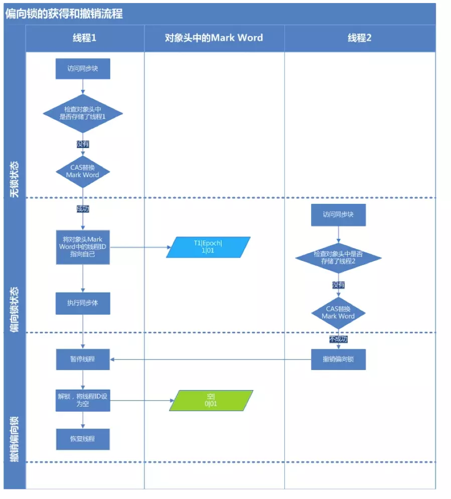
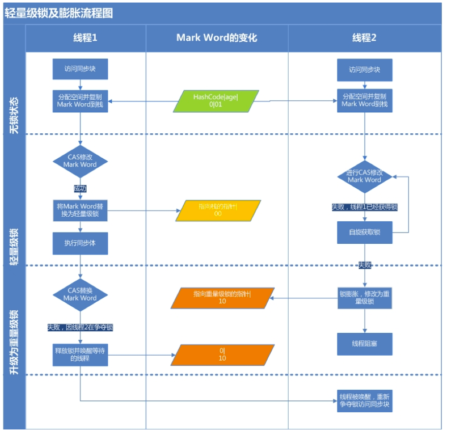

# 问题
（1）synchronized的特性？

（2）synchronized的实现原理？

（3）synchronized是否可重入？

（4）synchronized是否是公平锁？

（5）synchronized的优化？

（6）synchronized的五种使用方式？

# 简介
synchronized关键字是Java里面最基本的同步手段，它经过编译之后，会在同步块的前后分别生成 monitorenter 和 monitorexit 字节码指令，这两个字节码指令都需要一个引用类型的参数来指明要锁定和解锁的对象。

# 对象锁和类锁

- 对象锁：Java的所有对象都含有1个互斥锁，这个锁由JVM自动获取和释放。线程进入synchronized方法的时候获取该对象的锁，当然如果已经有线程获取了这个对象的锁，那么当前线程会等待；synchronized方法正常返回或者抛异常而终止，JVM会自动释放对象锁。这里也体现了用synchronized来加锁的1个好处，方法抛异常的时候，锁仍然可以由JVM来自动释放。
- 类锁：对象锁是用来控制实例方法之间的同步，类锁是用来控制静态方法（或静态变量互斥体）之间的同步。其实类锁只是一个概念上的东西，并不是真实存在的，它只是用来帮助我们理解锁定实例方法和静态方法的区别的。java类可能会有很多个对象，但是只有1个Class对象，也就是说类的不同实例之间共享该类的Class对象。Class对象其实也仅仅是1个java对象，只不过有点特殊而已。由于每个java对象都有1个互斥锁，而类的静态方法是需要Class对象。所以所谓的类锁，不过是Class对象的锁而已。

类锁和对象锁不是同1个东西，一个是类的Class对象的锁，一个是类的实例的锁。也就是说：1个线程访问静态synchronized的时候，允许另一个线程访问对象的实例synchronized方法。反过来也是成立的，因为他们需要的锁是不同的。

# synchronized的使用方式

- 修饰静态方法：其作用的范围是整个静态方法，作用于所有对象
- 修饰类：其作用的范围是synchronized后面括号括起来的部分（例如：test.class），作用于所有对象
- 修饰代码块：被修饰的代码块称为同步语句块，其作用的范围是大括号{}括起来的代码，作用于调用对象
- 修饰方法：被修饰的方法称为同步方法，其作用的范围是整个方法，作用于调用对象

注：注意：synchronized修饰方法时必须是显式调用，如果没有显式调用，例如子类重写该方法时没有显式加上synchronized，则不会有加锁效果。

在方法上使用synchronized的时候要注意，会隐式传参，分为静态方法和非静态方法，静态方法上的隐式参数为当前类对象，非静态方法上的隐式参数为当前实例this。

另外，多个synchronized只有锁的是同一个对象，它们之间的代码才是同步的，这一点在使用synchronized的时候一定要注意。

# 实现原理
## monitorenter 和 monitorexit
在学习Java内存模型的时候，我们介绍过两个指令：lock 和 unlock。

lock，锁定，作用于主内存的变量，它把主内存中的变量标识为一条线程独占状态。

unlock，解锁，作用于主内存的变量，它把锁定的变量释放出来，释放出来的变量才可以被其它线程锁定。

但是这两个指令并没有直接提供给用户使用，而是提供了两个更高层次的指令 monitorenter 和 monitorexit 来隐式地使用 lock 和 unlock 指令。

而 synchronized 就是使用 monitorenter 和 monitorexit 这两个指令来实现的。

根据JVM规范的要求，在执行monitorenter指令的时候，首先要去尝试获取对象的锁，如果这个对象没有被锁定，或者当前线程已经拥有了这个对象的锁，就把锁的计数器加1，相应地，在执行monitorexit的时候会把计数器减1，当计数器减小为0时，锁就释放了。

## 原子性、可见性、有序性
前面讲解Java内存模型的时候我们说过内存模型主要就是用来解决缓存一致性的问题的，而缓存一致性主要包括原子性、可见性、有序性。

那么，synchronized关键字能否保证这三个特性呢？

还是回到Java内存模型上来，synchronized关键字底层是通过monitorenter和monitorexit实现的，而这两个指令又是通过lock和unlock来实现的。

而lock和unlock在Java内存模型中是必须满足下面四条规则的：

（1）一个变量同一时刻只允许一条线程对其进行lock操作，但lock操作可以被同一个线程执行多次，多次执行lock后，只有执行相同次数的unlock操作，变量才能被解锁。

（2）如果对一个变量执行lock操作，将会清空工作内存中此变量的值，在执行引擎使用这个变量前，需要重新执行load或assign操作初始化变量的值；

（3）如果一个变量没有被lock操作锁定，则不允许对其执行unlock操作，也不允许unlock一个其它线程锁定的变量；

（4）对一个变量执行unlock操作之前，必须先把此变量同步回主内存中，即执行store和write操作；

通过规则（1），我们知道对于lock和unlock之间的代码，同一时刻只允许一个线程访问，所以，synchronized是具有原子性的。

通过规则（1）（2）和（4），我们知道每次lock和unlock时都会从主内存加载变量或把变量刷新回主内存，而lock和unlock之间的变量（这里是指锁定的变量）是不会被其它线程修改的，所以，synchronized是具有可见性的。

通过规则（1）和（3），我们知道所有对变量的加锁都要排队进行，且其它线程不允许解锁当前线程锁定的对象，所以，synchronized是具有有序性的。

综上所述，synchronized是可以保证原子性、可见性和有序性的。

# 公平锁 VS 非公平锁
通过上面的学习，我们知道了synchronized的实现原理，并且它是可重入的，那么，它是否是公平锁呢？

synchronized是一个非公平锁。

# synchronized锁优化
在JDK1.6之前，synchronized一直被称呼为重量级锁（重量级锁就是采用互斥量来控制对资源的访问）。通过反编译成字节码指令可以看到，synchronized会在同步块的前后分别形成monitorenter和monitorexit这两个字节码指令。根据虚拟机规范的要求，在执行monitorenter指令时，首先要尝试获取对象的锁。如果这个对象没被锁定，或者当前线程已经拥有了那个对象的锁，把锁的计数器加1，相应的，在执行monitorexit指令时会将锁计算器减1，当计数器为0时，锁就被释放，然后notify通知所有等待的线程。Java的线程是映射到操作系统的原生线程上的，如果要阻塞或唤醒一个线程，都需要操作系统来帮忙完成，这就需要用户态和内核态切换，大量的状态转换需要耗费很多处理器的时间。

Java在不断进化，同样地，Java中像synchronized这种古老的东西也在不断进化，比如ConcurrentHashMap在jdk7的时候还是使用ReentrantLock加锁的，在jdk8的时候已经换成了原生的synchronized了，可见synchronized有原生的支持，它的进化空间还是很大的。

在JDK1.6中对锁的实现引入了大量的优化：

1. 锁粗化（Lock Coarsening）：将多个连续的锁扩展成一个范围更大的锁，用以减少频繁互斥同步导致的性能损耗。
锁消除（Lock Elimination）：JVM即时编译器在运行时，通过逃逸分析，如果判断一段代码中，堆上的所有数据不会逃逸出去从来被其他线程访问到，就可以去除这个锁。
2. 偏向锁（Biased Locking）：目的是消除数据无竞争情况下的同步原语。使用CAS记录获取它的线程。下一次同一个线程进入则偏向该线程，无需任何同步操作。
3. 适应性自旋（Adaptive Spinning）：为了避免线程频繁挂起、恢复的状态切换消耗。线程会进入自旋状态。JDK1.6引入了自适应自旋。自旋时间根据之前锁自旋时间和线程状态，动态变化，可以能减少自旋的时间。
4. 轻量级锁（Lightweight Locking）：在没有多线程竞争的情况下避免重量级互斥锁，只需要依靠一条CAS原子指令就可以完成锁的获取及释放。

在JDK1.6之后，synchronized不再是重量级锁，锁的状态变成以下四种状态：无锁->偏向锁->轻量级锁->重量级锁

那么，synchronized有哪些进化中的状态呢？

我们这里稍做一些简单地介绍：

（1）偏向锁，是指一段同步代码一直被一个线程访问，那么这个线程会自动获取锁，降低获取锁的代价。

（2）轻量级锁，是指当锁是偏向锁时，被另一个线程所访问，偏向锁会升级为轻量级锁，这个线程会通过自旋的方式尝试获取锁，不会阻塞，提高性能。

（3）重量级锁，是指当锁是轻量级锁时，当自旋的线程自旋了一定的次数后，还没有获取到锁，就会进入阻塞状态，该锁升级为重量级锁，重量级锁会使其他线程阻塞，性能降低。

Java SE 1.6为了减少获得锁和释放锁带来的性能消耗，引入了“偏向锁”和“轻量级锁”，在Java SE 1.6中，锁一共有4种状态，级别从低到高依次是：无锁状态、偏向锁状态、轻量级锁状态和重量级锁状态，这几个状态会随着竞争情况逐渐升级。锁可以升级但不能降级，意味着偏向锁升级成轻量级锁后不能降级成偏向锁。这种锁升级却不能降级的策略，目的是为了提高获得锁和释放锁的效率。下面会对各种锁进行介绍。

# 锁的状态

## 自适应自旋锁
大部分时候，共享数据的锁定状态只会持续很短的一段时间，为了这段时间去挂起和恢复线程并不值得。如果能让两个或以上的线程同时并行执行，我们就可以让后面请求锁的那个线程“稍等一下”，但不放弃处理器的执行时间，看看持有锁的线程是否很快就会释放锁。这项技术就是所谓的自旋锁。自旋等待的时间必须要有一定的限度，如果自旋超过了限定的次数仍然没有获取到锁，则该线程应该被挂起。在JDK1.6中引入了自适应的自旋锁，自适应意味着自旋的时间不再固定，而是由前一次在同一个锁上的自旋时间及锁的拥有者的状态来决定。

注：所谓自旋，不是获取不到就阻塞，而是在原地等待一会儿，再次尝试（当然次数或者时长有限），他是以牺牲CPU为代价来换取内核状态切换带来的开销。借助于适应性自旋，可以在CPU时间片的损耗和内核状态的切换开销之间相对的找到一个平衡，进而能够提高性能

## 偏向锁
大多数情况下，锁不仅不存在多线程竞争，而且总是由同一线程多次获得，为了让线程获得锁的代价更低而引入了偏向锁。当一个线程访问同步块并获取锁时，会在对象头的锁记录里存储锁偏向的线程ID，以后该线程在进入和退出同步块时不需要进行CAS操作来加锁和解锁，只需简单地测试一下对象头的MarkWord里是否存储着指向当前线程的偏向锁。如果测试成功，表示线程已经获得了锁。如果测试失败，则需要再测试一下MarkWord中偏向锁的标识是否设置成1（表示当前是偏向锁）：如果没有设置，则使用CAS竞争锁；如果设置了，则尝试使用CAS将对象头的偏向锁指向当前线程，如果失败则进行轻量锁的升级。

## 轻量级锁
如果说偏向锁是只允许一个线程获得锁，那么轻量级锁就是允许多个线程获得锁，但是只允许他们顺序拿锁，不允许出现竞争，也就是拿锁失败的情况，轻量级锁的步骤如下：

1. 线程1在执行同步代码块之前，JVM会先在当前线程的栈帧中创建一个空间用来存储锁记录，然后再把对象头中的MarkWord复制到该锁记录中，官方称之为DisplacedMarkWord。然后线程尝试使用CAS将对象头中的MarkWord替换为指向锁记录的指针。如果成功，则获得锁，进入步骤3）。如果失败执行步骤2）
2. 线程自旋，自旋成功则获得锁，进入步骤3）。自旋失败，则膨胀成为重量级锁，并把锁标志位变为10，线程阻塞进入步骤3）
3. 锁的持有线程执行同步代码，执行完CAS替换MarkWord成功释放锁，如果CAS成功则流程结束，CAS失败执行步骤4）
4. CAS执行失败说明期间有线程尝试获得锁并自旋失败，轻量级锁升级为了重量级锁，此时释放锁之后，还要唤醒等待的线程

## 重量级锁
自旋的线程在自旋过程中，成功获得资源(即之前获的资源的线程执行完成并释放了共享资源)，则整个状态依然处于轻量级锁的状态，如果自旋失败则进入重量级锁的状态，这个时候，自旋的线程进行阻塞，等待之前线程执行完成并唤醒自己，需要从用户态切换到内核态实现。（当竞争竞争激烈时，线程直接进入阻塞状态。不过在高版本的JVM中不会立刻进入阻塞状态而是会自旋一小会儿看是否能获取锁如果不能则进入阻塞状态。）

## 总结
可以简单总结是如下场景：

- 只有一个线程进入加锁区，锁状态是偏向锁
- 多个线程交替进入加锁区，锁状态可能是轻量级锁
- 多线程同时进入加锁区，锁状态可能是重量级锁

# 总结
（1）synchronized在编译时会在同步块前后生成monitorenter和monitorexit字节码指令；

（2）monitorenter和monitorexit字节码指令需要一个引用类型的参数，基本类型不可以哦；

（3）monitorenter和monitorexit字节码指令更底层是使用Java内存模型的lock和unlock指令；

（4）synchronized是可重入锁；

（5）synchronized是非公平锁；

（6）synchronized可以同时保证原子性、可见性、有序性；

（7）synchronized有三种状态：偏向锁、轻量级锁、重量级锁；

# 参考文献

- [彻底理解synchronized](https://juejin.im/post/5ae6dc04f265da0ba351d3ff)
- [详解Java多线程锁之synchronized](https://juejin.im/post/5d9bd762f265da5ba674ab3a)