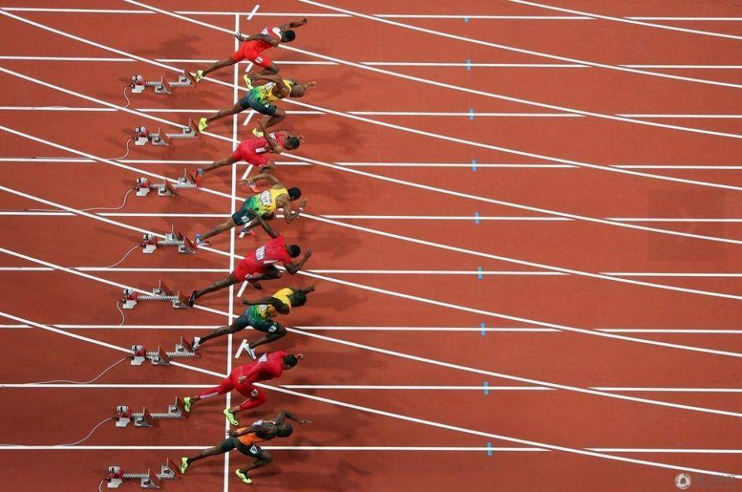

闭锁是一种同步工具类，可以延迟线程的进度直到其到达终止状态。

CountDownLatch是一种灵活的闭锁实现，它可以使一个或者多个线程等待一组事件的发生。

闭锁状态包含一个计数器，该计数器被初始化为一个正数，表示需要等待的事件数量。countDown方法递减计数器，表示已经有一个事件已经发生了。而await方法等待计数器达到0，这表示所有需要等待的事件都已经发生。如果计数器的值非0，那么await会一直阻塞直到计数器为0，或者等待中的线程中断或者超时。
下面，我们以经典的运动员赛跑举例：



我们在这里设置了两个门，一个是开始门，一个是结束门。

* 开始门： 所有运动员处于准备状态，等待教练的枪声。这时候运动员为n个，枪响只需要一声，等待的这一声枪响到了，开始门也就打开了，所有运动员开始跑。
* 结束门： 教练等待所有运动员，当最后一个运动员也冲破底线，教练才能宣布所有人到达终点，这时候是教练等待n个运动员，直到n为0。

下面我们根据具体的代码来演示CountDownLatch的用法：

```
package concurrency;

import java.util.Random;
import java.util.concurrent.CountDownLatch;
import java.util.concurrent.ExecutorService;
import java.util.concurrent.Executors;
import java.util.concurrent.TimeUnit;

// 运动员
class Runner implements Runnable {
    private static int counter = 0;
    private final int id = counter++;
    private static Random rand= new Random(47);// 每个运动员跑完的时间(随机)
    private final CountDownLatch start_latch;// 开始跑计数器
    private final CountDownLatch end_latch;// 所有运动员跑完计数器

	 // 两个CountDownLatch传进来
    public Runner(CountDownLatch start_latch, CountDownLatch end_latch) {
        this.start_latch = start_latch;
        this.end_latch = end_latch;
    }

    @Override
    public void run() {
        try {
            start_latch.await();  //所有运动员都在准备状态中，等待教练释放开始门(即教练调用countDown到0)
            try {
                doWork();  //每个人跑步的时间不同(该线程内部同步)
                end_latch.countDow n();  //跑完后，告诉教练跑完了
            } catch (InterruptedException e) {
                System.out.println("Interrupted Runner" + id);
            }
        } catch (InterruptedException e) {
            System.out.println("Interrupted Runner" + id);
        }
    }

	 // 模拟跑步
    public void doWork() throws InterruptedException {
        TimeUnit.MILLISECONDS.sleep(rand.nextInt(2000));
        System.out.println(this + "completed");
    }

    @Override
    public String toString() {
        return String.format("%1$-3d", id);
    }
}

// 教练
class Coach implements Runnable {
    private final CountDownLatch start_latch;
    private final CountDownLatch end_latch;

	// 两个CountDownLatch传进来，跟Runner使用同一个
    public Coach(CountDownLatch start_latch, CountDownLatch end_latch) {
        this.start_latch = start_latch;
        this.end_latch = end_latch;
    }

    @Override
    public void run() {
        start_latch.countDown();  //教练释放了开始门，运动员们都开始跑(start_latch的count为1)
        System.out.println("Coach say: Ready!!!!  Go!!!!");
        try {
            end_latch.await();  //当结束门的count down减为0时，教练宣布所有人都跑完了。
            System.out.println("All runner passed the end point");
        } catch (InterruptedException ex) {
            System.out.println(this + " interrupted");
        }
    }
}

public class TestRunner {
    private static final int SIZE = 10;
    public static void main(String[] args) {
        ExecutorService exec = Executors.newCachedThreadPool();// 线程池
        
        CountDownLatch startGate = new CountDownLatch(1);// 运动员等待教练的开始跑的命令
        CountDownLatch endGate = new CountDownLatch(SIZE);// 教练等待所有的运动员到达终点
        // 启动所有的运动员线程
        for (int i = 0; i < SIZE; i++) {
            exec.execute(new Runner(startGate, endGate));// 所有的运动员线程都会阻塞，等待startGate的count=0
        }
        exec.execute(new Coach(startGate, endGate));// 启动教练线程，该线程执行到start_latch.countDown()后所有的运动员线程都会执行
        exec.shutdown();
    }
}

```
CountDownLatch强调的是一个线程（或多个）需要等待另外的n个线程干完某件事情之后才能继续执行。 上述例子，Coach线程是裁判，10个Runner是跑步的。运动员先准备，裁判喊跑，运动员才开始跑（这是第一次同步，对应startGate）。10个人谁跑到终点了，countdown一下，直到10个人全部到达，裁判喊停（这是第二次同步，对应endGate）。
最后运行结果如下：

```
Coach say: Ready!!!!  Go!!!!
7  completed
9  completed
5  completed
8  completed
2  completed
0  completed
6  completed
4  completed
1  completed
3  completed
All runner passed the end point

```


# 参考文献

- [Java并发工具类（闭锁CountDownLatch）](https://juejin.im/post/5a3267646fb9a0451d4180aa)