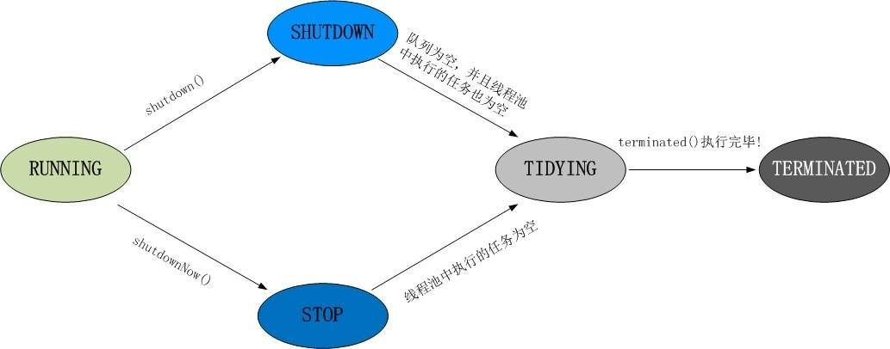
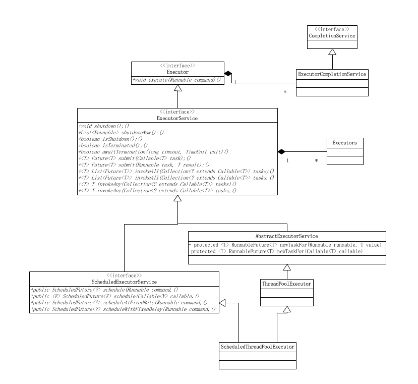
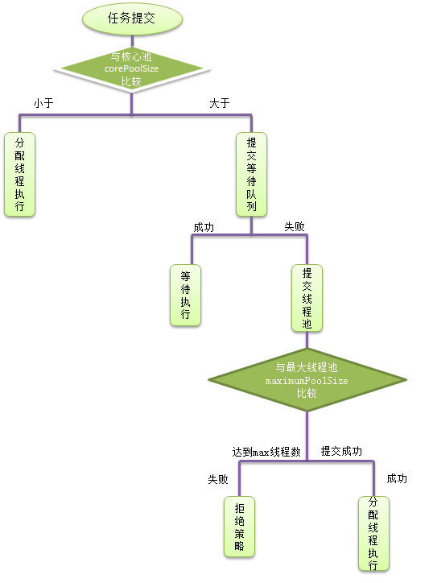

线程池状态图：


- RUNNING 自然是运行状态，指可以接受任务执行队列里的任务
- SHUTDOWN 指调用了 shutdown() 方法，不再接受新任务了，但是队列里的任务得执行完毕。
- STOP 指调用了 shutdownNow() 方法，不再接受新任务，同时抛弃阻塞队列里的所有任务并中断所有正在执行任务。
- TIDYING 所有任务都执行完毕，在调用 shutdown()/shutdownNow() 中都会尝试更新为这个状态。
- TERMINATED 终止状态，当执行 terminated() 后会更新为这个状态。

# 线程池

todo 

## 优点

- 重用线程池中的线程，避免因为线程的创建和销毁带来的性能开销。
- 有效控制线程的最大并发数，避免因大量的线程之间互相抢占系统资源而导致的阻塞 。
- 能够对线程进行简单的管理，并提供定时执行和执行循环间隔执行等功能


# 线程池创建

线程池可以通过ThreadPoolExecutor来创建，我们来看一下它的构造函数：


```
public ThreadPoolExecutor(int corePoolSize, int maximumPoolSize,long keepAliveTime,TimeUnit unit,
   BlockingQueue<Runnable> workQueue,
   ThreadFactory threadFactory,
   RejectedExecutionHandler handler) 

```

几个核心参数的作用：

- corePoolSize： 线程池核心线程数最大值
- maximumPoolSize： 线程池最大线程数大小
- keepAliveTime： 线程池中非核心线程空闲的存活时间大小
- unit： 线程空闲存活时间单位
- workQueue： 存放任务的阻塞队列
- threadFactory： 用于设置创建线程的工厂，可以给创建的线程设置有意义的名字，可方便排查问题。
handler：  线程池的饱和策略事件，主要有四种类型。

# 线程池实现原理

## 执行流程

- 提交一个任务，线程池里存活的核心线程数小于线程数corePoolSize时，线程池会创建一个核心线程去处理提交的任务。
- 如果线程池核心线程数已满，即线程数已经等于corePoolSize，一个新提交的任务，会被放进任务队列workQueue排队等待执行。
- 当线程池里面存活的线程数已经等于corePoolSize了,并且任务队列workQueue也满，判断线程数是否达到maximumPoolSize，即最大线程数是否已满，如果没到达，创建一个非核心线程执行提交的任务。
- 如果当前的线程数达到了maximumPoolSize，还有新的任务过来的话，直接采用拒绝策略处理。

## 四种拒绝策略

- AbortPolicy(抛出一个异常，默认的)
- DiscardPolicy(直接丢弃任务)
- DiscardOldestPolicy（丢弃队列里最老的任务，将当前这个任务继续提交给线程池）
- CallerRunsPolicy（交给线程池调用所在的线程进行处理)


# 线程池api

Excutor框架图如下:


- 接口：Executor,CompletionService,ExecutorService，ScheduledExecutorService

- 抽象类：AbstractExecutorService

- 实现类：ExecutorCompletionService，ThreadPoolExecutor，ScheduledThreadPoolExecutor


## Executors

为了能够适应不同的场景，`ThreadPoolExecutor`提供了可调参数和可扩展的钩子（hook）。虽然ThreadPoolExecutor灵活方便，但是强烈建议程序员使用Executors类的以下几个工厂方法，基本能满足大部分场景（但是阿里巴巴的手册强烈建议使用手动的ThreadPoolExecutor）：

- Executors.newCachedThreadPool()，无界的线程池，自动回收线程。[无限线程池]
- Executors.newFixedThreadPool(int)，固定大小的线程池。
- Executors.newSingleThreadExecutor()，单个后台线程池。

## ThreadPoolExecutor(class)

```
class ThreadPoolExecutor extends AbstractExecutorService 

abstract class AbstractExecutorService implements ExecutorService
```

```
ThreadPoolExecutor(int corePoolSize, int maximumPoolSize, long keepAliveTime, TimeUnit unit, BlockingQueue<Runnable> workQueue, RejectedExecutionHandler handler) 

```
- corePoolSize 为线程池的基本大小。

  当有任务过来的时候才会去创建创建线程执行任务。换个说法，线程池创建之后，线程池中的线程数为0，当任务过来就会创建一个线程去执行，直到线程数达到corePoolSize 之后，就会被到达的任务放在队列中。（注意是到达的任务）。换句更精炼的话：`corePoolSize 表示允许线程池中允许同时运行的最大线程数`。

- maximumPoolSize 为线程池最大线程大小。

  线程池允许的最大线程数，他表示最大能创建多少个线程。maximumPoolSize肯定是大于等于corePoolSize。
- keepAliveTime 和 unit 则是线程空闲后的存活时间。

  表示线程没有任务时最多保持多久然后停止。默认情况下，只有线程池中线程数大于corePoolSize 时，keepAliveTime 才会起作用。换句话说，当线程池中的线程数大于corePoolSize，并且一个线程空闲时间达到了keepAliveTime，那么就是shutdown。
- workQueue 用于存放任务的阻塞队列。

  一个阻塞队列，用来存储等待执行的任务，当线程池中的线程数超过它的corePoolSize的时候，线程会进入阻塞队列进行阻塞等待。通过workQueue，线程池实现了阻塞功能
- handler 当队列和最大线程池都满了之后的饱和策略。

> 任务缓存队列 interface BlockingQueue<E>

在前面我们多次提到了任务缓存队列，即workQueue，它用来存放等待执行的任务。

workQueue的类型为BlockingQueue<Runnable>，通常可以取下面三种类型：

1）有界任务队列`ArrayBlockingQueue`：基于数组的先进先出队列，此队列创建时必须指定大小；

2）无界任务队列`LinkedBlockingQueue`：基于链表的先进先出队列，如果创建时没有指定此队列大小，则默认为Integer.MAX_VALUE；

3）直接提交队列`synchronousQueue`：这个队列比较特殊，它不会保存提交的任务，而是将直接新建一个线程来执行新来的任务。

> 拒绝策略  interface RejectedExecutionHandler

- AbortPolicy:丢弃任务并抛出RejectedExecutionException

- CallerRunsPolicy：只要线程池未关闭，该策略直接在调用者线程中，运行当前被丢弃的任务。显然这样做不会真的丢弃任务，但是，任务提交线程的性能极有可能会急剧下降。

- DiscardOldestPolicy：丢弃队列中最老的一个请求，也就是即将被执行的一个任务，并尝试再次提交当前任务。

- DiscardPolicy：丢弃任务，不做任何处理。

> 线程池的任务处理策略：

- 如果当前线程池中的线程数目小于corePoolSize，则每来一个任务，就会创建一个线程去执行这个任务；

- 如果当前线程池中的线程数目>=corePoolSize，则每来一个任务，会尝试将其添加到任务缓存队列当中，若添加成功，则该任务会等待空闲线程将其取出去执行；若添加失败（一般来说是任务缓存队列已满），则会尝试创建新的线程去执行这个任务；如果当前线程池中的线程数目达到maximumPoolSize，则会采取任务拒绝策略进行处理；

- 如果线程池中的线程数量大于 corePoolSize时，如果某线程空闲时间超过keepAliveTime，线程将被终止，直至线程池中的线程数目不大于corePoolSize；如果允许为核心池中的线程设置存活时间，那么核心池中的线程空闲时间超过keepAliveTime，线程也会被终止。

> 线程池的关闭

ThreadPoolExecutor提供了两个方法，用于线程池的关闭，分别是shutdown()和shutdownNow()，其中：

- shutdown()：不会立即终止线程池，而是要等所有任务缓存队列中的任务都执行完后才终止，但再也不会接受新的任务

- shutdownNow()：立即终止线程池，并尝试打断正在执行的任务，并且清空任务缓存队列，返回尚未执行的任务


# 源码分析
todo 

线程池流程图


# 常见的四种线程池

todo 

## 1.newCachedThreadPool
- Executors.newCachedThreadPool()，无界的线程池，自动回收线程。

```
    public static ExecutorService newCachedThreadPool() {
        return new ThreadPoolExecutor(0, Integer.MAX_VALUE,
                                      60L, TimeUnit.SECONDS,
                                      new SynchronousQueue<Runnable>());
    }

实际上还是利用 ThreadPoolExecutor 类实现的。

    public static ExecutorService newCachedThreadPool(ThreadFactory var0) {
        return new ThreadPoolExecutor(0, 2147483647, 60L, TimeUnit.SECONDS, new SynchronousQueue(), var0);
    }

```
缓存线程池，缓存的线程默认存活60秒。线程的核心池corePoolSize大小为0，核心池最大为Integer.MAX_VALUE,阻塞队列使用的是SynchronousQueue。是一个直接提交的阻塞队列，    他总会迫使线程池增加新的线程去执行新的任务。在没有任务执行时，当线程的空闲时间超过keepAliveTime（60秒），则工作线程将会终止被回收，当提交新任务时，如果没有空闲线程，则创建新线程执行任务，会导致一定的系统开销。如果同时又大量任务被提交，而且任务执行的时间不是特别快，那么线程池便会新增出等量的线程池处理任务，这很可能会很快耗尽系统的资源。


## 2.newFixedThreadPool
- Executors.newFixedThreadPool(int)，固定大小的线程池。

```
public static ExecutorService newFixedThreadPool(int var0) {
        return new ThreadPoolExecutor(var0, var0, 0L, TimeUnit.MILLISECONDS, new LinkedBlockingQueue());
    }

public static ExecutorService newFixedThreadPool(int var0, ThreadFactory var1) {
    return new ThreadPoolExecutor(var0, var0, 0L, TimeUnit.MILLISECONDS, new LinkedBlockingQueue(), var1);
}
```
固定大小的线程池，可以指定线程池的大小，该线程池`corePoolSize和maximumPoolSize相等`，阻塞队列使用的是`LinkedBlockingQueue`，大小为整数最大值。

该线程池中的线程`数量始终不变`，当有新任务提交时，线程池中有空闲线程则会立即执行，如果没有，则会暂存到阻塞队列。对于固定大小的线程池，不存在线程数量的变化。同时使用无界的LinkedBlockingQueue来存放执行的任务。当任务提交十分频繁的时候，LinkedBlockingQueue

迅速增大，存在着耗尽系统资源的问题。而且在线程池空闲时，即线程池中没有可运行任务时，它也不会释放工作线程，还会占用一定的系统资源，需要shutdown。


## 3.newSingleThreadExecutor
- Executors.newSingleThreadExecutor()，单个后台线程池。

```
public static ExecutorService newSingleThreadExecutor() {
        return new Executors.FinalizableDelegatedExecutorService(new ThreadPoolExecutor(1, 1, 0L, TimeUnit.MILLISECONDS, new LinkedBlockingQueue()));
    }

    public static ExecutorService newSingleThreadExecutor(ThreadFactory var0) {
        return new Executors.FinalizableDelegatedExecutorService(new ThreadPoolExecutor(1, 1, 0L, TimeUnit.MILLISECONDS, new LinkedBlockingQueue(), var0));
    }
```

单个线程线程池，只有一个线程的线程池，阻塞队列使用的是LinkedBlockingQueue,若有多余的任务提交到线程池中，则会被暂存到阻塞队列，待空闲时再去执行。按照先入先出的顺序执行任务。

## 4.newScheduledThreadPool
```
public static ScheduledExecutorService newScheduledThreadPool(int var0) {
        return new ScheduledThreadPoolExecutor(var0);
    }

    public static ScheduledExecutorService newScheduledThreadPool(int var0, ThreadFactory var1) {
        return new ScheduledThreadPoolExecutor(var0, var1);
    }
```
定时线程池，该线程池可用于周期性地去执行任务，通常用于周期性的同步数据。

- scheduleAtFixedRate:是以固定的频率去执行任务，周期是指每次执行任务成功执行之间的间隔。

- schedultWithFixedDelay:是以固定的延时去执行任务，延时是指上一次执行成功之后和下一次开始执行的之前的时间。

# 使用示例

## newFixedThreadPool实例：


```
public class FixPoolDemo {

    private static Runnable getThread(final int i) {
        return new Runnable() {
            @Override
            public void run() {
                try {
                    Thread.sleep(500);
                } catch (InterruptedException e) {
                    e.printStackTrace();
                }
                System.out.println(i);
            }
        };
    }

    public static void main(String args[]) {
        ExecutorService fixPool = Executors.newFixedThreadPool(5);
        for (int i = 0; i < 10; i++) {
            fixPool.execute(getThread(i));
        }
        fixPool.shutdown();
    }
}
```

# 参考文献
- [由浅入深理解Java线程池及线程池的如何使用](https://www.cnblogs.com/superfj/p/7544971.html)
- [线程和线程池](https://juejin.im/post/58cb7cf72f301e007e3e06b0#heading-4)
- [面试必备：Java线程池解析](https://juejin.im/post/5d1882b1f265da1ba84aa676)
