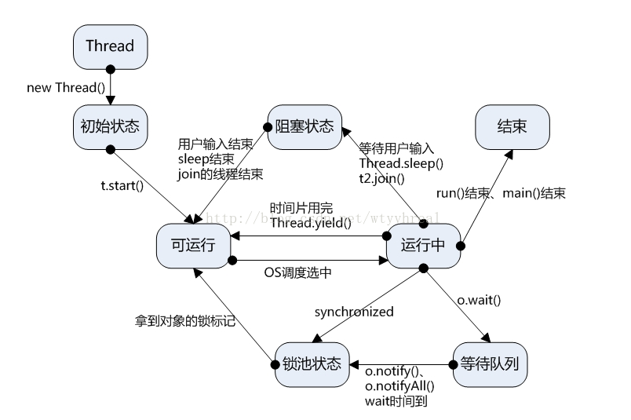

# 创建线程

todo 

# 线程状态转换

- 当一个线程执行了start方法后，不代表这个线程就会立即被执行，只代表这个线程处于可运行的状态，最终由OS的线程调度来决定哪个可运行状态下的线程被执行。
- 一个线程一次被选中执行是有时间限制的，这个时间段叫做CPU的时间片，当时间片用完但线程还没有结束时，这个线程又会变为可运行状态，等待OS的再次调度；在运行的线程里执行Thread.yeild()方法同样可以使当前线程变为可运行状态。
- 在一个运行中的线程等待用户输入、调用Thread.sleep()、调用了其他线程的join()方法，则当前线程变为阻塞状态。
- 阻塞状态的线程用户输入完毕、sleep时间到、join的线程结束，则当前线程由阻塞状态变为可运行状态。
- 运行中的线程调用wait方法，此线程进入等待队列。
- 运行中的线程遇到synchronized同时没有拿到对象的锁标记、等待队列的线程wait时间到、等待队列的- 线程被notify方法唤醒、有其他线程调用notifyAll方法，则线程变成锁池状态。
- 锁池状态的线程获得对象锁标记，则线程变成可运行状态。
- 运行中的线程run方法执行完毕或main线程结束，则线程运行结束。

# 线程操作

## yield()方法
Thread.yield()方法作用是：暂停当前正在执行的线程对象，并执行其他线程。yield()应该做的是让当前运行线程回到可运行状态，以允许具有相同优先级的其他线程获得运行机会。因此，使用yield()的目的是让相同优先级的线程之间能适当的轮转执行。但是，实际中无法保证yield()达到让步目的，因为让步的线程还有可能被线程调度程序再次选中。

结论：yield()从未导致线程转到等待/睡眠/阻塞状态。在大多数情况下，yield()将导致线程从运行状态转到可运行状态，但有可能没有效果。

## join()方法
保证当前线程停止执行，直到该线程所加入的线程完成为止，当前线程方可继续执行。然而，如果它加入的线程没有存活，则当前线程不需要停止。

# 参考文献

- [线程的状态转换以及基本操作](https://juejin.im/post/5ae6cf7a518825670960fcc2)
- [JAVA多线程及线程状态转换](https://www.cnblogs.com/nwnu-daizh/p/8036156.html)