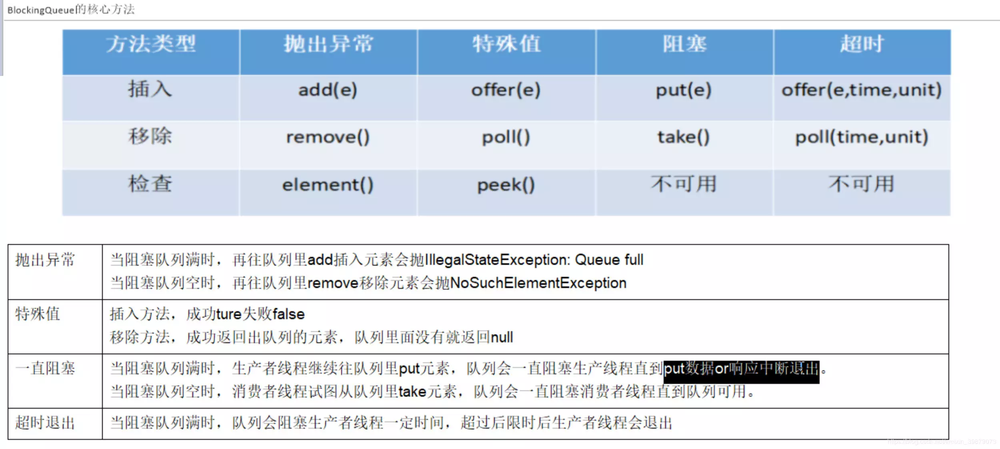
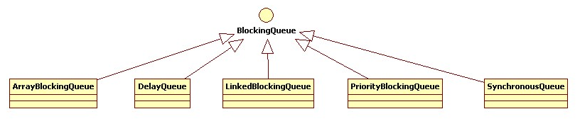

阻塞队列（BlockingQueue）是一个支持两个附加操作的队列。

两个附加的操作。

- 支持阻塞的 插入 方法，在队列为空时，获取元素的线程会等待队列变为非空。
- 支持阻塞的 移除 方法，当队列满时，存储元素的线程会等待队列可用。

阻塞队列常用于生产者和消费者的场景，生产者是往队列里添加元素的线程，消费者是从队列里拿元素的线程。

阻塞队列就是生产者存放元素的容器，而消费者也只从容器里拿元素。

BlockingQueue 是一个继承自 Queue 的接口，在 Queue 的队列基础上增加了阻塞操作。


# 阻塞队列方法



# 阻塞队列分类


JDK7 提供了 7 个阻塞队列。分别是

* **ArrayBlockingQueue** ：一个由数组结构组成的有界阻塞队列。
* **LinkedBlockingQueue** ：一个由链表结构组成的有界阻塞队列。
* **PriorityBlockingQueue** ：一个支持优先级排序的无界阻塞队列。
* DelayQueue：一个使用优先级队列实现的无界阻塞队列。
* **SynchronousQueue**：一个不存储元素的阻塞队列。
* LinkedTransferQueue：一个由链表结构组成的无界阻塞队列。
* LinkedBlockingDeque：一个由链表结构组成的双向阻塞队列。

## ArrayBlockingQueue

ArrayBlockingQueue 是一个用 数组 实现的 有界 阻塞队列。

此队列按照先进先出（FIFO）的原则对元素进行排序。

在创建对象时必须指定容量大小。

默认情况下不保证访问者公平的访问队列，所谓公平访问队列是指阻塞的所有生产者线程或消费者线程，当队列可用时，可以按照阻塞的先后顺序访问队列，即先阻塞的生产者线程，可以先往队列里插入元素，先阻塞的消费者线程，可以先从队列里获取元素。通常情况下为了保证公平性会降低吞吐量。

在创建 ArrayBlockingQueue 时，可以设置对象的内部锁是否采用公平锁，默认采用 非公平锁。

公平的阻塞队列，使用了 重入锁（ReentrantLock） 实现。

```
ArrayBlockingQueue fairQueue = new  ArrayBlockingQueue(1000,true);
......
public ArrayBlockingQueue(int capacity, boolean fair) {
        if (capacity <= 0)
            throw new IllegalArgumentException();
        this.items = new Object[capacity];
        lock = new ReentrantLock(fair);
        notEmpty = lock.newCondition();
        notFull =  lock.newCondition();
}
```

在 ArrayBlockingQueue 内部，维护了一个 定长数组（items），以便缓存队列中的数据对象，在生产者放入数据和消费者获取数据，都是共用同一个锁对象（lock），在插入或删除元素时不会产生或销毁任何额外的对象实例。

## LinkedBlockingQueue

LinkedBlockingQueue 是一个用 链表 实现的 有界 阻塞队列。

- 此队列的默认和最大长度为 Integer.MAX_VALUE。
- 此队列按照先进先出的原则对元素进行排序。
- 创建对象时如果不指定容量大小，则使用默认大小。

```
public LinkedBlockingQueue(int capacity) {
        if (capacity <= 0) throw new IllegalArgumentException();
        this.capacity = capacity;
        last = head = new Node<E>(null);
}
```

- 同 ArrayListBlockingQueue 类似，其内部也维持着一个数据缓冲队列（该队列 由一个链表构成）
当生产者往队列中放入一个数据时，队列会从生产者手中获取数据，并缓存在队列内部，而生产者立即返回。
- 只有当队列缓冲区达到最大值缓存容量时（LinkedBlockingQueue 可以通过构造函数指定该值），才会阻塞生产者队列，直到消费者从队列中消费掉一份数据，生产者线程会被唤醒，反之对于消费者这端的处理也基于同样的原理。
- LinkedBlockingQueue 之所以能够高效的处理并发数据，还因为其对于生产者端和消费者端分别采用了独立的锁来控制数据同步，这也意味着在高并发的情况下生产者和消费者可以并行地操作队列中的数据，以此来提高整个队列的并发性能。
- 值得注意的是，如果构造一个 LinkedBlockingQueue 对象，而没有指定其容量大小，LinkedBlockingQueue 会默认一个类似无限大小的容量（Integer.MAX_VALUE），这样的话，如果生产者的速度一旦大于消费者的速度，也许还没有等到队列满阻塞产生，系统内存就有可能已被消耗殆尽了。
- 在插入或删除元素时会生成一个额外的 Node 对象。

## PriorityBlockingQueue

PriorityBlockingQueue 是基于 优先级 的阻塞队列（优先级的判断通过构造函数传入的 Compator 对象决定），需要注意的是 PriorityBlockingQueue 并 不会阻塞数据生产者，而只会在没有可消费的数据时，阻塞数据的消费者。

- 因此使用的时候要特别注意，生产者生产数据的速度绝对不能快于消费者消费数据的速度，否则时间一长，会最终耗尽所有的可用堆内存空间。

- 在实现 PriorityBlockingQueue 时，内部控制线程同步的锁采用的是 公平锁。

```
public PriorityBlockingQueue(int initialCapacity,
                                 Comparator<? super E> comparator) {
        if (initialCapacity < 1)
            throw new IllegalArgumentException();
        this.lock = new ReentrantLock();
        this.notEmpty = lock.newCondition();
        this.comparator = comparator;
        this.queue = new Object[initialCapacity];
}
```

## SynchronousQueue

- SynchronousQueue 是一种 无缓冲 的等待队列，类似于无中介的直接交易，有点像原始社会中的生产者和消费者，生产者拿着产品去集市销售给产品的最终消费者，而消费者必须亲自去集市找到所要商品的直接生产者，如果一方没有找到合适的目标，那么都在集市等待。

    - 相对于有缓冲的 BlockingQueue 来说，少了一个中间经销商的环节（缓冲区），如果有经销商，生产者直接把产品批发给经销商，而无需在意经销商最终会将这些产品卖给那些消费者，由于经销商可以库存一部分商品，因此相对于直接交易模式，总体来说采用中间经销商的模式会吞吐量高一些（可以批量买卖）。

    - 但另一方面，又因为经销商的引入，使得产品从生产者到消费者中间增加了额外的交易环节，单个产品的及时响应性能可能会降低。

- 声明一个 SynchronousQueue 有两种不同的方式，它们之间有着不太一样的行为。

    - 如果采用公平模式，SynchronousQueue 会采用公平锁，并配合一个 FIFO 队列来阻塞多余的生产者和消费者，从而体现整体的公平策略。
    - 如果是非公平模式（SynchronousQueue 默认），SynchronousQueue 采用非公平锁，同时配合一个 LIFO 队列来管理多余的生产者和消费者，而后一种模式，如果生产者和消费者的处理速度有差距，则很容易出现饥渴的情况，即可能有某些生产者或者是消费者的数据永远都得不到处理。
- SynchronousQueue 非常适合于传递性场景，比如在一个线程中使用的数据，传递给另外一个线程使用，SynchronousQueue 的吞吐量高于 LinkedBlockingQueue 和 ArrayBlockingQueue。


# 阻塞队列的实现原理

## ArrayBlockingQueue

ArrayBlockingQueue 使用可重入锁 ReentrantLock 实现的访问公平性，两个 Condition 保证了添加和获取元素的并发控制。

```
public class ArrayBlockingQueue<E> extends AbstractQueue<E>
        implements BlockingQueue<E>, java.io.Serializable {

    //使用数组保存的元素
    final Object[] items;
    //下一次取元素的索引
    int takeIndex;
    //下一次添加元素的索引
    int putIndex;
    //当前队列中元素的个数
    int count;

    /*
     * Concurrency control uses the classic two-condition algorithm
     * found in any textbook.
     */

    //全部操作的锁
    final ReentrantLock lock;
    //等待获取元素的锁
    private final Condition notEmpty;
    //等待添加元素的锁
    private final Condition notFull;
    //...
}
```

todo 参考 [【Java 并发笔记】7 种阻塞队列相关整理](https://www.jianshu.com/p/f4eefb069e27)

# 参考文献

- [阻塞队列的理解和使用](https://www.jianshu.com/p/4df275facc15)
- [BlockingQueue（阻塞队列）详解](https://www.cnblogs.com/aspirant/p/8657801.html)
- [【Java 并发笔记】7 种阻塞队列相关整理](https://www.jianshu.com/p/f4eefb069e27)