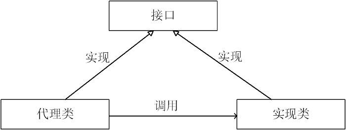

# 一、SpringAOP原理
##1.1AOP编程技术

###1.1.1什么是AOP编程

AOP: Aspect Oriented Programming 面向切面编程。

面向切面编程(也叫面向方面)：Aspect Oriented Programming(AOP),是目前软件开发中的一个热点。利用AOP可以对业务逻辑的各个部分进行隔离，从而使得业务逻辑各部分之间的耦合度降低，提高程序的可重用性，同时提高了开发的效率。
　　
AOP是OOP的延续，是（Aspect Oriented Programming）的缩写，意思是面向切面（方面）编程。
　　
主要的功能是：日志记录，性能统计，安全控制，事务处理，异常处理等等。

主要的意图是：将日志记录，性能统计，安全控制，事务处理，异常处理等代码从业务逻辑代码中划分出来，通过对这些行为的分离，我们希望可以将它们独立到非指导业务逻辑的方法中，进而改  变这些行为的时候不影响业务逻辑的代码。
	
可以通过预编译方式和运行期动态代理实现在不修改源代码的情况下给程序动态统一添加功能的一种技术。AOP实际是GoF设计模式的延续，设计模式孜孜不倦追求的是调用者和被调用者之间的解耦，AOP可以说也是这种目标的一种实现。
假设把应用程序想成一个立体结构的话，OOP的利刃是纵向切入系统，把系统划分为很多个模块（如：用户模块，文章模块等等），而AOP的利刃是横向切入系统，提取各个模块可能都要重复操作的部分（如：权限检查，日志记录等等）。由此可见，AOP是OOP的一个有效补充。
注意：AOP不是一种技术，实际上是编程思想。凡是符合AOP思想的技术，都可以看成是AOP的实现。
	
Aop，  aspect object programming  面向切面编程

功能： 让关注点代码与业务代码分离！


相关概念

- 关注点

	关注点,重复代码就叫做关注点；
- 切面

	 关注点形成的类，就叫切面(类)！
	 面向切面编程，就是指 对很多功能都有的重复的代码抽取，再在运行的时候网业务方法上动态植入“切面类代码”。
- 切入点

	执行目标对象方法，动态植入切面代码。
	可以通过切入点表达式，指定拦截哪些类的哪些方法； 给指定的类在运行的时候植入切面类代码。
	
## 1.2AOP底层实现原理
 
### 1.2.1代理设计模式

#### 什么是代理模式

通过代理控制对象的访问,可以详细访问某个对象的方法，在这个方法调用处理，或调用后处理。既(AOP微实现)  ,AOP核心技术面向切面编程。
	
	



#### 代理模式应用场景
SpringAOP、事物原理、日志打印、权限控制、远程调用、安全代理 可以隐蔽真实角色
#### 代理的分类

- 静态代理(静态定义代理类)

- 动态代理(动态生成代理类)

- Jdk自带动态代理

- Cglib 、javaassist（字节码操作库）

#### 静态代理
##### 什么是静态代理
由程序员创建或工具生成代理类的源码，再编译代理类。所谓静态也就是在程序运行前就已经存在代理类的字节码文件，代理类和委托类的关系在运行前就确定了。

##### 静态代理代码

```
public interface IUserDao {
	void save();
}
public class UserDao implements IUserDao {
	public void save() {
		System.out.println("已经保存数据...");
	}
}
代理类
public class UserDaoProxy implements IUserDao {
	private IUserDao target;

	public UserDaoProxy(IUserDao iuserDao) {
		this.target = iuserDao;
	}

	public void save() {
		System.out.println("开启事物...");
		target.save();
		System.out.println("关闭事物...");
	}

}
```
#### 动态代理
##### 什么是动态代理

1. 代理对象,不需要实现接口
2. 代理对象的生成,是利用JDK的API,动态的在内存中构建代理对象(需要我们指定创建代理对象/目标对象实现的接口的类型)
3. 动态代理也叫做:JDK代理,`接口代理`

##### JDK动态代理
1)原理：是根据类加载器和接口创建代理类（此代理类是接口的实现类，所以必须使用接口 面向接口生成代理，位于java.lang.reflect包下） 
2)实现方式： 

1. 通过实现InvocationHandler接口创建自己的调用处理器 IvocationHandler handler = new InvocationHandlerImpl(…); 
2. 通过为Proxy类指定ClassLoader对象和一组interface创建动态代理类Class clazz = Proxy.getProxyClass(classLoader,new Class[]{…}); 
3. 通过反射机制获取动态代理类的构造函数，其参数类型是调用处理器接口类型Constructor constructor = clazz.getConstructor(new Class[]{InvocationHandler.class}); 
4. 通过构造函数创建代理类实例，此时需将调用处理器对象作为参数被传入Interface Proxy = (Interface)constructor.newInstance(new Object[] (handler));
缺点：jdk动态代理，必须是面向接口，目标业务类必须实现接口

```
// 每次生成动态代理类对象时,实现了InvocationHandler接口的调用处理器对象 
public class InvocationHandlerImpl implements InvocationHandler {
	private Object target;// 这其实业务实现类对象，用来调用具体的业务方法
	// 通过构造函数传入目标对象
	public InvocationHandlerImpl(Object target) {
		this.target = target;
	}

	public Object invoke(Object proxy, Method method, Object[] args) throws Throwable {
		Object result = null;
		System.out.println("调用开始处理");
		result = method.invoke(target, args);
		System.out.println("调用结束处理");
		return result;
	}

	public static void main(String[] args) throws NoSuchMethodException, SecurityException, InstantiationException,
			IllegalAccessException, IllegalArgumentException, InvocationTargetException {
		// 被代理对象
		IUserDao userDao = new UserDao();
		InvocationHandlerImpl invocationHandlerImpl = new InvocationHandlerImpl(userDao);
		ClassLoader loader = userDao.getClass().getClassLoader();
		Class<?>[] interfaces = userDao.getClass().getInterfaces();
		// 主要装载器、一组接口及调用处理动态代理实例
		IUserDao newProxyInstance = (IUserDao) Proxy.newProxyInstance(loader, interfaces, invocationHandlerImpl);
		newProxyInstance.save();
	}

}
```

#### CGLIB动态代理
原理：利用`asm开源包`，对代理对象类的class文件加载进来，通过修改其字节码生成子类来处理。 
##### 什么是CGLIB动态代理
使用cglib[Code Generation Library]实现动态代理，`并不要求委托类必须实现接口`，底层采用asm字节码生成框架生成代理类的字节码
CGLIB动态代理相关代码

```
public class CglibProxy implements MethodInterceptor {
	private Object targetObject;
	// 这里的目标类型为Object，则可以接受任意一种参数作为被代理类，实现了动态代理
	public Object getInstance(Object target) {
		// 设置需要创建子类的类
		this.targetObject = target;
		Enhancer enhancer = new Enhancer();
		enhancer.setSuperclass(target.getClass());
		enhancer.setCallback(this);
		return enhancer.create();
	}

	public Object intercept(Object obj, Method method, Object[] args, MethodProxy proxy) throws Throwable {
		System.out.println("开启事物");
		Object result = proxy.invoke(targetObject, args);
		System.out.println("关闭事物");
		// 返回代理对象
		return result;
	}
	public static void main(String[] args) {
		CglibProxy cglibProxy = new CglibProxy();
		UserDao userDao = (UserDao) cglibProxy.getInstance(new UserDao());
		userDao.save();
	}
}
```

#### CGLIB动态代理与JDK动态区别
java动态代理是利用`反射机制`生成一个实现代理接口的匿名类，在调用具体方法前调用InvokeHandler来处理。
而cglib动态代理是利用asm开源包，对代理对象类的class文件加载进来，通过修改其字节码生成子类来处理。
Spring中。

1. 如果目标对象实现了接口，默认情况下会采用JDK的动态代理实现AOP 
2. 如果目标对象实现了接口，可以强制使用CGLIB实现AOP 
3. 如果目标对象没有实现了接口，必须采用CGLIB库，spring会自动在
JDK动态代理和CGLIB之间转换
4. `JDK动态代理只能对实现了接口`的类生成代理，而不能针对类 。
`CGLIB是针对类实现代理`，主要是对指定的类`生成一个子类`，覆盖其中的方法 。
因为是继承，所以该类或方法`最好不要声明成final` ，final可以阻止继承和多态。

### AOP编程使用

#### 注解版本实现AOP
```
<aop:aspectj-autoproxy></aop:aspectj-autoproxy>  开启事物注解权限

@Aspect							指定一个类为切面类		
@Pointcut("execution(* com.itmayiedu.service.UserService.add(..))")  指定切入点表达式
@Before("pointCut_()")				前置通知: 目标方法之前执行
@After("pointCut_()")				后置通知：目标方法之后执行（始终执行）
@AfterReturning("pointCut_()")		 返回后通知： 执行方法结束前执行(异常不执行)
@AfterThrowing("pointCut_()")			异常通知:  出现异常时候执行
@Around("pointCut_()")				环绕通知： 环绕目标方法执行

@Component
@Aspect
public class AopLog {

	// 前置通知
	@Before("execution(* com.itmayiedu.service.UserService.add(..))")
	public void begin() {
		System.out.println("前置通知");
	}

	//
	// 后置通知
	@After("execution(* com.itmayiedu.service.UserService.add(..))")
	public void commit() {
		System.out.println("后置通知");
	}

	// 运行通知
	@AfterReturning("execution(* com.itmayiedu.service.UserService.add(..))")
	public void returning() {
		System.out.println("运行通知");
	}

	// 异常通知
	@AfterThrowing("execution(* com.itmayiedu.service.UserService.add(..))")
	public void afterThrowing() {
		System.out.println("异常通知");
	}

	// 环绕通知
	@Around("execution(* com.itmayiedu.service.UserService.add(..))")
	public void around(ProceedingJoinPoint proceedingJoinPoint) throws Throwable {
		System.out.println("环绕通知开始");
		proceedingJoinPoint.proceed();
		System.out.println("环绕通知结束");
	}
}
```

#### XML方式实现AOP


```
Xml实现aop编程：
	1） 引入jar文件  【aop 相关jar， 4个】
	2） 引入aop名称空间
	3）aop 配置
		* 配置切面类 （重复执行代码形成的类）
		* aop配置
			拦截哪些方法 / 拦截到方法后应用通知代码
			
<beans xmlns="http://www.springframework.org/schema/beans"
	xmlns:xsi="http://www.w3.org/2001/XMLSchema-instance" xmlns:p="http://www.springframework.org/schema/p"
	xmlns:context="http://www.springframework.org/schema/context"
	xmlns:aop="http://www.springframework.org/schema/aop"
	xsi:schemaLocation="
        http://www.springframework.org/schema/beans
        http://www.springframework.org/schema/beans/spring-beans.xsd
        http://www.springframework.org/schema/context
        http://www.springframework.org/schema/context/spring-context.xsd
        http://www.springframework.org/schema/aop
        http://www.springframework.org/schema/aop/spring-aop.xsd">

	<!-- dao 实例 -->

	<bean id="userService" class="com.itmayiedu.service.UserService"></bean>
	<!-- 切面类 -->
	<bean id="aop" class="com.itmayiedu.aop2.AopLog2"></bean>
	<!-- Aop配置 -->
	<aop:config>
		<!-- 定义一个切入点表达式： 拦截哪些方法 -->
		<aop:pointcut expression="execution(* com.itmayiedu.service.UserService.*(..))"
			id="pt" />
		<!-- 切面 -->
		<aop:aspect ref="aop">
			<!-- 环绕通知 -->
			<aop:around method="around" pointcut-ref="pt" />
			<!-- 前置通知： 在目标方法调用前执行 -->
			<aop:before method="begin" pointcut-ref="pt" />
			<!-- 后置通知： -->
			<aop:after method="after" pointcut-ref="pt" />
			<!-- 返回后通知 -->
			<aop:after-returning method="afterReturning"
				pointcut-ref="pt" />
			<!-- 异常通知 -->
			<aop:after-throwing method="afterThrowing"
				pointcut-ref="pt" />
		</aop:aspect>
	</aop:config>

</beans>

public class AopLog2 {

	// 前置通知
	public void begin() {
		System.out.println("前置通知");
	}

	//
	// 后置通知
	public void commit() {
		System.out.println("后置通知");
	}

	// 运行通知
	public void returning() {
		System.out.println("运行通知");
	}

	// 异常通知
	public void afterThrowing() {
		System.out.println("异常通知");
	}

	// 环绕通知
	public void around(ProceedingJoinPoint proceedingJoinPoint) throws Throwable {
		System.out.println("环绕通知开始");
		proceedingJoinPoint.proceed();
		System.out.println("环绕通知结束");
	}
}
```


### AOP编程应用场景
日志记录，性能统计，安全控制，事务处理，异常处理
### Spring事务使用
#### 事务基本特性

1. 原子性（Atomicity）
	原子性是指事务包含的所有操作要么全部成功，要么全部失败回滚，因此事务的操作如果成功就必须要完全应用到数据库，如果操作失败则不能对数据库有任何影响。

2. 一致性（Consistency）
	一致性是指事务必须使数据库从一个一致性状态变换到另一个一致性状态，也就是说一个事务执行之前和执行之后都必须处于一致性状态。
　　拿转账来说，假设用户A和用户B两者的钱加起来一共是5000，那么不管A和B之间如何转账，转几次账，事务结束后两个用户的钱相加起来应该还得是5000，这就是事务的一致性。
3. 隔离性（Isolation）
	
	隔离性是当多个用户并发访问数据库时，比如操作同一张表时，数据库为每一个用户开启的事务，不能被其他事务的操作所干扰，多个并发事务之间要相互隔离。
　　即要达到这么一种效果：对于任意两个并发的事务T1和T2，在事务T1看来，T2要么在T1开始之前就已经结束，要么在T1结束之后才开始，这样每个事务都感觉不到有其他事务在并发地执行。
　　关于事务的隔离性数据库提供了多种隔离级别，稍后会介绍到。
4. 持久性（Durability）

	持久性是指一个事务一旦被提交了，那么对数据库中的数据的改变就是永久性的，即便是在数据库系统遇到故障的情况下也不会丢失提交事务的操作。
例如我们在使用JDBC操作数据库时，在提交事务方法后，提示用户事务操作完成，当我们程序执行完成直到看到提示后，就可以认定事务以及正确提交，即使这时候数据库出现了问题，也必须要将我们的事务完全执行完成，否则就会造成我们看到提示事务处理完毕，但是数据库因为故障而没有执行事务的重大错误。

### 事务控制分类

#### 编程式事务控制
自己手动控制事务，就叫做编程式事务控制。

```
Jdbc代码：
	Conn.setAutoCommite(false);  // 设置手动控制事务
Hibernate代码：
	Session.beginTransaction();    // 开启一个事务
```
	
【细粒度的事务控制： 可以对指定的方法、指定的方法的某几行添加事务控制】
	(比较灵活，但开发起来比较繁琐： 每次都要开启、提交、回滚.)

#### 声明式事务控制

Spring提供了对事务的管理, 这个就叫声明式事务管理。

Spring提供了对事务控制的实现。用户如果想用Spring的声明式事务管理，只需要在配置文件中配置即可； 不想使用时直接移除配置。这个实现了对事务控制的最大程度的解耦。
	
Spring声明式事务管理，核心实现就是基于Aop。
	
【粗粒度的事务控制： 只能给整个方法应用事务，不可以对方法的某几行应用事务。】
	(因为aop拦截的是方法。)

Spring声明式事务管理器类：

```
Jdbc技术：DataSourceTransactionManager
Hibernate技术：HibernateTransactionManager
```

# 参考文献
- [Spring AOP详细介绍](https://blog.csdn.net/JinXYan/article/details/89302126)