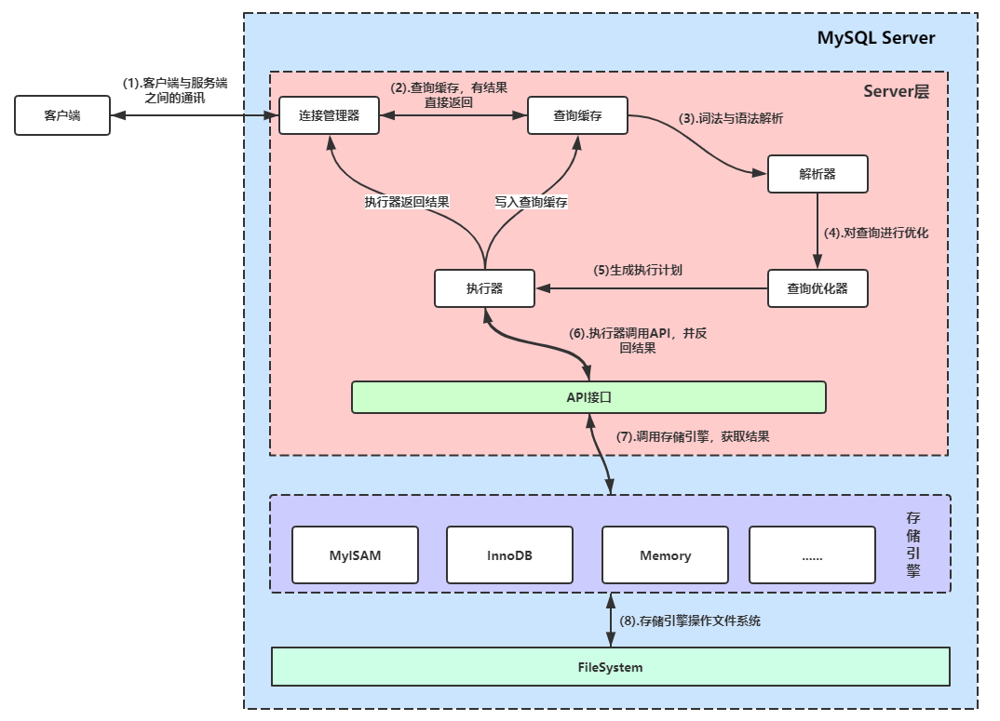

# MySQL架构


架构图



从上面的示意图可以看出来，MySQL的服务端大体上可以分为Server层和存储引擎层，而Server层分别为连接管理、解析与优化、查询优化器和执行器，而Server层与存储引擎之间的交互则通过统一的API进行调用，下面我们来详细了解MySQL Server的各个组件的功能与作用。


## 连接管理器
连接管理器的作用是管理和维持所有MySQL客户端的请求连接，当我们向MySQL发起请求时，连接管理器会负责创建连接并校验用户的权限。
对于已经建立的连接，如果没有太久没有发送请求，连接管理器会自动断开连接，我们可以通过设置变量wait_timeout决定多久断开不活跃的连接。

## 查询缓存
当我们与连接器建立连接后，如果我们执行的是SELECT语句，那么连接器会先从查询缓存中查询，看看之前是否执行过这条语句，如果没有再往走，如果有则判断相应的权限，符合权限，则直接返回结果。
查询缓存其实是把查询语句当作一个key，查询结果当用value，建立起来的key-value缓存结构。
不过，当数据表的数据发生变化时，其所对应的查询缓存则会失败，因此很多时候往往不能命中查询缓存，所以一般建议不要使用查询缓存。

```
mysql> select SQL_CACHE * from users where uid = 1000；

```
可能MySQL官方团队也意识到查询缓存的作用不大，在MySQL 8.0版本中已经将查询缓存的整块功能删掉了，所以如果你用的是MySQL 8.0的版本，查询缓存的功能就不存在了。

## 解析器
当在查询缓存中没有命令查询时，则需要真正执行语句，这时候就交给解析器先进行词法分析，对我们输入的语句进行拆解，折解后再进行语法分析，判断我们输入的语句是不是符合MySQL的语法规则，如果输入的语句不符合MySQL语法规则，则停止执行并提示错误。

## 查询优化器
我们输入的语句，经过分析器的词法和语法分析，MySQL服务器已经知道我们要查询什么了，不过，在开始查询前，还要交由查询优化器进行优化。
在优化的过程，优化器会根据SQL语句的查询条件决定使用哪一个索引，如果有连接(join)，会决定表的查询顺序，最终会根据优化的结果生成一个执行计划交由下面的执行器去执行。

## 执行器
SQL语句在经过查询优化器的优化后，接下来就交由执行器开始执行，不过执行器在开始执行前，会判断用户对相应的数据表是否有权限。
如果用户有权限，则开始调用数据，与其数据库不同的，MySQL的数据存储与调用交由存储实现，当我们调用时，执行器通过存储引擎API向底层的存储发送相应的指令，存储引擎负责具体执行，并将执行结果告诉执行器，然后再返回给客户端。

## 存储引擎
存储引擎，也叫做表类型，其具体作用便是决定一个数据表怎么处理和存储表中的数据，MySQL支持多种不同的存储引擎，而且存储引擎被设计为可插拔式的，在同一个数据库中，不同的数据表可以使用不同的存储引擎。
Innodb是MySQL的默认存储引擎，也是常用的存储引擎，另外比较常用的存储引擎还有MyISAM和Momery。

###  查询支持的存储引擎
在连接到MySQL服务端之后，我们可以使用下面的命令查询当前MySQL服务器支持的存储引擎：

```
mysql> show engines;
+--------------------+---------+----------------------------------------------------------------+--------------+------+------------+
| Engine             | Support | Comment                                                        | Transactions | XA   | Savepoints |
+--------------------+---------+----------------------------------------------------------------+--------------+------+------------+
| TokuDB             | YES     | Tokutek TokuDB Storage Engine with Fractal Tree(tm) Technology | YES          | YES  | YES        |
| MRG_MYISAM         | YES     | Collection of identical MyISAM tables                          | NO           | NO   | NO         |
| CSV                | YES     | CSV storage engine                                             | NO           | NO   | NO         |
| BLACKHOLE          | YES     | /dev/null storage engine (anything you write to it disappears) | NO           | NO   | NO         |
| SPHINX             | YES     | Sphinx storage engine 2.3.2-dev                                | NO           | NO   | NO         |
| MEMORY             | YES     | Hash based, stored in memory, useful for temporary tables      | NO           | NO   | NO         |
| ARCHIVE            | YES     | Archive storage engine                                         | NO           | NO   | NO         |
| MyISAM             | YES     | MyISAM storage engine                                          | NO           | NO   | NO         |
| PERFORMANCE_SCHEMA | YES     | Performance Schema                                             | NO           | NO   | NO         |
| InnoDB             | DEFAULT | Supports transactions, row-level locking, and foreign keys     | YES          | YES  | YES        |
| FEDERATED          | NO      | Federated MySQL storage engine                                 | NULL         | NULL | NULL       |
+--------------------+---------+----------------------------------------------------------------+--------------+------+------------+
11 rows in set (0.01 sec)

```
从上面的表格中，可以看出我本地的MySQL支持9种存储引擎，上面表格中，Engine列显示的是存储引擎的名称，Support列说明该引擎是否可用，DEFAULT则说明该引擎为默认引擎，Comment是该引擎的说明，Transactions列用于说明存储引擎是否支持事务，XA列说明该存储引擎是否支持分布事务，Savepoints列说明存储引擎是否支持部分事务回滚。


# 参考文献

- [重学MySQL系列(一)：谈谈MySQL架构](https://juejin.im/post/5d74f7db6fb9a06ae7642c2a)