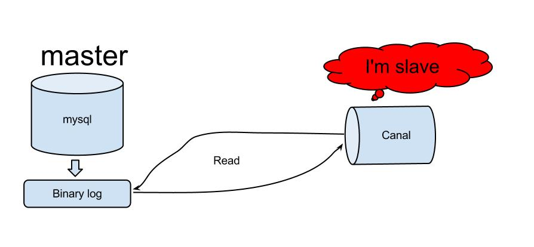
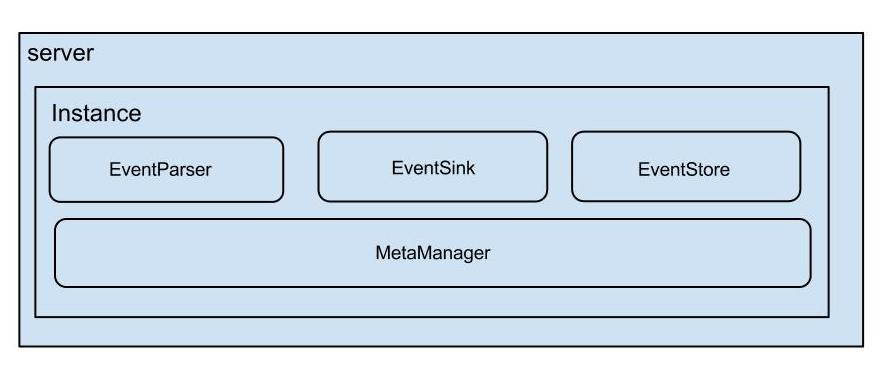

# 背景

   早期，阿里巴巴B2B公司因为存在杭州和美国双机房部署，存在跨机房同步的业务需求。不过早期的数据库同步业务，主要是基于trigger的方式获取增量变更，不过从2010年开始，阿里系公司开始逐步的尝试基于数据库的日志解析，获取增量变更进行同步，由此衍生出了增量订阅&消费的业务，从此开启了一段新纪元。ps. 目前内部使用的同步，已经支持mysql5.x和oracle部分版本的日志解析 

# binlog
简单点说：

- binlog是一个二进制格式的文件，用于记录用户对数据库更新的SQL语句信息，例如更改数据库表和更改内容的SQL语句都会记录到binlog里，但是对库表等内容的查询不会记录。
- mysql的binlog数据格式，按照生成的方式，主要分为：statement-based、row-based、mixed。
- 使用mysqlbinlog解析查看
一般来说开启二进制日志大概会有1%的性能损耗(参见MySQL官方中文手册 5.1.24版)。二进制有两个最重要的使用场景:
其一：MySQL Replication在Master端开启binlog，Mster把它的二进制日志传递给slaves来达到master-slave数据一致的目的。 （数据库的主从复制）
其二：自然就是数据恢复了，通过使用mysqlbinlog工具来使恢复数据。

# mysql主备复制原理

从上层来看，复制分成三步：

1. master将改变记录到二进制日志(binary log)中（这些记录叫做二进制日志事件，binary log events，可以通过show binlog events进行查看）；
2. slave将master的binary log events拷贝到它的中继日志(relay log)；
3. slave重做中继日志中的事件，将改变反映它自己的数据。

# canal的工作原理

原理相对比较简单：

1. canal模拟mysql slave的交互协议，伪装自己为mysql slave，向mysql master发送dump协议
2. mysql master收到dump请求，开始推送binary log给slave(也就是canal)
3. canal解析binary log对象(原始为byte流)

# canel架构

说明：

- server代表一个canal运行实例，对应于一个jvm
- instance对应于一个数据队列  （1个server对应1..n个instance)
instance模块：

- eventParser (数据源接入，模拟slave协议和master进行交互，协议解析)
- eventSink (Parser和Store链接器，进行数据过滤，加工，分发的工作)
- eventStore (数据存储)
- metaManager (增量订阅&消费信息管理器)

# 参考

- [binlog以及Canel](https://blog.csdn.net/github_38687585/article/details/80944824)
- [阿里巴巴开源项目: 基于mysql数据库binlog的增量订阅&消费](https://www.iteye.com/blog/agapple-1796633)
- [使用canal偷取MySQL的二进制日志](https://juejin.im/post/5b9a5967f265da0ae504fe6e#heading-1)
