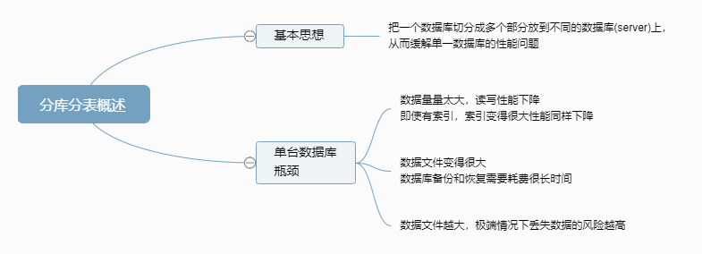
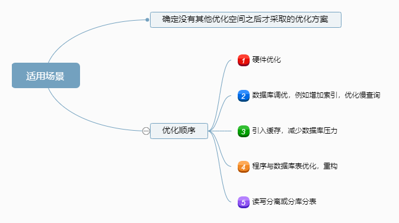
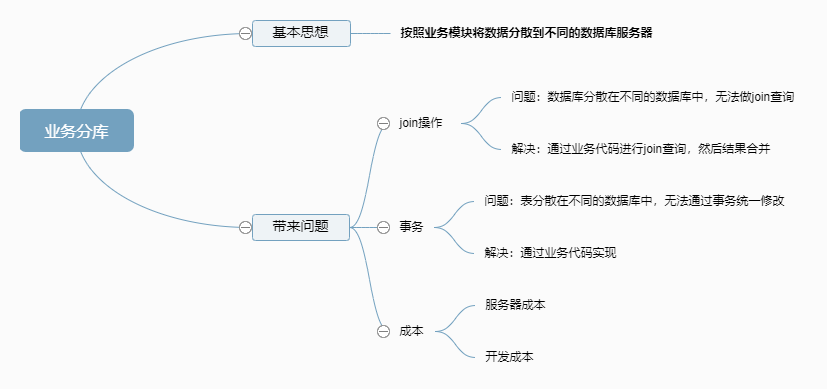
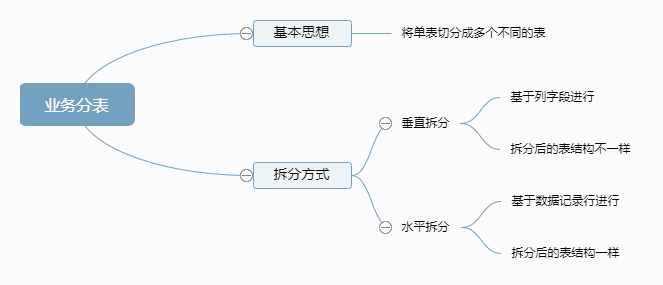
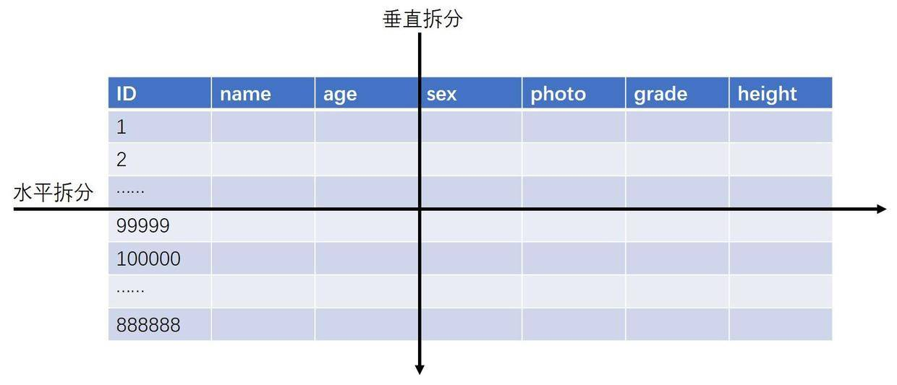
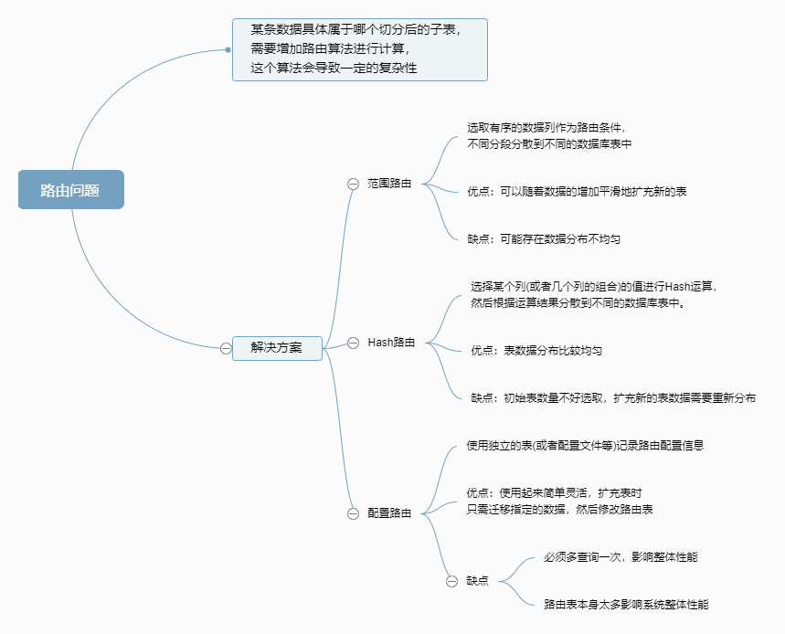
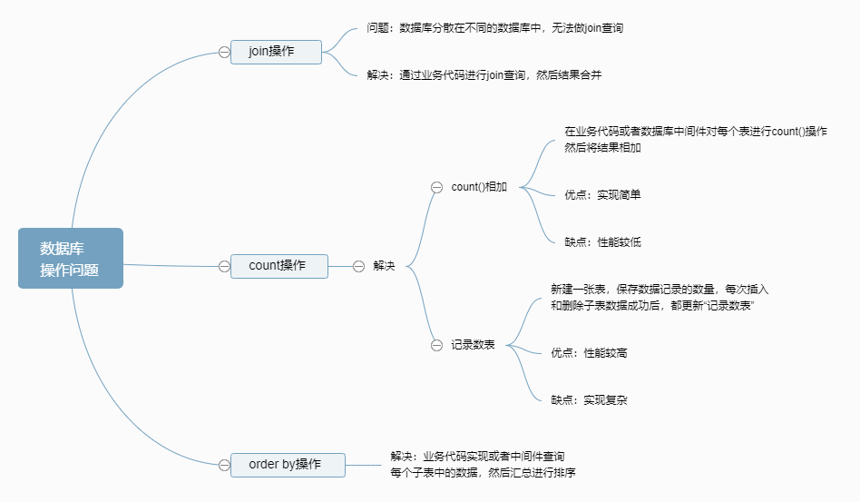

最近学习了阿里资深技术专家李运华的架构设计关于分库分表的教程，颇有收获，总结一下。

本文主要介绍高性能数据库集群分库分表相关理论，基本架构，涉及的复杂度问题以及常见解决方案。

# 分库分表概述

读写分离分散数据库读写操作压力，分库分表分散存储压力

# 何时分库分表

- 类似读写分离，分库分表也是确定没有其他优化空间之后才采取的优化方案。那如果业务真的发展很快岂不是很快要进行分库分表了？那为何不一开始就设计好呢？

- 按照架构设计的“三原则”（简单原则，合适原则，演化原则），简单分析一下：

- 首先，这里的“如果”事实上发生的概率比较低，做10个业务有一个业务能活下去就很不错了，更何况快速发展，和中彩票的概率差不多。如果我们每个业务上来就按照淘宝、微信的规模去做架构设计，不但会累死自己，还会害死业务。

- 其次，如果业务真的发展很快，后面进行分库分表也不迟。因为业务发展好，相应的资源投入就会加大，可以投入更多的人和更多的钱，那业务分库带来的代码和业务复杂问题就可以通过加人来解决，成本问题也可以通过增加资金来解决。

# 业务分库

# 业务分表
## 业务分表概述

## 分表问题

### 路由问题

### 数据库操作问题

## 实现方法

类似读写分离，具体实现也是“程序代码封装”和“中间件封装”，但具体实现复杂一些，因为还有要判断SQL中具体操作的表，具体操作(例如count、order by、group by等)，根据具体操作做不同的处理。

> 分库分表是小case，准备分库分表的阶段，才是重点：也就是数据同步。

# 参考文献

- [浅谈高性能数据库集群——分库分表](https://juejin.im/post/5b4009e151882519790c6abc)