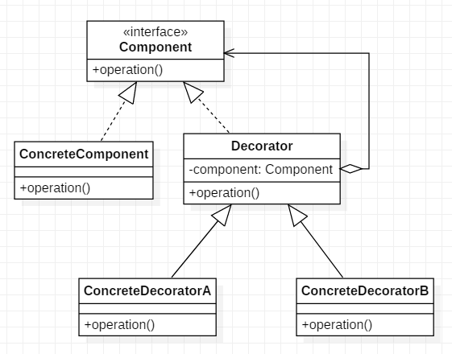

装饰模式也可以叫做包装器（Wrapper），可以给一个类或对象增加行为
通常有两种方式来给类或对象来增加行为：

* 继承机制：通过继承一个现有的类可以使得子类在拥有自己方法的同时还可以拥有父类的方法，但是这种方式是静态的，用户不能控制增加行为的方式和时机
* 关联机制：将一个对象嵌到另一个对象中，并由另一个对象来决定是否调用嵌入对象的行为来扩展自己的行为，这个嵌入对象就是装饰器（Decorator）

# 模式结构
角色职责

* 抽象构件（Component）：一个接口或抽象类，定义原始的对象
* 具体被装饰对象（ConcreteComponent）：具体的构件实现，被装饰的对象，可以给这个对象添加一些职责
* 抽象装饰类（Decorator）：持有一个指向Component实例的引用，并定义一个与Component接口一致的接口
* 具体装饰者（ConcreteDecorator）：具体的装饰对象，负责给构件对象添加职责

类图结构


# 代码实现
大家在看视频的时候，视频网站都会在播放之前给你来一段小广告... 然后告诉你充钱可以变强，可以不用看广告，有一些视频像综艺节目或电影在播放完后还会有彩蛋

抽象构件，定义一个播放视频的接口

```
public interface Video {

    /**
     * 播放
     */
    void play();
}

```
具体的构件，被修饰的对象，写一个播放电影的类

```
/**
 * Film  具体构件，被装饰的对象
 * @author zouxq
 */
public class Movie implements Video{

    @Override
    public void play() {
        System.out.println("看电影");
    }
}
```

抽象装饰类

```
/**
 * 抽象装饰类
 * @author zouxq
 */
public abstract class BaseVideoDecorator implements Video {

    private Video video;

    // 通过构造函数传递被修饰者
    public BaseVideoDecorator(Video video) {
        this.video = video;
    }

    // 委托给修饰者执行
    @Override
    public void play() {
        video.play();
    }
}
```
具体的装饰类，用来给具体的构件添加职责，这里给播放视频的对象添加播放广告的职责

```
/**
 * 具体的修饰类
 * @author zouxq
 */
public class AdvertisingVideoDecorator extends BaseVideoDecorator {

    // 定义被修饰者
    public AdvertisingVideoDecorator(Video video) {
        super(video);
    }

    @Override
    public void play() {
        addAdvertising();
        super.play();
    }

    // 定义修饰的方法
    private void addAdvertising(){
        System.out.println("来看个广告，充钱可以不用看哦");
    }

}

```

下面的装饰类用来添加播放彩蛋的职责

```
/**
 * 具体的修饰类
 * @author zouxq
 */
public class EasterEggsVideoDecorator extends BaseVideoDecorator {

    // 定义被修饰者
    public EasterEggsVideoDecorator(Video video) {
        super(video);
    }

    @Override
    public void play() {
        super.play();
        addEggs();
    }

    // 定义修饰的方法
    private void addEggs(){
        System.out.println("加个彩蛋...");
    }

}
```
测试使用

```
@Test
public void decoratorTest() {
    Video movie = new Movie();
    movie.play();
    System.out.println("第一次装饰......");
    movie = new AdvertisingVideoDecorator(movie);
    movie.play();
    System.out.println("第二次装饰......");
    movie = new EasterEggsVideoDecorator(movie);
    movie.play();
}
```
测试结果

```
看电影
第一次装饰......
来看个广告，充钱可以不用看哦
看电影
第二次装饰......
来看个广告，充钱可以不用看哦
看电影
加个彩蛋...
```

# 装饰模式的优缺点和使用场景

> 优缺点


装饰类和被装饰类可以相互独立，不会相互耦合。装饰类Decorator是从外部来扩展被装饰类Component的，不需要知道Component的内部实现
装饰模式是继承的一种替代方案，修饰返回的对象还是Component，是is-a的关系
装饰模式可以动态的扩展一个类的功能
可以把原始类中的装饰功能放到装饰类中，把类的核心职责和装饰功能区分开

装饰模式的一大缺点就是：多层的装饰会比较复杂，装饰的顺序也是很重要的，尽量要减少装饰类的数量，避免太过复杂

> 使用场景


* 需要扩展一个类的功能
* 动态的给对象增加功能，并且可以动态的撤销（继承是静态扩展）

# 为什么选择装饰模式而不是继承
从上面的例子和总结，我们可以看出使用装饰模式的好处，那么装饰模式和继承同样是可以扩展类的功能，为什么会更偏向使用装饰模式

我们用一个例子来说明一下，我们去饮品店去买一杯饮料，比如买一杯奶茶MilkyTea，这时服务员问你想要加什么，可以加红豆、椰奶、珍珠...  至于加料之后的奶茶我们很容易想到使用继承去实现，比如红豆OrmosiaMilkyTea、椰奶CoconutMilkyTea、珍珠PearlMilkyTea，假如要加多种料呢？红豆椰奶OrmosiaCoconutMilkyTea  ......

到这里就会发现，使用继承会要写许多的类，这里才3种加料，假如是可以加十几二十种配料呢，那自由组合的可能性就太多了，使用继承就会使我们的子类爆炸。使用继承我们要添加的功能是静态的，添加的功能便是在子类中实现，在编译时就已经确定下来；而使用装饰模式则是动态的添加功能，我需要什么功能便使用对应的装饰类去装饰，装饰的种类和顺序都是在客户端动态的加载，更加的灵活


# 参考文献

* [装饰模式-为类动态添加职责](https://juejin.im/post/5d69e6f7f265da03b810767c)