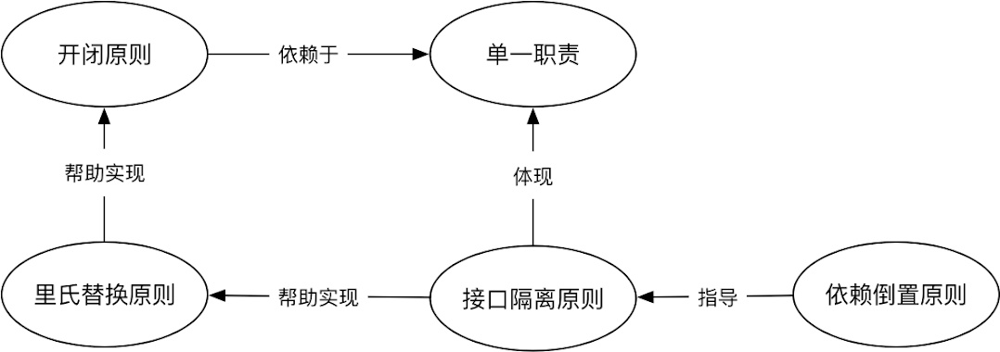

先抛出我的观点: 单一职责是所有设计原则的基础，开闭原则是设计的终极目标。里氏替换原则强调的是子类替换父类后程序运行时的正确性，它用来帮助实现开闭原则。而接口隔离原则用来帮助实现里氏替换原则，同时它也体现了单一职责。依赖倒置原则是过程式编程与OO编程的分水岭，同时它也被用来指导接口隔离原则。关系如下图：


# 设计模式六大原则


- 单一职责原则

- 里氏替换原则

- 依赖倒置原则

- 接口隔离原则

- 迪米特原则


## 单一职责
概念：对功能进行分类，代码进行解耦

栗子：一个网络请求框架大致分为：请求类，缓存类，配置类；不能把这三个功能混合在一起，必须分成三个类分别去实现不同的功能


利益相关者角色是一个重要的变化原因，不同的角色会有不同的需求，从而产生不同的变化原因。作为居民，家用的电线是普通的220V电线，而对电网建设者，使用的是高压电线。用一个Wire类同时服务于两类角色，通常意味着坏味道。

在实践中，怎么运用单一职责原则呢？什么时候要拆分，什么时候要合并？我们看看新厨师在学炒菜时，是如何掌握“盐少许”的。他会不断地品尝，直到味道刚好为止。写代码也一样，你需要识别需求变化的信号，不断“品尝”你的代码，当“味道”不够好时，持续重构，直到“味道”刚刚好。


## 里氏替换
概念：在继承类时，除了扩展一些新的功能之外，尽量不要删除或者修改对父类方法的引用，也尽量不要重载父类的方法

栗子：每个类都是Object的子类，Object类中有一个toString()的方法，假如子类重写该方法并且返回null，这个子类的下一级继承返回的都是null，那么在不同开发人员维护时可能考虑不到这个问题，并且很可能会导致程序崩溃


## 依赖倒置
概念：高层模块不依赖低层次模块的细节，高层次就是不依赖细节而是依赖抽象（不依赖具体的类，而是依赖于接口）

栗子：某个网络框架为了满足不同开发者的需求，即能使用高效的OkHttp框架，也可以使用原生的API。正所谓萝卜白菜各有所爱，那么是如何进行切换的呢，这个时候需要面向接口编程思想了，把一些网络请求的方法封装成一个接口，然后分别创建OkHttp和原生API的接口实现类，当然也方便后续其他开发人员进行扩展其他网络框架的应用

## 接口隔离
概念：在定义接口方法时应该合理化，尽量追求简单最小，避免接口臃肿

栗子：在实际开发中，往往为了节省时间，可能会将多个功能的方法抽成一个接口，其实这设计理念不正确的，这样会使接口处于臃肿的状态，这时就需要合理的拆分接口中的方法，另外抽取成一个独立的接口，避免原有的接口臃肿导致代码理解困难


而为了达成里氏替换原则，你需要接口隔离原则。


怎么给接口减肥呢？接口之所以存在，是为了解耦。开发者常常有一个错误的认知，以为是实现类需要接口。其实是消费者需要接口，实现类只是提供服务，因此应该由消费者（客户端）来定义接口。理解了这一点，才能正确地站在消费者的角度定义Role interface，而不是从实现类中提取Header Interface。

什么是Role interface? 举个例子，砖头(Brick)可以被建筑工人用来盖房子，也可以被用来正当防卫：

```
public class Brick {
    private int length;
    private int width;
    private int height;
    private int weight;

    public void build() {
        //...包工队盖房
    }

    public void defense() {
        //...正当防卫
    }
}

```

如果直接提取以下接口，这就是Header Interface：


```
public interface BrickInterface {
    void buildHouse();
    void defense();
}
```

普通大众需要的是可以防卫的武器，并不需要用砖盖房子。当普通大众(Person)被迫依赖了自己不需要的接口方法时，就违反接口隔离原则。正确的做法是站在消费者的角度，抽象出Role interface:

```
public interface BuildHouse {
    void build();
}

public interface StrickCompetence {
    void defense();
}

public class Brick implement BuildHouse, StrickCompetence {
}

```
有了Role interface，作为消费者的普通大众和建筑工人就可以分别消费自己的接口：


```
Worker.java
brick.build();

Person.java
brick.strike();

```
接口隔离原则本质上也是单一职责原则的体现，同时它也服务于里氏替换原则。而接下来介绍的依赖倒置原则可以用来指导接口隔离原则的实现。


## 迪米特 | 最少知道
概念：一个对象应该对其他对象有最少的了解；一个类应该对自己需要耦合或调用的类知道得最少，类的内部如何实现、如何复杂都与调用者或者依赖者没关系，调用者或者依赖者只需要知道他需要的方法即可，其他的一概不关心。类与类之间的关系越密切，耦合度越大，当一个类发生改变时，对另一个类的影响也越大。只与直接的朋友通信。每个对象都必然会与其他对象有耦合关系，两个对象之间的耦合就成为朋友关系，这种关系的类型有很多，例如组合、聚合、依赖等。

栗子：一般在使用框架的时候，框架的开发者会抽出一个类供外部调用，而这个主要的类像是一个中介一样去调用框架里面的其他类，恰恰框架里面其他类一般都是不可访问（调用）的，这个框架就遵守了迪米特原则，其他开发人员只关心调用的方法，并不需要关心功能具体如何实现

## 开闭
概念：类、模块和函数应该对扩展开放，对修改关闭

栗子：在软件的生命周期内，因为变化、升级和维护等原因需要对软件原有代码进行修改时，可能会给旧代码中引入错误，也可能会使我们不得不对整个功能进行重构，并且需要原有代码经过重新测试，整个流程对开发周期影响很大，这个时候就需要开闭原则来解决这种问题

开闭原则指软件实体（类、模块等）应当对扩展开放，对修改闭合。这听起来似乎很不合理，不能修改，只能扩展？那我怎么写代码？


我们先看看为什么要有开闭原则。假设你是一名成功的开源类库作者，很多开发者使用你的类库。如果某天你要扩展功能，只能通过修改某些代码完成，结果导致类库的使用者都需要修改代码。更可怕的是，他们被迫修改了代码后，又可能造成别的依赖者也被迫修改代码。这种场景绝对是一场灾难。


如果你的设计是满足开闭原则的，那就完全是另一种场景。你可以通过扩展，而不是修改来改变软件的行为，将对依赖方的影响降到最低。

这不正是设计的终极目标吗？解耦、高内聚、低耦合等等设计原则最终不都是为了这个目标吗？畅想一下，类、模块、服务都不需要修改，而是通过扩展就能够改变其行为。就像计算机一样，组件可以轻松扩展。硬盘太小？直接换个大的，显示器不够大的？来个8K的怎么样？

什么时候应该应用开闭原则，怎么做到呢？没有人能够在一开始就识别出所有扩展点，也不可能在所有地方都预留出扩展点，这么做的成本是不可接受的。因此一定是由需求变化驱动。如果你有领域专家的支持，他可以帮你识别出变化点。否则，你应该在变化发生时来做决策，因为在没有任何依据时做过多预先设计违反了Yagni。


实现开闭原则的关键是抽象。在Bertrand Meyer提出开闭原则的年代（上世纪80年代），在类库中增加属性或方法，都不可避免地要修改依赖此类库的代码。这显然导致软件很难维护，因此他强调的是要允许通过继承来扩展类。随着技术发展，我们有了更多的方法来实现开闭原则，包括接口、抽象类、策略模式等。


# 参考文献

- [设计模式六大原则](https://blog.csdn.net/carrie_q/article/details/80494010)
- [浅谈软件开发中的设计原则及设计模式](https://juejin.im/post/5d21a160f265da1b5e7314f3)
- [写了这么多年代码，你真的了解SOLID吗？(讲得很好)](https://zhuanlan.zhihu.com/p/44344256)


