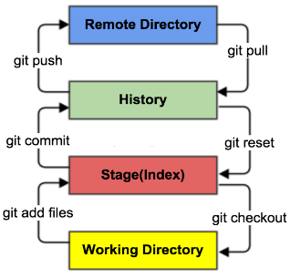
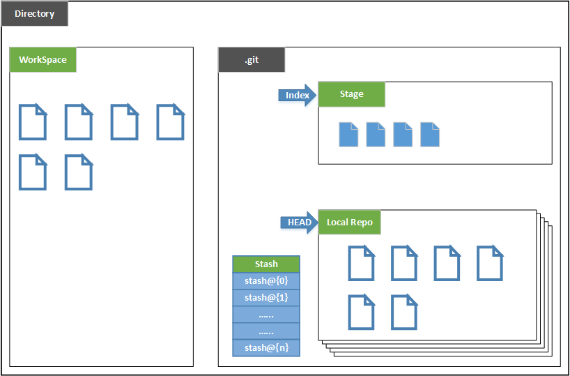
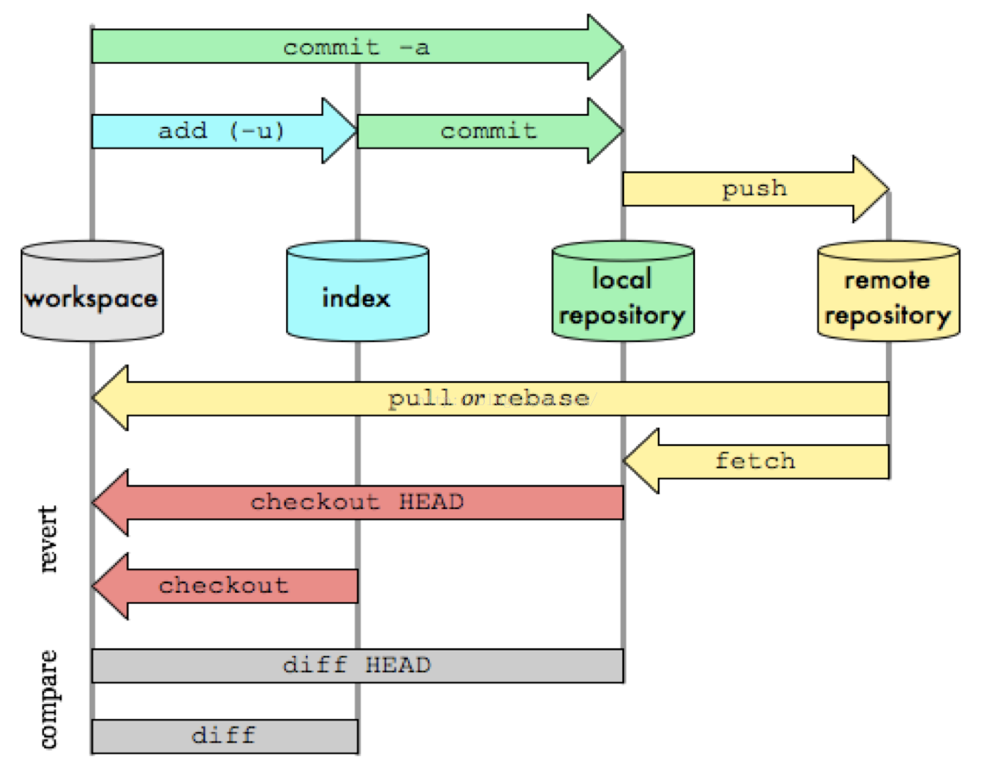
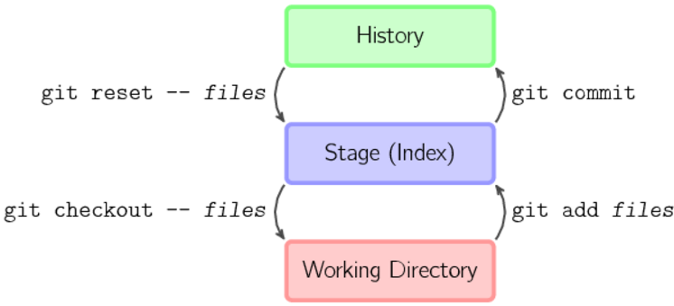
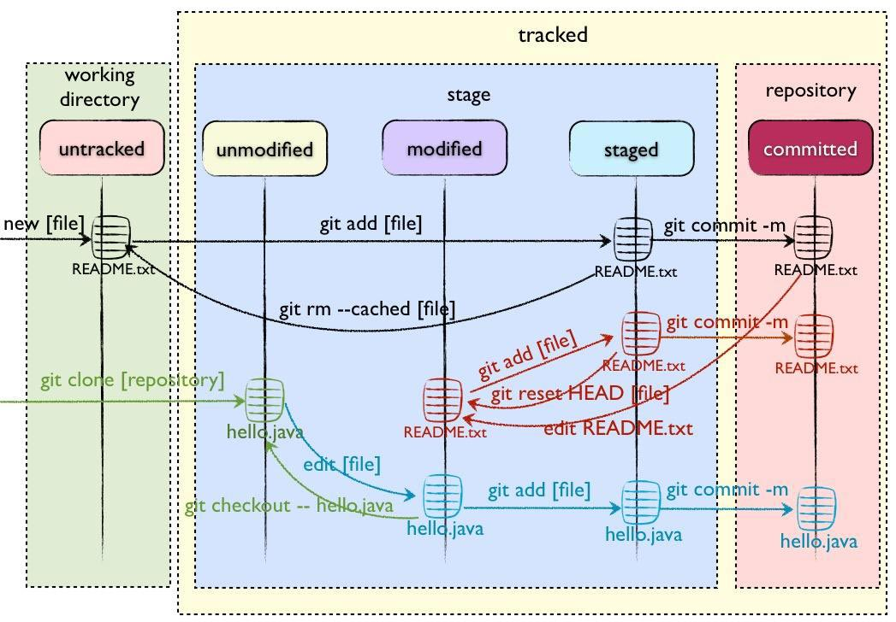

# 一、git理论

## 工作区域



- Workspace：工作区，就是你平时存放项目代码的地方
- Index / Stage：暂存区，用于临时存放你的改动，事实上它只是一个文件，保存即将提交到文件列表信息
- Repository：仓库区（或本地仓库），就是安全存放数据的位置，这里面有你提交到所有版本的数据。其中HEAD指向最新放入仓库的版本
- Remote：远程仓库，托管代码的服务器，可以简单的认为是你项目组中的一台电脑用于远程数据交换




- Directory：使用Git管理的一个目录，也就是一个仓库，包含我们的工作空间和Git的管理空间。
- WorkSpace：需要通过Git进行版本控制的目录和文件，这些目录和文件组成了工作空间。
- .git：存放Git管理信息的目录，初始化仓库的时候自动创建。
- Index/Stage：暂存区，或者叫待提交更新区，在提交进入repo之前，我们可以把所有的更新放在暂存区。
- Local Repo：本地仓库，一个存放在本地的版本库；HEAD会只是当前的开发分支（branch）。
- Stash：隐藏，是一个工作状态保存栈，用于保存/恢复WorkSpace中的临时状态。

注：工作区（Working Directory）就是你在电脑里能看到的目录。

版本库（Repository）工作区有一个隐藏目录.git，这个不算工作区，而是Git的版本库。

Git的版本库里存了很多东西，其中最重要的就是称为stage（或者叫index）的暂存区，还有Git为我们自动创建的第一个分支master，以及指向master的一个指针叫HEAD。

## 工作流程
git的工作流程一般是这样的：

１、在工作目录中添加、修改文件；

２、将需要进行版本管理的文件放入暂存区域；

３、将暂存区域的文件提交到git仓库。

因此，git管理的文件有三种状态：已修改（modified）,已暂存（staged）,已提交(committed)



## 图解教程
个人认为Git的原理相比别的版本控制器还是复杂一些的，有一份图解教程比较直观：

[图解教程中文版](http://www.cnblogs.com/yaozhongxiao/p/3811130.html)




# 二、git操作

## 2.1创建工作目录与常用指令
工作目录（WorkSpace)一般就是你希望Git帮助你管理的文件夹，可以是你项目的目录，也可以是一个空目录，建议不要有中文。

日常使用只要记住下图6个命令：


## 2.2获得GIT仓库
创建本地仓库的方法有两种：一种是创建全新的仓库，另一种是克隆远程仓库。

### 创建全新仓库

需要用GIT管理的项目的根目录执行：

> 在当前目录新建一个Git代码库

```
$ git init
```

执行后可以看到，仅仅在项目目录多出了一个.git目录，关于版本等的所有信息都在这个目录里面。

当然如果使用如下命令，可以把创建目录与仓库一起完成：

> 新建一个目录，将其初始化为Git代码库

```
$ git init [project-name]
```

### 克隆远程仓库
另一种方式是克隆远程目录，由于是将远程服务器上的仓库完全镜像一份至本地，而不是取某一个特定版本，所以用clone而不是checkout，语法格式如下：

```
# 克隆一个项目和它的整个代码历史(版本信息)
$ git clone [url]
``` 

## 2.3文件状态


- Untracked: 未跟踪, 此文件在文件夹中, 但并没有加入到git库, 不参与版本控制. 通过git add 状态变为Staged.

- Unmodify: 文件已经入库, 未修改, 即版本库中的文件快照内容与文件夹中完全一致. 这种类型的文件有两种去处, 如果它被修改, 而变为Modified. 如果使用git rm移出版本库, 则成为Untracked文件

- Modified: 文件已修改, 仅仅是修改, 并没有进行其他的操作. 这个文件也有两个去处, 通过git add可进入暂存staged状态, 使用git checkout 则丢弃修改过, 返回到unmodify状态, 这个git checkout即从库中取出文件, 覆盖当前修改

- Staged: 暂存状态. 执行git commit则将修改同步到库中, 这时库中的文件和本地文件又变为一致, 文件为Unmodify状态. 执行git reset HEAD filename取消暂存, 文件状态为Modified




### 查看文件状态
上面说文件有4种状态，通过如下命令可以查看到文件的状态：

```
#查看指定文件状态
git status [filename]

#查看所有文件状态
git status
```

### 添加到暂存区
将untracked状态的文件添加到暂存区，语法格式如下：

```
# 添加指定文件到暂存区
$ git add [file1] [file2] ...

# 添加指定目录到暂存区，包括子目录
$ git add [dir]

# 添加当前目录的所有文件到暂存区
$ git add .
```

### 移除文件与目录（撤销add）

当执行如下命令时，会直接从暂存区删除文件，工作区则不做出改变


```
直接从暂存区删除文件，工作区则不做出改变
git rm --cached <file>
```

### reset 通过重写目录树移除add文件：

通过重写目录树移除add文件：

```
#如果已经用add 命令把文件加入stage了，就先需要从stage中撤销
git reset HEAD <file>...
```

当执行 “git reset HEAD” 命令时，暂存区的目录树会被重写，被 master 分支指向的目录树所替换，但是工作区不受影响。


# 参考文献

- [一个小时学会Git](https://www.cnblogs.com/best/p/7474442.html)
- [小团队适用的git-workflow](https://juejin.im/post/5d0b536ae51d45105e0212d8)


