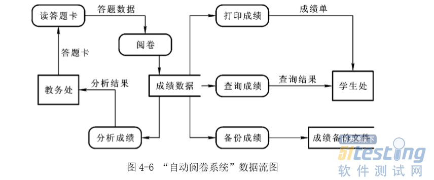
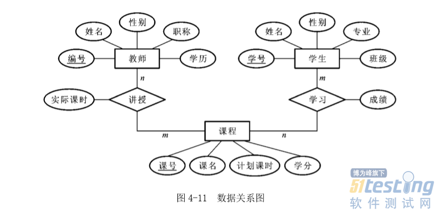

# 软件开发过程

## 需求分析

### 功能需求
数据流图

### 数据需求
数据字典

ER图

### 非功能性需求

## 结构化分析
数据流图

## 相关图

- 层次模型

	描述功能组织结构
	
- 数据流图

	描述数据加工流程
	
	
	
- ER图
	
	

	

## 系统设计
针对项目的关键问题，给出多种设计思路，并对比各种思路的优缺点，最后给出，采用哪种思路，并在后面的概要设计中详述。

## 概要设计

阐述系统的整体设计，一般会包括多个部分（每部分负责一个模块）

系统对外接口：即对外暴露的接口，如果比较复杂，可以编写单独的接口设计文档，并在此引用。
架构图和说明：把系统分解成若干个子系统或模块，给出系统架构图，并给出每个模块完成的主要功能。
流程图和说明：通过流程图说明，各个模块之间是如何交互来实现系统功能的。

### 总体设计
3. 处理流程
3. 总体结构和模块外部设计
	4. 每个功能模块的流程
3. 功能分配

### 接口设计

#### 外部接口

> teles

- 接收外部系统的回访单子
	- 生成业务单，并打标(幂等)
- teles推送回访单子到路由
	- 批量推送(幂等)
- teles接收外呼结果

> AI路由

- AI路由接收teles批单
	- 将批单转为外呼任务
- AI路由向电话平台发起呼叫的任务
- 路由接收电话平台的外呼结果

#### 内部接口

> teles

- 回访标签规则设置
	- 规则是什么样
- 外呼规则设置
	- 是否需要新设计表

> AI路由

- 外呼规则设置
- 外呼任务管理
	- 外呼列表查询
	

### 数据库概要设计

#### 逻辑结构设计(ER图)

> teles

- 回访原始信息表

> IA路由

- 外呼规则表

#### 物理结构设计(数据库表设计)

todo 

## 详细设计
概要设计主要是对需求的分析，将所有的用例整理出来，以及简单的描述。而详细设计更多的是详细的指出美个用例的解决方案，包括系统的设计，UIs的设计等。最终开发者是根据详细设计文档进行编码开发。

详细设计则是在概要设计的基础上对系统的各个模块进一步细化，分析各个模块的子模块，甚至给出各子模块的算法；数据库设计方面则要求到具体每张表的字段。通常面向开发人员，应该是开发人员看了你的详细设计，就可以直接写代码。

todo 

## 代码编写

### 编码

### 单元测试

## 测试
todo 

# 参考文献

- [软件工程中的各种图](https://www.cnblogs.com/sungyouyu/p/3590592.html)
- [软件工程之软件需求分析](http://www.51testing.com/html/19/n-4421019.html)
- [网上订餐系统概要设计](http://www.lunwenstudy.com/gcglshuoshi/rjgcshuoshi/122980.html)