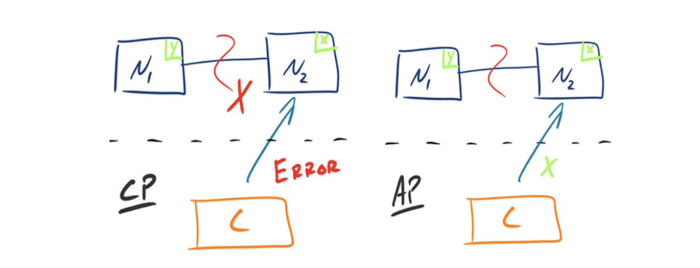
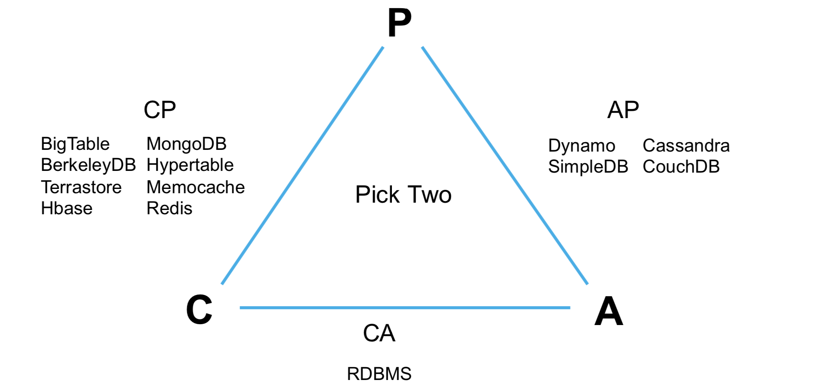

# CAP理论

## Consistency
Ø 通过某个节点的写操作结果对后面通过其它节点的读操作可见
Ø 如果更新数据后，并发访问情况下可立即感知该更新，称为强一致性
Ø 如果允许之后部分或者全部感知不到该更新，称为弱一致性
Ø 若在之后的一段时间(通常该时间不固定)后，一定可以感知该更新，称为最终一致性
## Availability
Ø 任何一个没有发生故障的节点必须在有限的时间内返回合理的结果
## Partition tolerance
Ø 部分节点宕机或者无法与其它节点通信时，各分区间还可保持分布式系统的功能

CAP理论:分布式系统中，一致性、可用性、分区容忍性最多只可同时满足两个

一般分区容忍性都要求有保障，因此很多时候是在可用性与一致性之间做权衡

# 常见的中间件的CAP模型

- CA: RDBMS满足，比如mysql, oracle
- CP: redis,mongodb,memcache; big table, hbase; 

# 一致性方案
## Master-slave
Ø RDBMS的读写分离即为典型的Master-slave方案 Ø 同步复制可保证强一致性但会影响可用性
Ø 异步复制可提供高可用性但会降低一致性
## WNR
Ø 主要用于去中心化(P2P)的分布式系统中。DynamoDB与Cassandra即采用此方案
Ø N代表副本数，W代表每次写操作要保证的最少写成功的副本数，R代表每次读至少读取的副本数
Ø 当W+R>N时，可保证每次读取的数据至少有一个副本具有最新的更新
Ø 多个写操作的顺序难以保证，可能导致多副本间的写操作顺序不一致，Dynamo通过向量时钟保证最终一致性
## Paxos及其变种
Ø Google的Chubby，Zookeeper的Zab，RAFT等