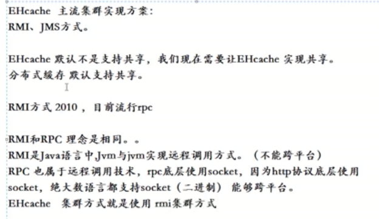

# EHCache

# Spring boot整合Ehcache

todo 

# 参考文献

- [spring-boot整合ehcache实现缓存机制](https://www.cnblogs.com/lic309/p/4072848.html)
- [
SpringBoot+EHcache实现缓存](https://blog.csdn.net/qq_28143647/article/details/79789368)