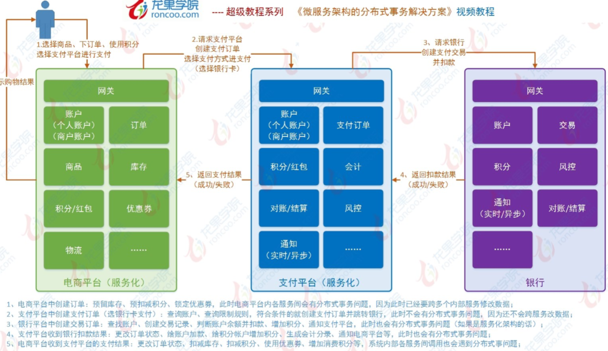
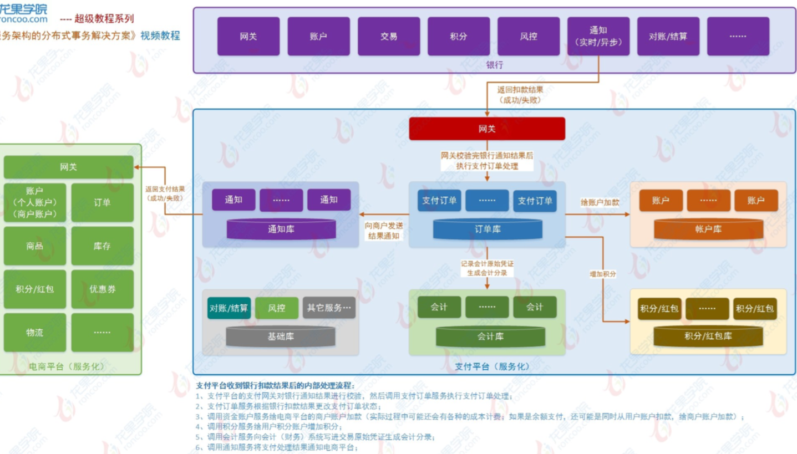

# 分布式事务电商示例讲解


# 示例

## 下单流程



## 下单详细流程




> 支付订单处理有问题的代码

```
@Transactional(rollbackFor = Exception.class) 
public void completeOrder() {
	orderDao.update(); // 订单服务本地更新订单状态
	accountService.update(); // 调用资金账户服务给资金帐户加款 
	pointService.update(); // 调用积分服务给积分帐户增加积分 
	accountingService.insert(); // 调用会计服务向会计系统写入会计原始凭证 
	merchantNotifyService.notify(); // 调用商户通知服务向商户发送支付结果通知
} 
```

本地事务控制还可行吗?

答：不行


[进度：03 常用的分布式事务解决方案介绍.wmv
](https://pan.baidu.com/play/video#/video?path=%2F%E7%BC%96%E7%A8%8B%E7%9B%B8%E5%85%B3%2Fjava%2F2019-05-02%E5%BE%AE%E6%9C%8D%E5%8A%A1%E5%AE%9E%E6%88%98%2F12%E3%80%81%E5%BE%AE%E6%9C%8D%E5%8A%A1%E6%9E%B6%E6%9E%84%E3%80%81%E5%88%86%E5%B8%83%E5%BC%8F%E6%9E%B6%E6%9E%84%E4%BA%8B%E5%8A%A1%E8%A7%A3%E5%86%B3%E7%B2%BE%E8%AE%B2%E8%A7%86%E9%A2%91%2F03%20%E5%B8%B8%E7%94%A8%E7%9A%84%E5%88%86%E5%B8%83%E5%BC%8F%E4%BA%8B%E5%8A%A1%E8%A7%A3%E5%86%B3%E6%96%B9%E6%A1%88%E4%BB%8B%E7%BB%8D.wmv&t=2)


