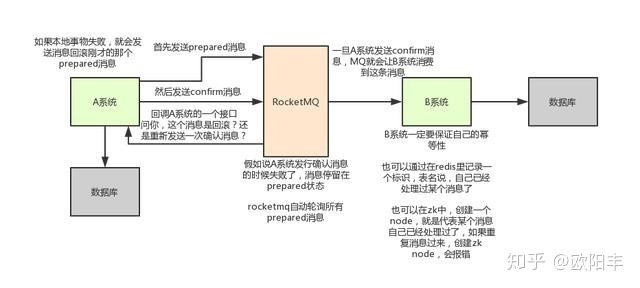

# Java 中的事务
搞清楚了事务之后，我们来看点眼熟的，java 中的事务是怎么玩的？ Java 中我们平时用的最多的就是在 service 层的增删改方法上添加@Transactional 注解，让 spring 去帮我们管理事务。

它底层会给我们的 service 组件生成一个对应的 proxy 动态代理，这样所有对 service 组件的方法都由它对应的 proxy 来接管，当 proxy 在调用对应业务方法比如 add()时，proxy就会基于 AOP 的思想在调用真正的业务方法前执行 setAutoCommit（false）打开事务。

然后在业务方法执行完后执行 commit 提交事务，当在执行业务方法的过程中发生异常时就会执行 rollback 来回滚事务。

当然@Transactional 注解具体的实现细节这里不再展开，这个不是本篇文章的重点，本文的 topic 是“分布式事务”，关于@Transactional 注解大家有兴趣的话，可以自己打断点debug 源码研究下，源码出真知。

## 流程x

1. A 系统先发送一个 prepared 消息到 mq，如果这个 prepared 消息发送失败那么就直接取消操作别执行了，后续操作都不再执行。
2. 如果这个消息发送成功过了，那么接着执行 A 系统的本地事务，如果执行失败就告诉 mq 回滚消息，后续操作都不再执行。
3. 如果 A 系统本地事务执行成功，就告诉 mq 发送确认消息。
4. 那如果 A 系统迟迟不发送确认消息呢？ 此时 mq 会自动定时轮询所有 prepared 消息，然后调用 A 系统事先提供的接口，通过这个接口反查 A 系统的上次本地事务是否执行成功 如果成功，就发送确认消息给 mq；失败则告诉 mq 回滚消息（后续操作都不再执行）。
5. 此时 B 系统会接收到确认消息，然后执行本地的事务，如果本地事务执行成功则事务正常完成。
6. 如果系统 B 的本地事务执行失败了咋办？ 基于 mq 重试咯，mq 会自动不断重试直到成功，如果实在是不行，可以发送报警由人工来手工回滚和补偿。 这种方案的要点就是可以基于 mq 来进行不断重试，最终一定会执行成功的。 因为一般执行失败的原因是网络抖动或者数据库瞬间负载太高，都是暂时性问题。 通过这种方案，99.9%的情况都是可以保证数据最终一致性的，剩下的 0.1%出问题的时候，就人工修复数据呗。

适用场景： 这个方案的使用还是比较广，目前国内互联网公司大都是基于这种思路玩儿的。

