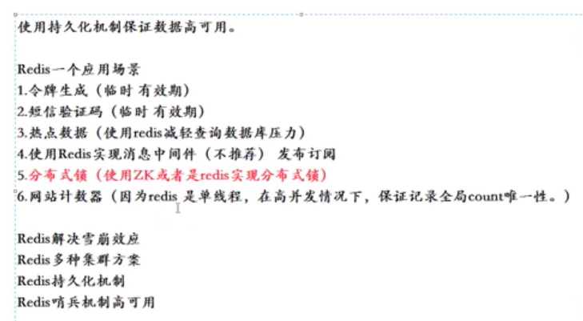

# 什么是redis

# redis客户端推荐

medis
> medis是一个图形化redis客户端工具. 支持命令.

[medis](http://getmedis.com/)

以上推荐为mac上的。

# 应用场景
1. 令牌(Token)生成
2. 短信验证码
3. 发布订阅

	相当于消息系统，ActiveMQ，RocketMQ等工具类似，但是个人觉得简单用一下还行，如果对于数据一致性要求高的话还是用RocketMQ等专业系统。
由于redis把数据添加到队列是返回添加元素在队列的第几位，所以可以做判断用户是第几个访问这种业务
队列不仅可以把并发请求变成串行，并且还可以做队列或者栈使用
4. 分布式锁

	验证前端的重复请求（可以自由扩展类似情况），可以通过redis进行过滤：每次请求将request Ip、参数、接口等hash作为key存储redis（幂等性请求），设置多长时间有效期，然后下次请求过来的时候先在redis中检索有没有这个key，进而验证是不是一定时间内过来的重复提交
秒杀系统，基于redis是单线程特征，防止出现数据库“爆破”
全局增量ID生成，类似“秒杀”
5. 计数器
诸如统计点击数等应用。由于单线程，可以避免并发问题，保证不会出错，而且100%毫秒级性能！
6. 缓存(热点数据)

	热点数据（经常会被查询，但是不经常被修改或者删除的数据），首选是使用redis缓存，毕竟强大到冒泡的QPS和极强的稳定性不是所有类似工具都有的，而且相比于memcached还提供了丰富的数据类型可以使用，另外，内存中的数据也提供了AOF和RDB等持久化机制可以选择，要冷、热的还是忽冷忽热的都可选。
结合具体应用需要注意一下：很多人用spring的AOP来构建redis缓存的自动生产和清除，过程可能如下：
Select 数据库前查询redis，有的话使用redis数据，放弃select 数据库，没有的话，select 数据库，然后将数据插入redis
update或者delete数据库钱，查询redis是否存在该数据，存在的话先删除redis中数据，然后再update或者delete数据库中的数据
上面这种操作，如果并发量很小的情况下基本没问题，但是高并发的情况请注意下面场景：
为了update先删掉了redis中的该数据，这时候另一个线程执行查询，发现redis中没有，瞬间执行了查询SQL，并且插入到redis中一条数据，回到刚才那个update语句，这个悲催的线程压根不知道刚才那个该死的select线程犯了一个弥天大错！于是这个redis中的错误数据就永远的存在了下去，直到下一个update或者delete。 

# redis书推荐

- redis开发与运维
- redis设计与实现

# 参考文献
[Redis闲谈（1）：构建知识图谱](https://juejin.im/post/5cce56cee51d453aa307c80e)