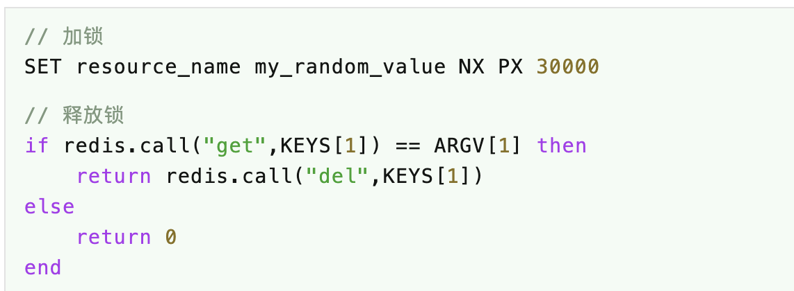

# 问题
（1）redis如何实现分布式锁？

（2）redis分布式锁有哪些优点？

（3）redis分布式锁有哪些缺点？

（4）redis实现分布式锁有没有现成的轮子可以使用？

# 简介
Redis（全称：Remote Dictionary Server 远程字典服务）是一个开源的使用ANSI C语言编写、支持网络、可基于内存亦可持久化的日志型、Key-Value数据库，并提供多种语言的API。

本章我们将介绍如何基于redis实现分布式锁，并把其实现的进化史从头到尾讲明白，以便大家在面试的时候能讲清楚redis分布式锁的来（忽）龙（悠）去（考）脉（官）。

# 实现锁的条件
基于前面关于锁（分布式锁）的学习，我们知道实现锁的条件有三个：

（1）状态（共享）变量，它是有状态的，这个状态的值标识了是否已经被加锁，在ReentrantLock中是通过控制state的值实现的，在ZookeeperLock中是通过控制子节点来实现的；

（2）队列，它是用来存放排队的线程，在ReentrantLock中是通过AQS的队列实现的，在ZookeeperLock中是通过子节点的有序性实现的；

（3）唤醒，上一个线程释放锁之后唤醒下一个等待的线程，在ReentrantLock中结合AQS的队列释放时自动唤醒下一个线程，在ZookeeperLock中是通过其监听机制来实现的；

那么上面三个条件是不是必要的呢？

其实不然，实现锁的必要条件只有第一个，对共享变量的控制，如果共享变量的值为null就给他设置个值（java中可以使用CAS操作进程内共享变量），如果共享变量有值则不断重复检查其是否有值（重试），待锁内逻辑执行完毕再把共享变量的值设置回null。

说白了，只要有个地方存这个共享变量就行了，而且要保证整个系统（多个进程）内只有这一份即可。

这也是redis实现分布式锁的关键。

# redis分布式锁进化史

## 进化史一——set
既然上面说了实现分布式锁只需要对共享变量控制到位即可，那么redis我们怎么控制这个共享变量呢？

首先，我们知道redis的基础命令有get/set/del，通过这三个命令可以实现分布式锁吗？当然可以。

在获取锁之前先 getlock_user_1看这个锁存不存在，如果不存在则再 setlock_user_1 value，如果存在则等待一段时间后再重试，最后使用完成了再删除这个锁 dellock_user_1即可。

但是，这种方案有个问题，如果一开始这个锁是不存在的，两个线程去同时get，这个时候返回的都是null（nil），然后这两个线程都去set，这时候就出问题了，两个线程都可以set成功，相当于两个线程都获取到同一个锁了。

所以，这种方案不可行！


## 进化史二——setnx
上面的方案不可行的主要原因是多个线程同时set都是可以成功的，所以后来有了 setnx这个命令，它是 set if not exist的缩写，也就是如果不存在就set。

可以看到，当重复对同一个key进行setnx的时候，只有第一次是可以成功的。

因此，方案二就是先使用 setnx lock_user_1 value命令，如果返回1则表示加锁成功，如果返回0则表示其它线程先执行成功了，那就等待一段时间后重试，最后一样使用 dellock_user_1释放锁。

但是，这种方案也有个问题，如果获取锁的这个客户端断线了怎么办？这个锁不是一直都不会释放吗？是的，是这样的。

所以，这种方案也不可行！

## 进化史三——setnx + setex
上面的方案不可行的主要原因是获取锁之后客户端断线了无法释放锁的问题，那么，我在setnx之后立马再执行setex可以吗？

答案是可以的，2.6.12之前的版本使用redis实现分布式锁大家都是这么玩的。

因此，方案三就是先使用 setnx lock_user_1 value命令拿到锁，再立即使用 setex lock_user_130value设置过期时间，最后使用 dellock_user_1释放锁。

在setnx获取到锁之后再执行setex设置过期时间，这样就很大概率地解决了获取锁之后客户端断线不会释放锁的问题。

但是，这种方案依然有问题，如果setnx之后setex之前这个客户端就断线了呢？嗯~，似乎无解，不过这种概率实在是非常小，所以2.6.12之前的版本大家也都这么用，几乎没出现过什么问题。

所以，这种方案基本可用，只是不太好！

## 进化史四——set nx ex
上面的方案不太好的主要原因是setnx/setex是两条独立的命令，无法解决前者成功之后客户端断线的问题，那么，把两条命令合在一起不就行了吗？

是的，redis官方也意识到这个问题了，所以2.6.12版本给set命令加了一些参数：

```
SET key value [EX seconds][PX milliseconds][NX|XX]
```

- EX，过期时间，单位秒

- PX，过期时间，单位毫秒

- NX，not exist，如果不存在才设置成功

- XX，exist exist？如果存在才设置成功

通过这个命令我们就再也不怕客户端无故断线了。

因此，方案四就是先使用 setlock_user_1 value nx ex30获取锁，获取锁之后使用，使用完成了最后 dellock_user_1释放锁。

然而，这种方案就没有问题吗？

当然有问题，其实这里的释放锁只要简单地执行 dellock_user_1即可，并不会检查这个锁是不是当前客户端获取到的。

所以，这种方案还不是很完美。

## 进化史五——random value + lua script
上面的方案不完美的主要原因是释放锁这里控制的还不是很到位，那么有没有其它方法可以控制释放锁的线程和加锁的线程一定是同一个客户端呢？

redis官方给出的方案是这样的：


加锁的时候，设置随机值，保证这个随机值只有当前客户端自己知道。

释放锁的时候，执行一段lua脚本，把这段lua脚本当成一个完整的命令，先检查这个锁对应的值是不是上面设置的随机值，如果是再执行del释放锁，否则直接返回释放锁失败。

我们知道，redis是单线程的，所以这段lua脚本中的get和del不会存在并发问题，但是不能在java中先get再del，这样会当成两个命令，会有并发问题，lua脚本相当于是一个命令一起传输给redis的。

这种方案算是比较完美了，但是还有一点小缺陷，就是这个过期时间设置成多少合适呢？

设置的过小，有可能上一个线程还没执行完锁内逻辑，锁就自动释放了，导致另一个线程可以获取锁了，就出现并发问题了；

设置的过大，就要考虑客户端断线了，这个锁要等待很长一段时间。

所以，这里又衍生出一个新的问题，过期时间我设置小一点，但是快到期了它能自动续期就好了。

## 进化史六——redisson(redis2.8+)
上面方案的缺陷是过期时间不好把握，虽然也可以自己启一个监听线程来处理续期，但是代码实在不太好写，好在现成的轮子redisson已经帮我们把这个逻辑都实现好了，我们拿过来直接用就可以了。

而且，redisson充分考虑了redis演化过程中留下的各种问题，单机模式、哨兵模式、集群模式，它统统都处理好了，不管是从单机进化到集群还是从哨兵进化到集群，都只需要简单地修改下配置就可以了，不用改动任何代码，可以说是非（业）常（界）方（良）便（心）。

redisson实现的分布式锁内部使用的是Redlock算法，这是官方推荐的一种算法。

另外，redisson还提供了很多分布式对象（分布式的原子类）、分布式集合（分布式的Map/List/Set/Queue等）、分布式同步器（分布式的CountDownLatch/Semaphore等）、分布式锁（分布式的公平锁/非公平锁/读写锁等）

# 代码实现
因为前面五种方案都已经过时，所以彤哥这里偷个懒，就不去一一实现的，我们直接看最后一种redisson的实现方式。

pom.xml文件
添加spring redis及redisson的依赖，我这里使用的是springboot 2.1.6版本，springboot 1.x版本的自己注意下，查看上面的github可以找到方法。

代码见 [死磕 java同步系列之redis分布式锁进化史](https://mp.weixin.qq.com/s/hOaZ6JWhtb0ybbShgKhaHQ)

# 参考文献

- [聊聊分布式锁的实现(一)](https://juejin.im/post/5d81f98051882562861585ee)
- [死磕 java同步系列之redis分布式锁进化史](https://mp.weixin.qq.com/s/hOaZ6JWhtb0ybbShgKhaHQ)