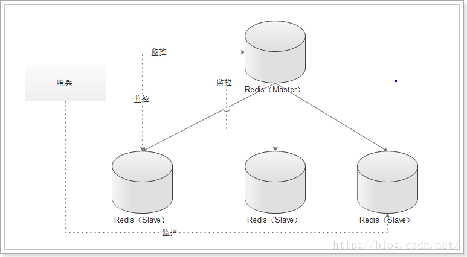

# redis主从复制

## 什么是主从复制

只能有一个主，可以有多个从。主服务器可以做读写，从服务器只能用来做读的操作。

## 主从应用场景
- 做集群(一般不会用，一般用分片的方式做集群)
- 读写分离，增加吞吐量。

	读写分离存在的问题：数据同步，一致性的问题(redis已经自带)
	
- 日志备份
- 高可用	

## 主从同步过程

过程：

1. 当一个从数据库启动时，会向主数据库发送sync命令，
2. 主数据库接收到sync命令后会开始在后台保存快照（执行rdb操作），并将保存期间接收到的命令缓存起来
3. 当快照完成后，redis会将快照文件和所有缓存的命令发送给从数据库。
4. 从数据库收到后，会载入快照文件并执行收到的缓存的命令。

# 哨兵机制

Redis的哨兵(sentinel) 系统用于管理多个 Redis 服务器,该系统执行以下三个任务:

- 监控(Monitoring): 哨兵(sentinel) 会不断地检查你的Master和Slave是否运作正常。
- 提醒(Notification):当被监控的某个 Redis出现问题时, 哨兵(sentinel) 可以通过 API 向管理员或者其他应用程序发送通知。
- 自动故障迁移(Automatic failover):当一个Master不能正常工作时，哨兵(sentinel) 会开始一次自动故障迁移操作,它会将失效Master的其中一个Slave升级为新的Master, 并让失效Master的其他Slave改为复制新的Master; 当客户端试图连接失效的Master时,集群也会向客户端返回新Master的地址,使得集群可以使用Master代替失效Master。

哨兵(sentinel) 是一个分布式系统,你可以在一个架构中运行多个哨兵(sentinel) 进程,这些进程使用流言协议(gossipprotocols)来接收关于Master是否下线的信息,并使用投票协议(agreement protocols)来决定是否执行自动故障迁移,以及选择哪个Slave作为新的Master.
每个哨兵(sentinel) 会向其它哨兵(sentinel)、master、slave定时发送消息,以确认对方是否”活”着,如果发现对方在指定时间(可配置)内未回应,则暂时认为对方已挂(所谓的”主观认为宕机” Subjective Down,简称sdown).
若“哨兵群”中的多数sentinel,都报告某一master没响应,系统才认为该master"彻底死亡"(即:客观上的真正down机,Objective Down,简称odown),通过一定的vote算法,从剩下的slave节点中,选一台提升为master,然后自动修改相关配置.
虽然哨兵(sentinel) 释出为一个单独的可执行文件 redis-sentinel ,但实际上它只是一个运行在特殊模式下的 Redis 服务器，你可以在启动一个普通 Redis 服务器时通过给定 --sentinel 选项来启动哨兵(sentinel).
哨兵(sentinel) 的一些设计思路和zookeeper非常类似

单个哨兵(sentinel)

# Redis集群

todo  

# 参考

- [支撑微博亿级社交平台，小白也能玩转Redis集群(原理篇)](https://juejin.im/post/5dacfe2fe51d452b32181efb)