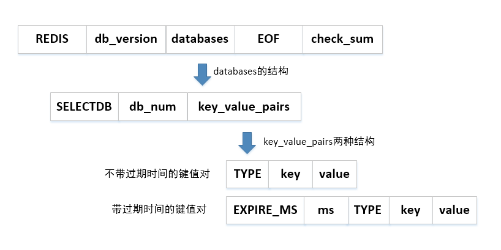

众所周知，Redis是一个内存数据库。但它与其它内存数据库（如memcache）等有一个很大的区别，就是Redis可以持久化到磁盘。有了持久化方案，Redis就可以对数据进行备份、恢复、复制。


# redis持久化意义

todo


# 持久化

redis为内存数据库，为了防止服务器宕机以及服务器进程退出后，服务器数据丢失，Redis提供了持久化功能，即将Redis中内存数据持久化到磁盘中。Redis 提供了不同级别的持久化方式：

- RDB持久化方式：可以在指定的时间间隔能对数据进行快照存储.
- AOF持久化方式：记录每次对服务器写的操作,当服务器重启的时候会重新执行这些命令来恢复原始的数据,AOF命令以redis协议追加保存每次写的操作到文件末尾.Redis还能对AOF文件进行后台重写,使得AOF文件的体积不至于过大.

如果服务器开启了AOF持久化功能。服务器会优先使用AOF文件还原数据。只有关闭了AOF持久化功能，服务器才会使用RDB文件还原数据


# RDB
RDB持久化是通过快照的方式，即在指定的时间间隔内将内存中的数据集快照写入磁盘。在创建快照之后，用户可以备份该快照，可以将快照复制到其他服务器以创建相同数据的服务器副本，或者在重启服务器后恢复数据。RDB是Redis默认的持久化方式

RDB持久化会生成RDB文件，该文件是一个压缩过的二进制文件，可以通过该文件还原快照时的数据库状态，即生成该RDB文件时的服务器数据。RDB文件默认为当前工作目录下的dump.rdb，可以根据配置文件中的dbfilename和dir设置RDB的文件名和文件位置




## 工作方式

当 Redis 需要保存 dump.rdb 文件时， 服务器执行以下操作:

- Redis 调用forks。同时拥有父进程和子进程。
- 子进程将数据集写入到一个临时 RDB 文件中。
- 当子进程完成对新 RDB 文件的写入时，Redis 用新 RDB 文件替换原来的 RDB 文件，并删除旧的 RDB 文件。


## 触发快照的时机

* 执行save和bgsave命令
* 配置文件设置save <seconds> <changes>规则，自动间隔性执行bgsave命令
* 主从复制时，从库全量复制同步主库数据，主库会执行bgsave
* 执行flushall命令清空服务器数据
* 执行shutdown命令关闭Redis时，会执行save命令

 让它在“ N 秒内数据集至少有 M 个改动”这一条件被满足时， 自动进行数据集保存操作）。

 ```
比如：
/*服务器在900秒之内，对数据库进行了至少1次修改*/
Save  900   1
/*服务器在300秒之内，对数据库进行了至少10次修改*/
Save  300   10
/*服务器在60秒之内，对数据库进行了至少10000次修改*/
Save  60     10000
 ```

## save和bgsave命令

执行save和bgsave命令，可以手动触发快照，生成RDB文件，两者的区别如下

使用save命令会阻塞Redis服务器进程，服务器进程在RDB文件创建完成之前是不能处理任何的命令请求

而使用bgsave命令不同的是，basave命令会fork一个子进程，然后该子进程会负责创建RDB文件，而服务器进程会继续处理命令请求


# AOF

> 原理

通过前面的介绍会发现，如果使用RDB，在意外情况下，比如Redis服务突然宕机，这个时候有些内存里面的数据还没来得及刷新进磁盘，就会导致一部分数据丢失。

AOF就是用来解决这个问题的。AOF是Append Only File的缩写，AOF可以将Redis执行的每一条写命令追加到磁盘文件中，在Redis启动时候优先选择从AOF文件恢复数据。

因为每一次写操作，都需要记录到文件中，所以开启AOF持久化会对性能有一定的影响，但是大部分情况下这个影响是可以接受的，我们可以使用读写速率高的硬盘提高AOF性能。与RDB持久化相比，AOF持久化数据丢失更少，其消耗内存更少(RDB方式执行bgsve会有内存拷贝)。

AOF实现本质是基于Redis通讯协议，将命令以纯文本的方式写入到文件中。


# 参考文献

* [Redis持久化机制：RDB和AOF](https://juejin.im/post/5d776dcef265da03b574744d)
* [Redis持久化机制](https://juejin.im/post/5d8587c65188253a4835306b)
* [【redis】redis之持久化机制](https://blog.csdn.net/bible_reader/article/details/84138665)
* [Redis中的持久化](https://www.jianshu.com/p/b31935b46cce)
* [一文深度揭秘Redis的磁盘持久化机制](https://juejin.im/post/5da14c37e51d45784603adb7)

