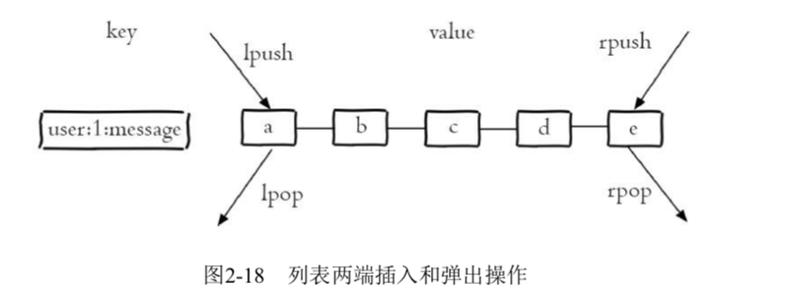

# 通用命令

- keys *

	复杂度O(n)，生产数据量大的话，禁止使用。
- dbsize
	
	复杂度O(1)
	
- exists key

- del key [key ...]	
	
	批量删除：del a b c
	
- expire key seconds

	到达过期时间后会自动删除
	
- ttl key 

	
	1. 返回值 > 0: 剩余过期时间
	2. -1 未设置过期时间
	3. -2 不存在

- get key
- type key
	
	查看键的数据结构类型
	
	

# String

- set key value [ex seconds] [px milliseconds] [nx|xx]

	参数：
	
	1. ex: 秒级过期时间；
	2. px: 毫秒级过期时间；
	3. nx: 不存在才设置成功；
	4. xx: 存在才设置成功。
	
- setex

	存在才可以设置成功，用于更新
- setnx(可以用来实现分布式锁，只能让一个客户端执行成功)

	不存在才可以设置成功
	
- get key
- mset key value [key value ...]

	批量设置
	
- mget key [key ...]

	批量获取
	
- incr key

	自增操作
	
	- 如果非整数，返回错误；
	- 如果是整数，返回自增后的结果；	
	- 如果不存在，从0开始自增，返回1.

- decr key

	自减操作
	
- incrby key step
- decrby key step
 	

# List

-  rpush key value [value ...]
-  lpush key value [value ...]

	从左侧插入

- linsert key before|after pivot value

	某元素前或者后插入
	
	如：linsert listkey before b java

-  lrange key 0 -1

	查看list的所有元素
	
- lrange key start end

	获取指定范围内的元素
	
	- 从左到右: 0 N-1
	- 从右到左: -1 -N	
- lindex key index

	获取指定位置的元素
- llen key

	获取长度

- lpop key

	从左弹出元素
	
- rpop key
- 	

# Hash

- hset key field value [field value ...]

	设置map键值对
- hsetnx key field value

	不可以批量获取field
- hget key field

	必须传递field
	
- hdel key field [field1 ...]

	删除field
	
- hlen key

	计算某个key下的fields的个数	
	
- hmget key field [field ...]

	批量获取fields
	
- hmset key field value [field value ....]

	批量设置
	
- hexists key field

- **`hgetall key`**	

	获取该key的所有的键值对
	注意：量大的话，会阻塞。
- **`hkeys key`**	

	获取该key的所有的键
	
	
- kvals key	

	获取该key的所有的value

- hincrby key field

