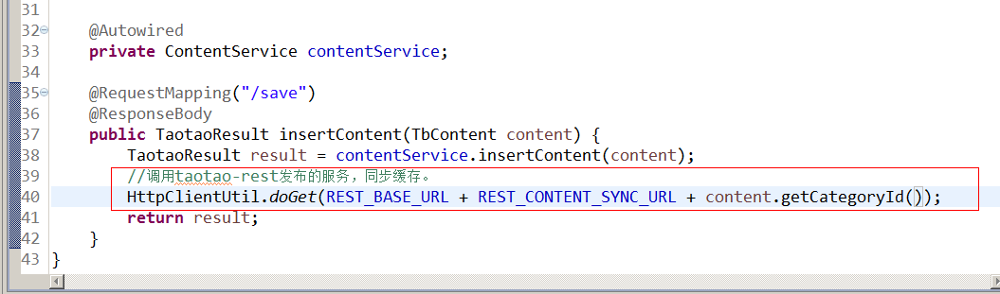

# 一、redis安装

## 1.1 Redis 的单机版


### 安装步骤：

- 第一步：安装gcc编译环境
yum install gcc-c++
- 第二步：把redis的源码上传到linux服务器。
- 第三步：解压缩。
tar -zxvf redis-3.0.0.tar.gz
- 第四步：make
- 第五步：make install PREFIX=/usr/local/redis

### 启动redis
两种启动方式，前端启动、后台启动。

- 前端启动：./redis-server
- 后台启动：

1. 复制redis.conf到redis的安装目录
2. 修改redis.conf。修改daemonize yes

	[root@bogon redis]# ./redis-server redis.conf
	
### 3.1.3客户端
redis-cli -p 端口 -h ip地址 <-c>连接集群时使用此参数

- 默认端口：6379
- Ip：localhost（127.0.0.1）

RedisDesktopManager：


## 1.2 Redis集群

### redis-cluster架构图

 

### 架构细节:

1. 所有的redis节点彼此互联(PING-PONG机制),内部使用二进制协议优化传输速度和带宽.
2. 节点的fail是通过集群中超过半数的节点检测失效时才生效.
3. 客户端与redis节点直连,不需要中间proxy层.客户端不需要连接集群所有节点,连接集群中任何一个可用节点即可
4. redis-cluster把所有的物理节点映射到[0-16383]slot上,cluster 负责维护node<->slot<->value

Redis 集群中内置了 16384 个哈希槽，当需要在 Redis 集群中放置一个 key-value 时，redis 先对 key 使用 crc16 算法算出一个结果，然后把结果对 16384 求余数，这样每个 key 都会对应一个编号在 0-16383 之间的哈希槽，redis 会根据节点数量大致均等的将哈希槽映射到不同的节点


# 二、redis使用

## String

- set key value
- get key

todo

## list

todo

## set

- hset key item value
- hget key item

todo

## map

todo

## 通用

- keys *
- ttl
- expire
 


# 三、java链接redis
需要使用Jedis连接redis服务器。

先把jedis依赖的jar包添加到工程中。

## 连接单机版

> 单机版测试

```
	@Test
	public void testJedisSingle() throws Exception {
		//创建一个Jedis对象
		Jedis jedis = new Jedis("192.168.25.153", 6379);
		jedis.set("test", "hello jedis");
		String string = jedis.get("test");
		System.out.println(string);
		jedis.close();
	}
```

> 使用连接池：

```
	@Test
	public void testJedisPool() throws Exception {
		//创建一个连接池对象
		//系统中应该是单例的。
		JedisPool jedisPool = new JedisPool("192.168.25.153", 6379);
		//从连接池中获得一个连接
		Jedis jedis = jedisPool.getResource();
		String result = jedis.get("test");
		System.out.println(result);
		//jedis必须关闭
		jedis.close();
		
		//系统关闭时关闭连接池
		jedisPool.close();
		
	}
```


## 集群版使用Jedis

```
@Test
	public void testJedisCluster() throws Exception {
		//创建一个JedisCluster对象
		Set<HostAndPort> nodes = new HashSet<>();
		nodes.add(new HostAndPort("192.168.25.153", 7001));
		nodes.add(new HostAndPort("192.168.25.153", 7002));
		nodes.add(new HostAndPort("192.168.25.153", 7003));
		nodes.add(new HostAndPort("192.168.25.153", 7004));
		nodes.add(new HostAndPort("192.168.25.153", 7005));
		nodes.add(new HostAndPort("192.168.25.153", 7006));
		//在nodes中指定每个节点的地址
		//jedisCluster在系统中是单例的。
		JedisCluster jedisCluster = new JedisCluster(nodes);
		jedisCluster.set("name", "zhangsan");
		jedisCluster.set("value", "100");
		String name = jedisCluster.get("name");
		String value = jedisCluster.get("value");
		System.out.println(name);
		System.out.println(value);
		
		
		//系统关闭时关闭jedisCluster
		jedisCluster.close();
	}
``` 

# 四、项目中使用Jedis

思路：创建一个redis操作的接口。分别创建两个实现类对应redis 的单机版和集群版。当使用单机版redis时，配置单机版的实现类，当使用集群版本的时候，配置集群版的实现类。

## 3.4.1单机版实现类

```
/**
 * redis客户端单机版实现类
 * <p>Title: JedisClientSingle</p>
 * <p>Description: </p>
 * <p>Company: www.itcast.com</p> 
 * @author	入云龙
 * @date	2015年11月20日上午10:13:58
 * @version 1.0
 */
public class JedisClientSingle implements JedisClient{
	
	@Autowired
	private JedisPool jedisPool;

	@Override
	public String set(String key, String value) {
		Jedis jedis = jedisPool.getResource();
		String result = jedis.set(key, value);
		jedis.close();
		return result;
	}

	@Override
	public String get(String key) {
		Jedis jedis = jedisPool.getResource();
		String result = jedis.get(key);
		jedis.close();
		return result;
	}

	@Override
	public Long hset(String key, String item, String value) {
		Jedis jedis = jedisPool.getResource();
		Long result = jedis.hset(key, item, value);
		jedis.close();
		return result;
	}

	@Override
	public String hget(String key, String item) {
		Jedis jedis = jedisPool.getResource();
		String result = jedis.hget(key, item);
		jedis.close();
		return result;
	}

	@Override
	public Long incr(String key) {
		Jedis jedis = jedisPool.getResource();
		Long result = jedis.incr(key);
		jedis.close();
		return result;
	}

	@Override
	public Long decr(String key) {
		Jedis jedis = jedisPool.getResource();
		Long result = jedis.decr(key);
		jedis.close();
		return result;
	}

	@Override
	public Long expire(String key, int second) {
		Jedis jedis = jedisPool.getResource();
		Long result = jedis.expire(key, second);
		jedis.close();
		return result;
	}

	@Override
	public Long ttl(String key) {
		Jedis jedis = jedisPool.getResource();
		Long result = jedis.ttl(key);
		jedis.close();
		return result;
	}

}
```

3.4.3Spring的配置

```
<?xml version="1.0" encoding="UTF-8"?>
<beans xmlns="http://www.springframework.org/schema/beans"
	xmlns:context="http://www.springframework.org/schema/context" xmlns:p="http://www.springframework.org/schema/p"
	xmlns:aop="http://www.springframework.org/schema/aop" xmlns:tx="http://www.springframework.org/schema/tx"
	xmlns:xsi="http://www.w3.org/2001/XMLSchema-instance"
	xsi:schemaLocation="http://www.springframework.org/schema/beans http://www.springframework.org/schema/beans/spring-beans-4.0.xsd
	http://www.springframework.org/schema/context http://www.springframework.org/schema/context/spring-context-4.0.xsd
	http://www.springframework.org/schema/aop http://www.springframework.org/schema/aop/spring-aop-4.0.xsd http://www.springframework.org/schema/tx http://www.springframework.org/schema/tx/spring-tx-4.0.xsd
	http://www.springframework.org/schema/util http://www.springframework.org/schema/util/spring-util-4.0.xsd">

	<!-- 包扫描器，扫描带@Service注解的类 -->
	<context:component-scan base-package="com.taotao.rest.service"></context:component-scan>
	<!-- 配置redis客户端单机版 -->
	<bean id="jedisPool" class="redis.clients.jedis.JedisPool">
		<constructor-arg name="host" value="192.168.25.153"></constructor-arg>
		<constructor-arg name="port" value="6379"></constructor-arg>
	</bean>
	<!-- 配置redis客户端实现类 -->
	<bean id="jedisClientSingle" class="com.taotao.rest.component.impl.JedisClientSingle"/>
	
	<!-- 配置redis客户端集群版 -->
	<!-- <bean id="jedisCluster" class="redis.clients.jedis.JedisCluster">
		<constructor-arg>
			<set>
				<bean class="redis.clients.jedis.HostAndPort">
					<constructor-arg name="host" value="192.168.25.153"/>
					<constructor-arg name="port" value="7001"/>
				</bean>
				<bean class="redis.clients.jedis.HostAndPort">
					<constructor-arg name="host" value="192.168.25.153"/>
					<constructor-arg name="port" value="7002"/>
				</bean>
				<bean class="redis.clients.jedis.HostAndPort">
					<constructor-arg name="host" value="192.168.25.153"/>
					<constructor-arg name="port" value="7003"/>
				</bean>
				<bean class="redis.clients.jedis.HostAndPort">
					<constructor-arg name="host" value="192.168.25.153"/>
					<constructor-arg name="port" value="7004"/>
				</bean>
				<bean class="redis.clients.jedis.HostAndPort">
					<constructor-arg name="host" value="192.168.25.153"/>
					<constructor-arg name="port" value="7005"/>
				</bean>
				<bean class="redis.clients.jedis.HostAndPort">
					<constructor-arg name="host" value="192.168.25.153"/>
					<constructor-arg name="port" value="7006"/>
				</bean>
			</set>
		</constructor-arg>
	</bean>
	<bean id="jedisClientCluster" class="com.taotao.rest.component.impl.JedisClientCluster"/> -->
</beans>
```

测试代码

```
@Test
	public void testJedisClientSpring() throws Exception {
		//创建一个spring容器
		ApplicationContext applicationContext = new ClassPathXmlApplicationContext("classpath:spring/applicationContext-*.xml");
		//从容器中获得JedisClient对象
		JedisClient jedisClient = applicationContext.getBean(JedisClient.class);
		//jedisClient操作redis
		jedisClient.set("cliet1", "1000");
		String string = jedisClient.get("cliet1");
		System.out.println(string);
	}
```

## 3.4.2集群版

```
/**
 * redis客户端集群版实现类
 * <p>Title: JedisClientCluster</p>
 * <p>Description: </p>
 * <p>Company: www.itcast.com</p> 
 * @author	入云龙
 * @date	2015年11月20日上午10:14:57
 * @version 1.0
 */
public class JedisClientCluster implements JedisClient {
	
	@Autowired
	private JedisCluster jedisCluster;

	@Override
	public String set(String key, String value) {
		return jedisCluster.set(key, value);
	}

	@Override
	public String get(String key) {
		return jedisCluster.get(key);
	}

	@Override
	public Long hset(String key, String item, String value) {
		return jedisCluster.hset(key, item, value);
	}

	@Override
	public String hget(String key, String item) {
		return jedisCluster.hget(key, item);
	}

	@Override
	public Long incr(String key) {
		return jedisCluster.incr(key);
	}

	@Override
	public Long decr(String key) {
		return jedisCluster.decr(key);
	}

	@Override
	public Long expire(String key, int second) {
		return jedisCluster.expire(key, second);
	}

	@Override
	public Long ttl(String key) {
		return jedisCluster.ttl(key);
	}

}
```

## 3.5业务逻辑中添加缓存
注意：添加缓存时不要影响正常的业务逻辑。

```
@Override
	public List<TbContent> getContentList(Long cid) {
		//添加缓存
		//查询数据库之前先查询缓存，如果有直接返回
		try {
			//从redis中取缓存数据
			String json = jedisClient.hget(REDIS_CONTENT_KEY, cid+"");
			if (!StringUtils.isBlank(json)) {
				//把json转换成List
				List<TbContent> list = JsonUtils.jsonToList(json, TbContent.class);
				return list;
			}
		} catch (Exception e) {
			e.printStackTrace();
		}
		// 根据cid查询内容列表
		TbContentExample example = new TbContentExample();
		Criteria criteria = example.createCriteria();
		criteria.andCategoryIdEqualTo(cid);
		//执行查询
		List<TbContent> list = contentMapper.selectByExampleWithBLOBs(example);
		
		//返回结果之前，向缓存中添加数据
		try {
			//为了规范key可以使用hash
			//定义一个保存内容的key，hash中每个项就是cid
			//value是list，需要把list转换成json数据。
			jedisClient.hset(REDIS_CONTENT_KEY, cid+"", JsonUtils.objectToJson(list));
		} catch (Exception e) {
			e.printStackTrace();
		}
		return list;
	}
```

## 3.6缓存同步
当后台修改内容信息后，只需要把redis中缓存的数据删除即可。
后台系统不直接操作redis数据库。

可以在taotao-rest中发布一个服务，当后台对内容信息修改后，调用服务即可。
服务的功能就是根据cid删除redis中缓存数据。

### 3.6.1发布服务

3.6.1.1Dao层

使用JedisClient。

3.6.1.2Service层

接收cid，根据cid调用JedisClient删除redis中缓存的数据。返回结果TaotaoResult。

```
@Override
	public TaotaoResult syncContent(Long cid) {
		jedisClient.hdel(REDIS_CONTENT_KEY, cid + "");
		return TaotaoResult.ok();
	}
```

3.6.1.3Controller层

发布服务，接收参数cid，返回结果TaotaoResult。

```
@RequestMapping("/sync/content/{cid}")
	@ResponseBody
	public TaotaoResult sysncContent(@PathVariable Long cid) {
		try {
			TaotaoResult result = contentService.syncContent(cid);
			return result;
		} catch (Exception e) {
			e.printStackTrace();
			return TaotaoResult.build(500, ExceptionUtil.getStackTrace(e));
		}
	}
```

## 3.7调用缓存同步
后台系统中，只要内容发生变化（增删改操作）需要调用缓存同步的服务。




# 参考文献

- [后端开发应该掌握的Redis基础](https://juejin.im/post/5d078cd6f265da1b8466e62c)


