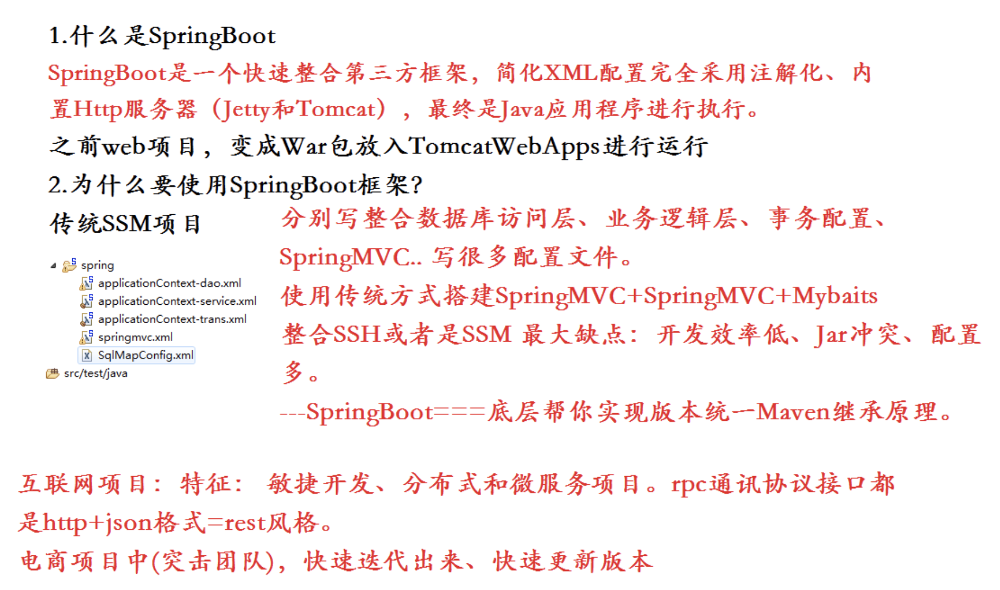

# SpringBoot是什么

SpringBoot 是一个快速开发的框架,能够快速的整合第三方框架，简化XML配置，全部采用注解形式，内置Tomcat容器,帮助开发者能够实现快速开发，SpringBoot的Web组件 默认集成的是SpringMVC框架。

SpringMVC是控制层。

# SpringBoot和SpringMVC区别
SpringBoot 是一个快速开发的框架,能够快速的整合第三方框架，简化XML配置，全部采用注解形式，内置Tomcat容器,帮助开发者能够实现快速开发，SpringBoot的Web组件 默认集成的是SpringMVC框架。
SpringMVC是控制层。

# SpringBoot和SpringCloud区别
SpringBoot 是一个快速开发的框架,能够快速的整合第三方框架，简化XML配置，全部采用注解形式，内置Tomcat容器,帮助开发者能够实现快速开发，SpringBoot的Web组件 默认集成的是SpringMVC框架。

SpringMVC是控制层。

SpringCloud依赖与SpringBoot组件，使用SpringMVC编写Http协议接口，同时SpringCloud是一套完整的微服务解决框架。

# spring-boot-starter-parent作用
在pom.xml中引入spring-boot-start-parent,spring官方的解释叫什么stater poms,它可以提供dependency management,也就是说依赖管理，引入以后在申明其它dependency的时候就不需要version了，后面可以看到。

# 参考文献

