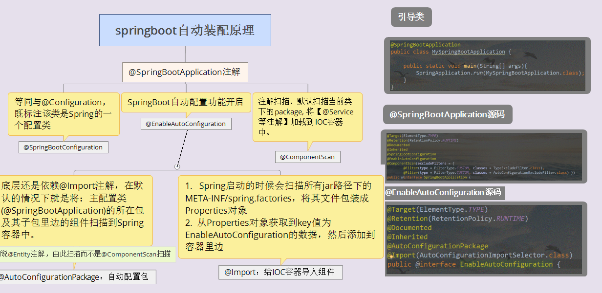

# SpringBoot自动化配置原理

# @SpringBootApplication注解

引导类里面只有一个注解@SpringBootApplication注解,从里面看有3个注解比较重要

- @SpringBootConfiguration
- @EnableAutoConfiguration
- @ComponentScan

这3个注解，其中@EnableAutoConfiguration是关键注解，作用是启动自动配置。内部实际使用@Import注解,加载META-INF/spring.factories文件的信息，然后筛选出以EnableAutoConfiguration为key的数据，加载到IOC容器中，实现自动配置功能！

## @SpringBootConfiguration注解

从源码看其等同@Configuration,即标注该类是Spring的一个配置类

## @ComponentScan注解

- 学习spring过后，这个就很简单了。就是注解扫描
- 扫描当前类下的package,@Controller/@Service/@Component/@Repository等注解

## @EnableAutoConfiguration注解

- @AutoConfigurationPackage注解：自动配置包

	里面还是依靠的@Import注解,注解扫描的工作。

- @Import注解：给IOC容器导入组件

	- FACTORIES_RESOURCE_LOCATION的值是META-INF/spring.factories
	- Spring启动的时候会扫描所有jar路径下的META-INF/spring.factories，将其文件包装成Properties对象
	- 从Properties对象获取到key值为EnableAutoConfiguration的数据，然后添加到容器里边。

