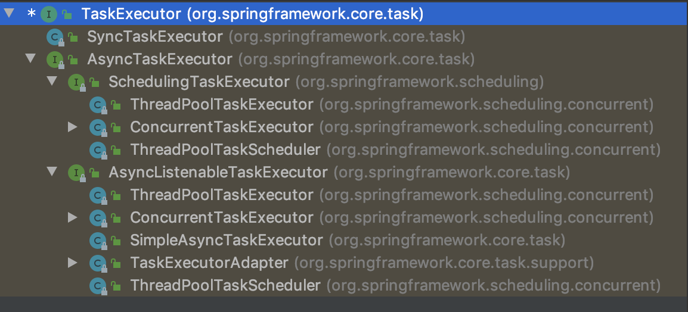

# 异步任务EnableAsync

如果我们需要在 SpringBoot 实现异步编程的话，通过 Spring 提供的两个注解会让这件事情变的非常简单。

- @EnableAsync：通过在配置类或者Main类上加@EnableAsync开启对异步方法的支持。
- @Async 可以作用在类上或者方法上，作用在类上代表这个类的所有方法都是异步方法。

## 1. 自定义 TaskExecutor
很多人对于 TaskExecutor 不是太了解，所以我们花一点篇幅先介绍一下这个东西。从名字就能看出它是任务的执行者，它领导执行着线程来处理任务，就像司令官一样，而我们的线程就好比一只只军队一样，这些军队可以异步对敌人进行打击👊。
Spring 提供了TaskExecutor接口作为任务执行者的抽象,它和java.util.concurrent包下的Executor接口很像。稍微不同的 TaskExecutor接口用到了 Java 8 的语法@FunctionalInterface声明这个接口是一个函数式接口。
org.springframework.core.task.TaskExecutor

```
@FunctionalInterface
public interface TaskExecutor extends Executor {
    void execute(Runnable var1);
}
```



```
import org.springframework.context.annotation.Bean;
import org.springframework.context.annotation.Configuration;
import org.springframework.scheduling.annotation.AsyncConfigurer;
import org.springframework.scheduling.annotation.EnableAsync;
import org.springframework.scheduling.concurrent.ThreadPoolTaskExecutor;

import java.util.concurrent.Executor;

/** @author shuang.kou */
@Configuration
@EnableAsync
public class AsyncConfig implements AsyncConfigurer {

  private static final int CORE_POOL_SIZE = 6;
  private static final int MAX_POOL_SIZE = 10;
  private static final int QUEUE_CAPACITY = 100;

  @Bean
  public Executor taskExecutor() {
    // Spring 默认配置是核心线程数大小为1，最大线程容量大小不受限制，队列容量也不受限制。
    ThreadPoolTaskExecutor executor = new ThreadPoolTaskExecutor();
    // 核心线程数
    executor.setCorePoolSize(CORE_POOL_SIZE);
    // 最大线程数
    executor.setMaxPoolSize(MAX_POOL_SIZE);
    // 队列大小
    executor.setQueueCapacity(QUEUE_CAPACITY);
    // 当最大池已满时，此策略保证不会丢失任务请求，但是可能会影响应用程序整体性能。
    executor.setRejectedExecutionHandler(new ThreadPoolExecutor.CallerRunsPolicy());
    executor.setThreadNamePrefix("My ThreadPoolTaskExecutor-");
    executor.initialize();
    return executor;
  }
}


```

ThreadPoolTaskExecutor 常见概念：

- Core Pool Size : 核心线程数线程数定义了最小可以同时运行的线程数量。
- Queue Capacity : 当新任务来的时候会先判断当前运行的线程数量是否达到核心线程数，如果达到的话，信任就会被存放在队列中。
- Maximum Pool Size : 当队列中存放的任务达到队列容量的时候，当前可以同时运行的线程数量变为最大线程数。

一般情况下不会将队列大小设为：Integer.MAX_VALUE,也不会将核心线程数和最大线程数设为同样的大小，这样的话最大线程数的设置都没什么意义了，你也无法确定当前 CPU 和内存利用率具体情况如何。

如果队列已满并且当前同时运行的线程数达到最大线程数的时候，如果再有新任务过来会发生什么呢？
Spring 默认使用的是 ThreadPoolExecutor.AbortPolicy。在Spring的默认情况下，ThreadPoolExecutor  将抛出 RejectedExecutionException 来拒绝新来的任务 ，这代表你将丢失对这个任务的处理。 对于可伸缩的应用程序，建议使用 ThreadPoolExecutor.CallerRunsPolicy。当最大池被填满时，此策略为我们提供可伸缩队列。
ThreadPoolTaskExecutor 饱和策略定义:
如果当前同时运行的线程数量达到最大线程数量时，ThreadPoolTaskExecutor 定义一些策略:

- ThreadPoolExecutor.AbortPolicy：抛出 RejectedExecutionException来拒绝新任务的处理。
- ThreadPoolExecutor.CallerRunsPolicy：调用执行自己的线程运行任务。您不会任务请求。但是这种策略会降低对于新任务提交速度，影响程序的整体性能。另外，这个策略喜欢增加队列容量。如果您的应用程序可以承受此延迟并且你不能任务丢弃任何一个任务请求的话，你可以选择这个策略。
- ThreadPoolExecutor.DiscardPolicy： 不处理新任务，直接丢弃掉。
- ThreadPoolExecutor.DiscardOldestPolicy： 此策略将丢弃最早的未处理的任务请求。


# 参考

- [新手也能看懂的 SpringBoot 异步编程指南](https://juejin.im/post/5d9e7cfa6fb9a04e1f12ec02)