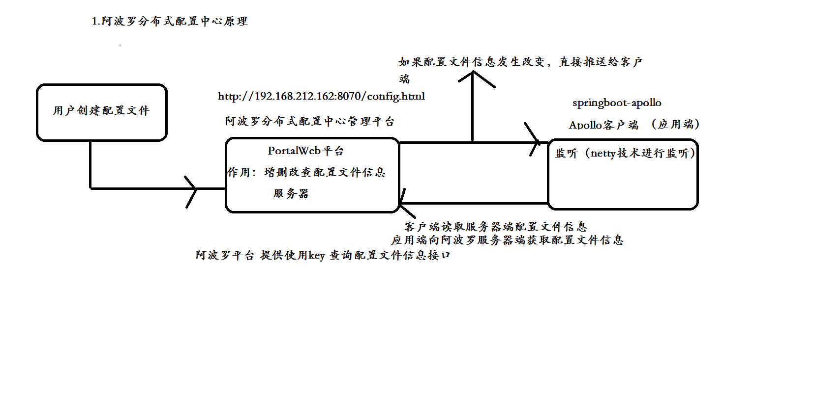

# 分布式配置中心

## 传统配置中心缺点

## 常用的配置中心

- Disconf（依赖于zookpeer）、
- Zookpeer（）、
- diamond、
- 携程（阿波罗）、

Zookpeer保证配置文件信息实时更新 （事件通知）

大型互联网公司自己内部都有自己独立分布式配置中心
独立RPC、独立分布式各种解决方案
注册中心解决 rpc服务治理
分布式配置中心 解决分布式配置文件管理

# 原理

