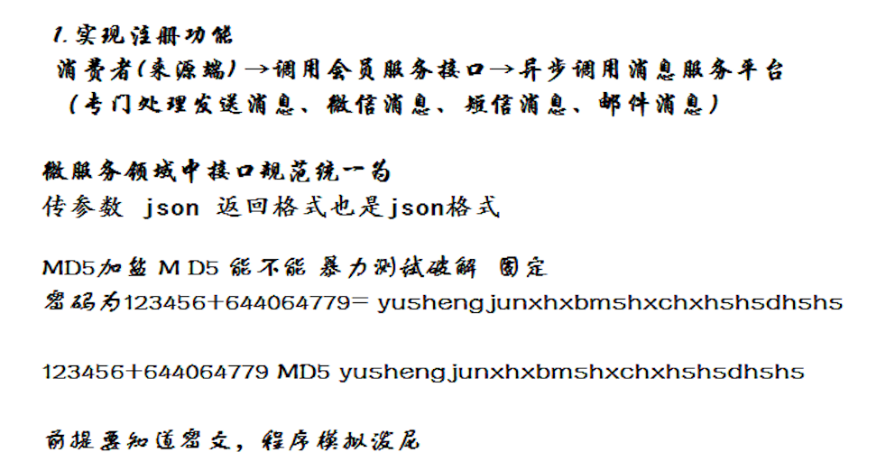
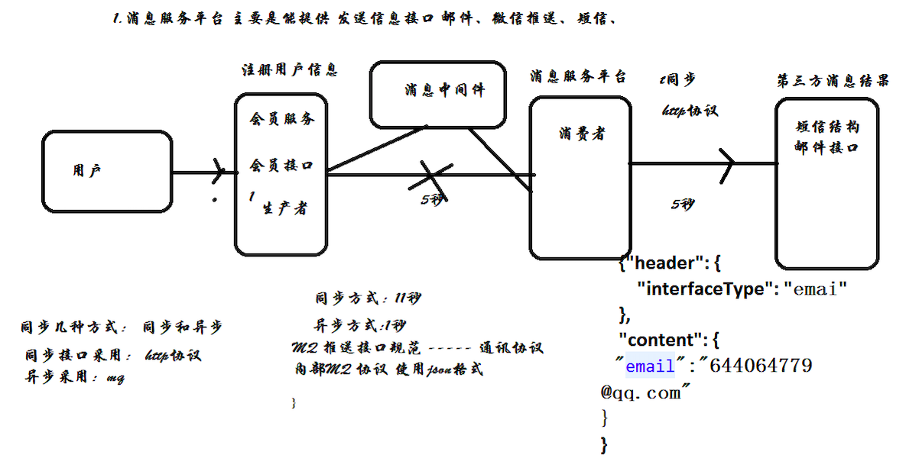

# 功能需求

todo

# 使用技术知识点

# 微服务架构

# 代码结构

# mysql整合

todo 

## 数据源
todo 

### druid数据源
todo

## 分布式开发中数据库怎么分的

todo

一个项目一个数据库，数据库根据系统分的。

## 分库分表

todo

## 分布式事务

todo

# 功能实现举例

## 注册功能

> 用户注册功能 

> 会员注册流程

### ActiveMQ使用

todo 

此处注册成功后，发送邮件，使用异步方式(MQ)。

进度：[进度：02、【中级项目】SpringCloud微服务支付项目实战（电商支付）](https://pan.baidu.com/disk/home?#/all?vmode=list&path=%2F%E7%BC%96%E7%A8%8B%E7%9B%B8%E5%85%B3%2Fjava%2F2019-05-02%E5%BE%AE%E6%9C%8D%E5%8A%A1%E5%AE%9E%E6%88%98%2F02%E3%80%81%E3%80%90%E4%B8%AD%E7%BA%A7%E9%A1%B9%E7%9B%AE%E3%80%91SpringCloud%E5%BE%AE%E6%9C%8D%E5%8A%A1%E6%94%AF%E4%BB%98%E9%A1%B9%E7%9B%AE%E5%AE%9E%E6%88%98%EF%BC%88%E7%94%B5%E5%95%86%E6%94%AF%E4%BB%98%EF%BC%89%2F03%E3%80%81%E4%BA%92%E8%81%94%E7%BD%91%E5%BE%AE%E6%9C%8D%E5%8A%A1%E7%94%B5%E5%95%86%E9%A1%B9%E7%9B%AE%E4%B9%8B%E4%BC%9A%E5%91%98%E7%B3%BB%E7%BB%9F-%E4%BC%9A%E5%91%98%E7%99%BB%E5%BD%95%E4%B8%8E%E6%B3%A8%E5%86%8C)

