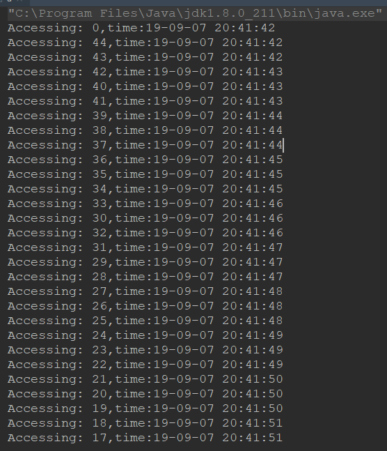

# 限流算法
正常情况，限流算法是用在网关里的。

## 计数器
思想：采用计数器实现限流有点简单粗暴，一般我们会限制一段时间能够通过的请求数，比如限流qps为100/min


采用计数器实现限流有点简单粗暴，一般我们会限制一秒钟的能够通过的请求数，比如限流qps为100，算法的实现思路就是从第一个请求进来开始计时，在接下去的1s内，每来一个请求，就把计数加1，如果累加的数字达到了100，那么后续的请求就会被全部拒绝。等到1s结束后，把计数恢复成0，重新开始计数。

具体的实现可以是这样的：对于每次服务调用，可以通过 AtomicLong#incrementAndGet()方法来给计数器加1并返回最新值，通过这个最新值和阈值进行比较。

### 问题：临界点的问题

> 临界问题解决方式：滑动窗口算法实现计数器

因此，可以采用滑动窗口的方式，就是将每一个周期分割为多个窗口，每个窗口有自己独立的计数器，当一个周期结束时，只将整个周期的开始时刻移动一个窗口的位置，这样就可以防止上面那种临界点瞬间大流量的冲击。


## 令牌桶算法(RateLimiter)

思想：在令牌桶算法中，存在一个桶，用来存放固定数量的令牌。算法中存在一种机制，以一定的速率往桶中放令牌。每次请求调用需要先获取令牌，只有拿到令牌，才有机会继续执行，否则选择选择等待可用的令牌、或者直接拒绝。

实现思路：可以准备一个队列，用来保存令牌，另外通过一个线程池定期生成令牌放到队列中，每来一个请求，就从队列中获取一个令牌，并继续执行。

幸运的是，通过Google开源的guava包，我们可以很轻松的创建一个令牌桶算法的限流器。

```
public static void main(String[] args) {
        //线程池
        ExecutorService exec = Executors.newCachedThreadPool();
        //速率是每秒只有3个许可
        final RateLimiter rateLimiter = RateLimiter.create(3.0);

        for (int i = 0; i < 100; i++) {
            final int no = i;
            Runnable runnable = new Runnable() {
                @Override
                public void run() {
                    try {
                        //获取许可
                        rateLimiter.acquire();
                        System.out.println("Accessing: " + no + ",time:"
                                + new SimpleDateFormat("yy-MM-dd HH:mm:ss").format(new Date()));

                    } catch (Exception e) {
                        e.printStackTrace();
                    }

                }
            };
            //执行线程
            exec.execute(runnable);
        }
        //退出线程池
        exec.shutdown();
    }

```
我们可以从结果看出，每秒只能执行三个：




## 漏桶算法
漏桶算法其实很简单，可以粗略的认为就是注水漏水过程，往桶中以一定速率流出水，以任意速率流入水，当水超过桶流量则丢弃，因为桶容量是不变的，保证了整体的速率

# 分布式限流
RateLimiter是一个单机的限流组件，如果是分布式应用的话，该怎么做？

```
local key = "rate.limit:" .. KEYS[1] --限流KEY
local limit = tonumber(ARGV[1])        --限流大小
local current = tonumber(redis.call('get', key) or "0")
if current + 1 > limit then --如果超出限流大小
  return 0
else  --请求数+1，并设置1秒过期
  redis.call("INCRBY", key,"1")
   redis.call("expire", key,"1")
   return current + 1
end

```
Java代码如下：

```
public static boolean accquire() throws IOException, URISyntaxException {
    Jedis jedis = new Jedis("127.0.0.1");
    File luaFile = new File(RedisLimitRateWithLUA.class.getResource("/").toURI().getPath() + "limit.lua");
    String luaScript = FileUtils.readFileToString(luaFile);

    String key = "ip:" + System.currentTimeMillis()/1000; // 当前秒
    String limit = "5"; // 最大限制
    List<String> keys = new ArrayList<String>();
    keys.add(key);
    List<String> args = new ArrayList<String>();
    args.add(limit);
    Long result = (Long)(jedis.eval(luaScript, keys, args)); // 执行lua脚本，传入参数
    return result == 1;
}

```

解释：

- Java代码传入key和最大的限制limit参数进lua脚本
- 执行lua脚本（lua脚本判断当前key是否超过了最大限制limit）
	- 如果超过，则返回0（限流）
	- 如果没超过，返回1（程序继续执行）

> 分布式限流器方案二:(外呼中使用)

通过redis和redis锁来实现


# 应用层限流(Nginx)
todo 


# 参考文献
- [基于循环数组实现的带滑动窗口的计数器限流算法](https://blog.csdn.net/dbqb007/article/details/88082279)
- [带你了解什么是限流](https://juejin.im/post/5d8036a3e51d4561ff6668c3)

