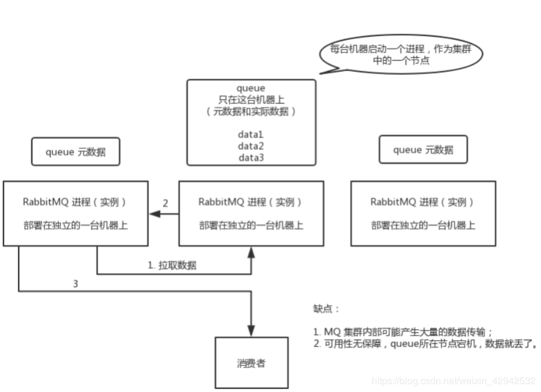
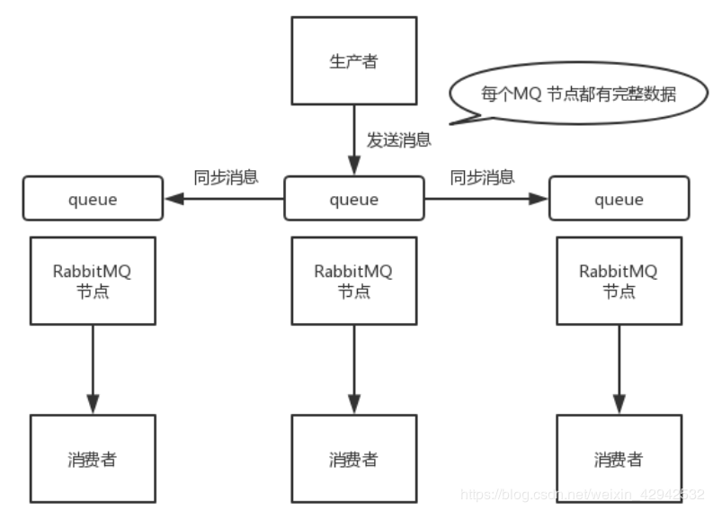

# RabbitMQ简介

不是分布式的

kafka是分布式的

# 优缺点

不是分布式架构的MQ

kafka是纯分布式的架构

# 高可用

rabbitmq有3种模式，但集群模式是2种。详细如下：

## 单一模式：
即单机情况不做集群，就单独运行一个rabbitmq而已。
## 普通集群模式：

该模式为默认模式

优缺点：
这种方式只是一个简单的集群,并没有考虑高可用. 并且性能开销巨大.容易造成单实例的性能瓶颈. 并且如果真正有数据的那个queue的实例宕机了. 那么其他的实例就无法进行数据的拉取.

这种方式只是通过集群部署的方式提高了消息的吞吐量,但是并没有考虑到高可用.

## 镜像集群模式:

这种模式才是高可用模式. 与普通集群模式的主要区别在于. 无论queue的元数据还是queue中的消息都会同时存在与多个实例上.

优缺点：
这种方式的好处就在于, 任何一个服务宕机了,都不会影响整个集群数据的完整性, 因为其他服务中都有queue的完整数据, 当进行消息消费的时候,连接其他的服务器节点一样也能获取到数据.

缺点:

1: 性能开销大: 因为需要进行整个集群内部所有实例的数据同步

2:无法线性扩容: 因为每一个服务器中都包含整个集群服务节点中的所有数据, 这样如果一旦单个服务器节点的容量无法容纳了怎么办?.
