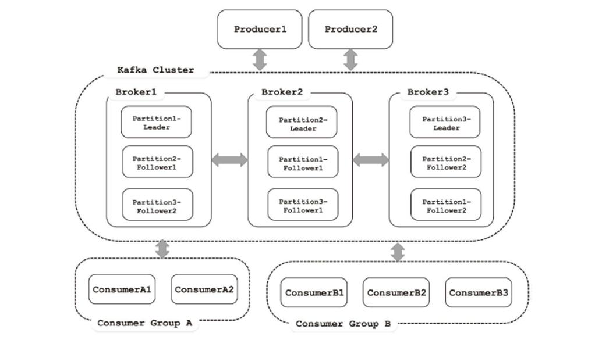
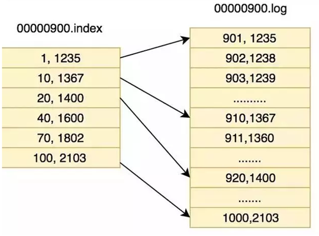
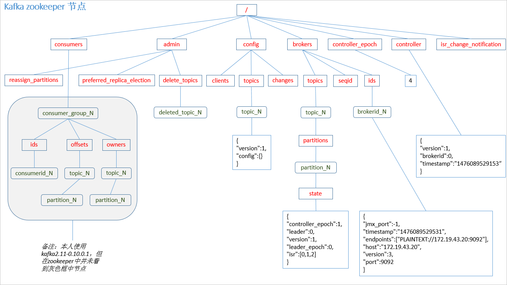

# 消息系统分类

## Peer-to-Peer
- 一般基于Pull或者Polling接收消息
- 发送到队列中的消息被一个而且仅仅一个接收者所接收，
即使有多个接收者在同一个队列中侦听同一消息
- 即支持异步“即发即弃”的消息传送方式，也支持同步请
求/应答传送方式

## 发布/订阅
- 发布到一个主题的消息，可被多个订阅者所接收
- 发布/订阅即可基于Push消费数据，也可基于Pull或者
Polling消费数据
- 解耦能力比P2P模型更强

# 消息系统适用场景
- 解耦 各位系统之间通过消息系统这个统一的接口交换数据，无须了解彼此的存在
- 冗余 部分消息系统具有消息持久化能力，可规避消息处理前丢失的风险
- 扩展 消息系统是统一的数据接口，各系统可独立扩展
- 峰值处理能力 消息系统可顶住峰值流量，业务系统可根据处理能力从消息系统中获取并处理对应量的请求
- 可恢复性 系统中部分组件失效并不会影响整个系统，它恢复后仍然可从消息系统中获取并处理数据
- 异步通信 在不需要立即处理请求的场景下，可以将请求放入消息系统，合适的时候再处理

# 常用消息系统对比
- RabbitMQ Erlang编写，支持多协议 AMQP，XMPP，SMTP，STOMP。支持负载均衡、数据持久化。同时
支持Peer-to-Peer和发布/订阅模式
- Redis 基于Key-Value对的NoSQL数据库，同时支持MQ功能，可做轻量级队列服务使用。就入队操作而言，
Redis对短消息（小于10KB）的性能比RabbitMQ好，长消息的性能比RabbitMQ差。
- ZeroMQ 轻量级，不需要单独的消息服务器或中间件，应用程序本身扮演该角色，Peer-to-Peer。它实质上是
一个库，需要开发人员自己组合多种技术，使用复杂度高
- ActiveMQ JMS实现，Peer-to-Peer，支持持久化、XA事务
- Kafka/Jafka 高性能跨语言的分布式发布/订阅消息系统，数据持久化，全分布式，同时支持在线和离线处理
- MetaQ/RocketMQ 纯Java实现，发布/订阅消息系统，支持本地事务和XA分布式事务

# Kafka设计目标
- 高吞吐率 在廉价的商用机器上单机可支持每秒100万条消息的读写
- 消息持久化 所有消息均被持久化到磁盘，无消息丢失，支持消息重放
- 完全分布式 Producer，Broker，Consumer均支持水平扩展
- 同时适应在线流处理和离线批处理

# 简单说明什么是kafka
Apache kafka是消息中间件的一种，我发现很多人不知道消息中间件是什么，在开始学习之前，我这边就先简单的解释一下什么是消息中间件，只是粗略的讲解，目前kafka已经可以做更多的事情。

举个例子，生产者消费者，生产者生产鸡蛋，消费者消费鸡蛋，生产者生产一个鸡蛋，消费者就消费一个鸡蛋，假设消费者消费鸡蛋的时候噎住了（系统宕机了），生产者还在生产鸡蛋，那新生产的鸡蛋就丢失了。再比如生产者很强劲（大交易量的情况），生产者1秒钟生产100个鸡蛋，消费者1秒钟只能吃50个鸡蛋，那要不了一会，消费者就吃不消了（消息堵塞，最终导致系统超时），消费者拒绝再吃了，”鸡蛋“又丢失了，这个时候我们放个篮子在它们中间，生产出来的鸡蛋都放到篮子里，消费者去篮子里拿鸡蛋，这样鸡蛋就不会丢失了，都在篮子里，而这个篮子就是”kafka“。
鸡蛋其实就是“数据流”，系统之间的交互都是通过“数据流”来传输的（就是tcp、https什么的），也称为报文，也叫“消息”。
消息队列满了，其实就是篮子满了，”鸡蛋“ 放不下了，那赶紧多放几个篮子，其实就是kafka的扩容。
各位现在知道kafka是干什么的了吧，它就是那个"篮子"。

# 架构图

# kafka名词解释

在一套 Kafka 架构中有多个 Producer，多个 Broker，多个 Consumer，每个 Producer 可以对应多个 Topic，每个 Consumer 只能对应一个 Consumer Group。

整个 Kafka 架构对应一个 ZK 集群，通过 ZK 管理集群配置，选举 Leader，以及在 Consumer Group 发生变化时进行 Rebalance。

## Broker
一个单独的Kafka server就是一个Broker,Broker的主要工作就是接收生产者发送来的消息,分配offset,然后将包装过的数据保存到磁盘上;此外,Broker还会接收消费者和其他Broker的请求,根据请求的类型进行相应的处理然后返回响应。多个Broker可以做成一个Cluster(集群)对外提供服务,每个Cluster当中会选出一个Broker来担任Controller,Controller是Kafka集群的指挥中心,其他的Broker则听从Controller指挥实现相应的功能。Controller负责管理分区的状态、管理每个分区的副本状态、监听zookeeper中数据的变化等。Controller也是一主多从的实现,所有的Broker都会监听Controller Leader的状态,当Leader Controller出现了故障的时候就重新选举新的Controller Leader。

## 消息
消息是Kafka中最基本的消息单元。消息由一串字节组成,其中主要由key和value构成,key和value都是字节数组。key的主要作用是根据一定的策略,将这个消息路由到指定的分区中,这样就可以保证包含同一个key的消息全部写入同一个分区

## Topic
Topic是用于存储消息的逻辑概念,Topic可以看做是一个消息的集合。每个Topic可以有多个生产者向其中push消息,也可以有多个消费者向其中pull消息。

## 分区(partition)
每一个Topic都可以划分成多个分区(每一个Topic都至少有一个分区),不同的分区会分配在不同的Broker上以对Kafka进行水平扩展从而增加Kafka的并行处理能力。同一个Topic下的不同分区包含的消息是不同的。每一个消息在被添加到分区的时候,都会被分配一个offset,他是消息在此分区中的唯一编号,此外,Kafka通过offset保证消息在分区中的顺序,offset的顺序性不跨分区,也就是说在Kafka的同一个分区中的消息是有序的,不同分区的消息可能不是有序的。

## Log
分区在逻辑上对应着一个Log,当生产者将消息写入分区的时候,实际上就是写入到了一个Log中。Log是一个逻辑概念,对应的是一个磁盘上的文件夹。Log由多个Segment组成,每一个Segment又对应着一个日志文件和一个索引文件。

每个Partition其实都会对应一个日志目录：{topicName}-{partitionid}/，在目录下面会对应多个日志分段(LogSegment)。LogSegment文件由两部分组成，分别为“.index”文件和“.log”文件
索引文件使用稀疏索引的方式，避免对日志每条数据建索引，节省存储空间

## 副本
Kafka对消息进行了冗余备份,每一个分区都可以有多个副本,每一个副本中包含的消息是相同的(但不保证同一时刻下完全相同)。副本的类型分为Leader和Follower,当分区只有一个副本的时候,该副本属于Leader,没有
Follower。Kafka的副本具有一定的同步机制,在每个副本集合中,都会选举出一个副本作为Leader副本,Kafka在不同的场景中会采用不同的选举策略。Kafka中所有的读写请求都由选举出的Leader副本处理,其他的都作为Follower副本,Follower副本仅仅是从Leader副本中把数据拉取到本地之后,同步更新到自己的Log中。

## 生产者
生产者主要是生产消息,并将消息按照一定的规则推送到Topic的分区中

## 消费者
消费者主要是从Topic中拉取消息,并对消息进行消费。Consumer维护消费者消费者消费到Partition的哪一个位置(offset的值)这一信息。**在Kafka中,多个Consumer可以组成一个Consumer Group,一个Consumer只能属于一个Consumer Group。Consumer Group保证其订阅的Topic中每一个分区只被分配给此Consumer Group中的一个消费者处理,所以如果需要实现消息的广播消费,则将消费者放在多个不同的Consumer Group中即可实现。**通过向Consumer Group中动态的添加适量的Consumer,可以出发Kafka的Rebalance操作重新分配分区与消费者的对应关系,从而实现了水平扩展的能力。

# Zookeeper

# 参考

- [kafka学习笔记：知识点整理](https://www.cnblogs.com/cyfonly/p/5954614.html)