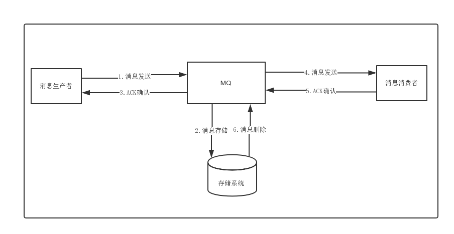
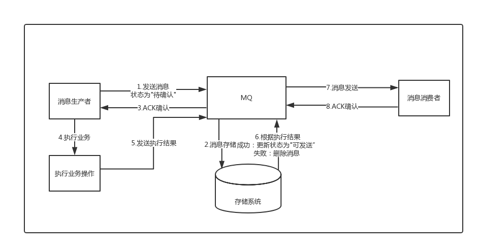

随着分布式服务架构的流行与普及，原来在单体应用中执行的多个逻辑操作，现在被拆分成了多个服务之间的远程调用。虽然服务化为我们的系统带来了水平伸缩的能力，然而随之而来挑战就是分布式事务问题，多个服务之间使用自己单独维护的数据库，它们彼此之间不在同一个事务中，假如A执行成功了，B执行却失败了，而A的事务此时已经提交，无法回滚，那么最终就会导致两边数据不一致性的问题；尽管很早之前就有基于两阶段提交的XA分布式事务，但是这类方案因为需要资源的全局锁定，导致性能极差；因此后面就逐渐衍生出了消息最终一致性、TCC等柔性事务的分布式事务方案，本文主要分析的是基于消息的最终一致性方案。

# 普通消息的处理流程



1. 消息生成者发送消息
2. MQ收到消息，将消息进行持久化，在存储中新增一条记录
3. 返回ACK给生产者
4. MQ push 消息给对应的消费者，然后等待消费者返回ACK
5. 如果消息消费者在指定时间内成功返回ack，那么MQ认为消息消费成功，在存储中删除消息，即执行第6步；如果MQ在指定时间内没有收到ACK，则认为消息消费失败，会尝试重新push消息,重复执行4、5、6步骤
6. MQ删除消息

## 普通消息处理存在的一致性问题
我们以订单创建为例，订单系统先创建订单(本地事务)，再发送消息给下游处理；如果订单创建成功，然而消息没有发送出去，那么下游所有系统都无法感知到这个事件，会出现脏数据；

```
public void processOrder() {
    // 订单处理(业务操作) 
    orderService.process();
    // 发送订单处理成功消息(发送消息) 
    sendBizMsg ();
}
```

如果先发送订单消息，再创建订单；那么就有可能消息发送成功，但是在订单创建的时候却失败了，此时下游系统却认为这个订单已经创建，也会出现脏数据。

```
public void processOrder() {
   // 发送订单处理成功消息(发送消息) 
    sendBizMsg ();
    // 订单处理(业务操作) 
    orderService.process();
}
```
# 事务消息
由于传统的处理方式无法解决消息生成者本地事务处理成功与消息发送成功两者的一致性问题，因此事务消息就诞生了，它实现了消息生成者本地事务与消息发送的原子性，保证了消息生成者本地事务处理成功与消息发送成功的最终一致性问题。

## 事务消息处理的流程




# 参考文献

- [MQ消息最终一致性解决方案](https://juejin.im/post/5d8882bdf265da03c9273821)

