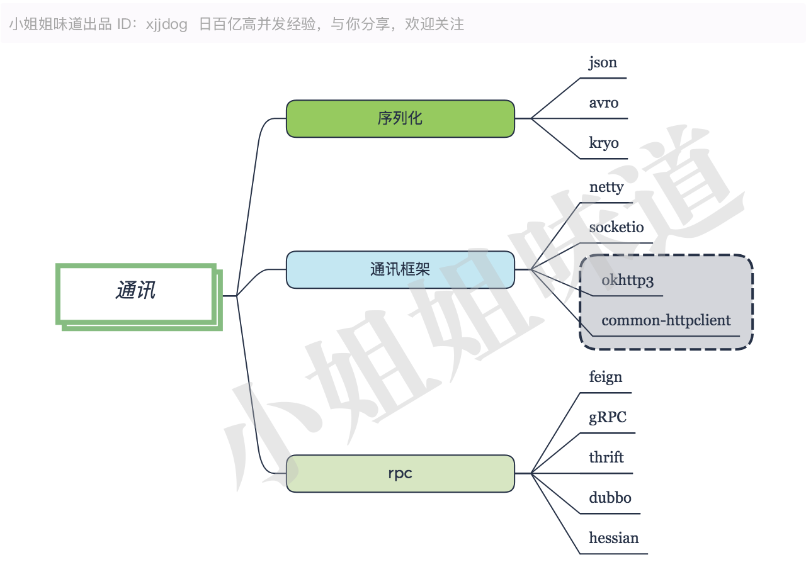

# 通讯框架

Java 中，netty已经成为当之无愧的网络开发框架，包括其上的socketio（不要再和我提mina了）。对于http协议，有common-httpclient，以及更加轻量级的工具okhttp来支持。

对于一个rpc来说，要约定一个通讯方式和序列化方式。json是最常用的序列化方式，但是传输和解析成本大，xml等文本协议与其类似，都有很多冗余的信息；avro和kryo是二进制的序列化工具，没有这些缺点，但调试不便。

rpc是远程过程调用的意思 ，其中，thrift、dubbo、gRPC默认都是二进制序列化方式的socket通讯框架；feign、hessian都是onhttp的远程调用框架。

对了，gRPC的序列化工具是protobuf，一个压缩比很高的二进制序列化工具。

通常，服务的响应时间主要耗费在业务逻辑以及数据库上，通讯层耗时在其中的占比很小。可以根据自己公司的研发水平和业务规模来选择。

