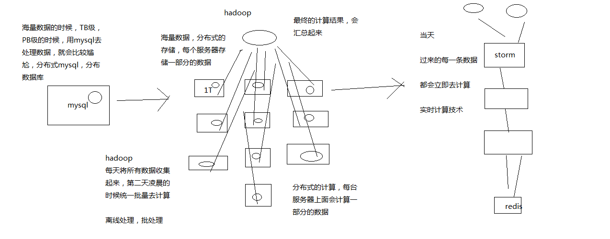

这块给大家解释一下，就是说，有些技术我们可能就是简单带着大家去用一下就好了

nginx，java，一般都会一些

kafka，zookeeper，lua，我觉得，那些东西的话，主要是讲解基于他们的一些架构，和解决方案的设计还有开发

## Redis
redis：跟我们的这个topic是很有关系的，大型缓存架构，高并发高性能高可用的缓存架构的底层支持，redis，细致的去讲解，那块`redis`技术和知识是本套课程的一个`重点`

`数据库+缓存双写`，`多级缓存架构`，大家重点去理解里面的方案设计和架构思想

`热数据的处理`，`缓存雪崩` --> `storm，hystrix`

对于这两个技术，都是关键性的会去影响你的热数据，缓存雪崩时的系统可用性和稳定性

对这两个技术，storm，hystrix，都很重要

会类似redis，花费较多的篇幅去给大家讲解一下，让大家可以把这两个技术同时也学习的非常好

正好跟着我们的大的项目实战在走，学完以后，直接可以学以致用，用到我们的系统架构中去

---

> 消息队列

kafka，消息队列，用起来很简单，而且搞java得一般来说，对消息队列都有一些了解吧，而且到了真实的生产环境中，kafka你是可以换成其他的技术，Active MQ，Rabbit MQ，Rocket MQ

> zk

zookeeper，分布式锁，分布式锁，搞java一般也会知道一些，zk去做，redis去做锁也是可以的

lua，大家后面真的是要用到lua，觉得课程里讲解的东西不够，可以自己去网上查一些lua的语法可以了，语法是最最简单的

> storm

storm，说句实话，在做热数据这块，如果要做复杂的热数据的统计和分析，亿流量，高并发的场景下，我还真觉得，最合适的技术就是storm，没有其他

缓存架构，热数据先关的架构设计，热数据相关的架构中最重要的唯一的可选技术，storm，好好的去讲一下的

> hystrix

hystrix，分布式系统的`高可用性的限流，熔断，降级`，等等，一些措施，`缓存雪崩的方案，限流`的技术

## 讲给Java工程师的史上最通俗易懂Storm教程

讲给Java工程师：我知道你没什么大数据的背景和经验，基础，那么我就把你当做一个大数据小白，主要是java背景和基础

史上最通俗易懂：市面上其他的storm视频课程，或者是一些书籍，我告诉，storm还是挺难的，事务，云里雾里，云里雾里

搞storm大数据的，连这个并行度和流分组的本质它都说不清楚，因为市面上的资料也说不清楚

会把你当做小白，用最最通俗易懂的语言，给你去讲解这块的知识，画图

### 一、Storm到底是什么？

1、mysql，hadoop与storm

- mysql：`事务性`系统，面临`海量数据的尴尬`
- hadoop：`离线批处理`
- storm：`实时计算`

**mysql、hadoop与storm的关系**

2、我们能不能自己搞一套storm？

来一条数据，我理解就算一条，来一条，算一条

坑，海量高并发大数据，高并发的请求数据，分布式的系统，流式处理的分布式系统

如果自己搞一套实时流系统出来，也是可以的，但是。。。。

（1）`花费大量的时间在底层技术细节上`：如何部署各种中间队列，节点间的通信，容错，资源调配，计算节点的迁移和部署，等等

（2）花费大量的时间`在系统的高可用上问题上`：如何保证各种节点能够高可用稳定运行

（3）花费大量的时间在系统扩容上：吞吐量需要扩容的时候，你需要花费大量的时间去增加节点，修改配置，测试，等等

5万/s，10万/s，扩容

国内，国产的实时大数据计算系统，唯一做出来的，做得好的，做得影响力特别大，特别牛逼的，`就是JStorm，阿里搞的`

阿里，技术实力，世界一流，顶尖，国内顶尖，一流

JStorm，clojure编程预压，Java重新写了一遍，Galaxy流式计算的系统，百度，腾讯，也都自己做了，也能做得很好

3、storm的特点是什么？

（1）支撑各种实时类的项目场景：实时处理消息以及更新数据库，基于最基础的实时计算语义和API（实时数据处理领域）；对实时的数据流持续的进行查询或计算，同时将最新的计算结果持续的推送给客户端展示，同样基于最基础的实时计算语义和API（实时数据分析领域）；对耗时的查询进行并行化，基于DRPC，即分布式RPC调用，单表30天数据，并行化，每个进程查询一天数据，最后组装结果

storm做各种实时类的项目都ok

（2）高度的可伸缩性：如果要扩容，直接加机器，调整storm计算作业的并行度就可以了，storm会自动部署更多的进程和线程到其他的机器上去，无缝快速扩容

扩容起来，超方便

（3）数据不丢失的保证：storm的消息可靠机制开启后，可以保证一条数据都不丢

数据不丢失，也不重复计算

（4）超强的健壮性：从历史经验来看，storm比hadoop、spark等大数据类系统，健壮的多的多，因为元数据全部放zookeeper，不在内存中，随便挂都不要紧

特别的健壮，稳定性和可用性很高

（5）使用的便捷性：核心语义非常的简单，开发起来效率很高

用起来很简单，开发API还是很简单的
