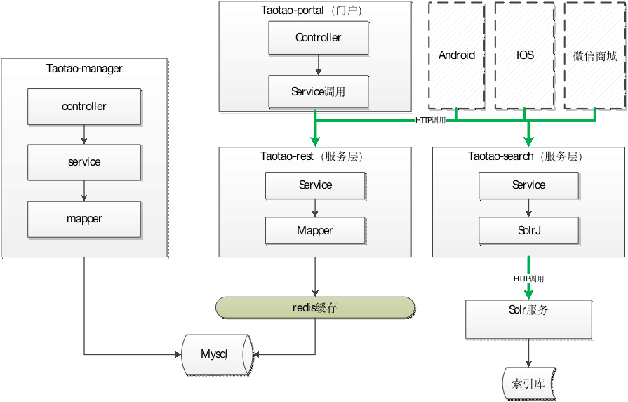

# solr介绍

todo 

# 5搜索系统搭建
搜索功能需要发布服务共pc端、移动端使用。根据关键词搜索，得到json格式的搜索结果。

创建一个搜索系统，发布搜索服务。

系统架构：




1. 创建一个搜索工程：taotao-search
2. 搭建solr服务

## 5.1创建搜索系统
可以参考taotao-rest创建。

使用的技术：

1. Mybatis
2. Spring
3. Springmvc（发布服务）
4. SolrJ（solr服务的客户端）

## 5.4Solr服务的搭建
需要在linux系统下搭建solr服务。

1. 需要安装tomcat
2. 安装jdk

### 5.4.1 CentOS单机版安装：

- 第一步：安装jdk、安装tomcat
- 第二步：解压solr压缩包。
- 第三步：把dist/solr-4.10.3.war部署到tomcat下。
- 第四步：解压缩war包。启动tomcat解压。
- 第五步：需要把/root/solr-4.10.3/example/lib/ext目录下的所有的jar包添加到solr工程中。
- 第六步：创建solrhome。把/root/solr-4.10.3/example/solr文件夹复制一份作为solrhome。
- 第七步：告诉solr服务solrhome的位置。需要修改web.xml
- 第八步：启动tomcat。

### 5.4.2配置中文分析器、自定义业务域
分析器使用IKAnalyzer。

使用方法：

- 第一步：把IKAnalyzer依赖的jar包添加到solr工程中。把分析器使用的扩展词典添加到classpath中。
- 第二步：需要自定义一个FieldType。Schema.xml中定义。可以在FieldType中指定中文分析器。

	```
	<fieldType name="text_ik" class="solr.TextField">
	  <analyzer class="org.wltea.analyzer.lucene.IKAnalyzer"/>
	</fieldType>
	```

- 第三步：自定义域。指定域的类型为自定义的FieldType。

sql语句

```
Sql语句：
SELECT
	a.id,
	a.title,
	a.sell_point,
	a.price,
	a.image,
	b.`name` category_name,
	c.item_desc
FROM
	tb_item a
LEFT JOIN tb_item_cat b ON a.cid = b.id
LEFT JOIN tb_item_desc c ON a.id = c.item_id
WHERE
	a.`status` = 1
```

```
<field name="item_title" type="text_ik" indexed="true" stored="true"/>
<field name="item_sell_point" type="text_ik" indexed="true" stored="true"/>
<field name="item_price"  type="long" indexed="true" stored="true"/>
<field name="item_image" type="string" indexed="false" stored="true" />
<field name="item_category_name" type="string" indexed="true" stored="true" />
<field name="item_desc" type="text_ik" indexed="true" stored="false" />

<field name="item_keywords" type="text_ik" indexed="true" stored="false" multiValued="true"/>
<copyField source="item_title" dest="item_keywords"/>
<copyField source="item_sell_point" dest="item_keywords"/>
<copyField source="item_category_name" dest="item_keywords"/>
<copyField source="item_desc" dest="item_keywords"/>
```

- 第四步：重新启动tomcat

## 5.5索引库中导入数据
### 5.5.1Solrj的使用

```
public class SolrJTest {

	@Test
	public void testSolrJ() throws Exception {
		//创建连接
		SolrServer solrServer = new HttpSolrServer("http://192.168.25.154:8080/solr");
		//创建一个文档对象
		SolrInputDocument document = new SolrInputDocument();
		//添加域
		document.addField("id", "solrtest01");
		document.addField("item_title", "测试商品");
		document.addField("item_sell_point", "卖点");
		//添加到索引库
		solrServer.add(document);
		//提交
		solrServer.commit();
	}
	
	@Test
	public void testQuery() throws Exception {
		//创建连接
		SolrServer solrServer = new HttpSolrServer("http://192.168.25.154:8080/solr");
		//创建一个查询对象
		SolrQuery query = new SolrQuery();
		query.setQuery("*:*");
		//执行查询
		QueryResponse response = solrServer.query(query);
		//取查询结果
		SolrDocumentList solrDocumentList = response.getResults();
		for (SolrDocument solrDocument : solrDocumentList) {
			System.out.println(solrDocument.get("id"));
			System.out.println(solrDocument.get("item_title"));
			System.out.println(solrDocument.get("item_sell_point"));
		}
	}
}
```

### 5.5.2导入数据

> 5.5.2.1分析


从数据库中根据sql语句查询数据，遍历数据创建文档对象，把文档对象写入索引库。

> 5.5.2.2Dao层

Sql语句：

```
SELECT
	a.id,
	a.title,
	a.sell_point,
	a.price,
	a.image,
	b.`name` category_name,
	c.item_desc
FROM
	tb_item a
LEFT JOIN tb_item_cat b ON a.cid = b.id
LEFT JOIN tb_item_desc c ON a.id = c.item_id
WHERE
	a.`status` = 1
```
需要创建一个mapper文件。

接口：

```
public interface ItemMapper {

	List<SearchItem> getItemList();
}
```

Mapper文件：

```
<?xml version="1.0" encoding="UTF-8" ?>
<!DOCTYPE mapper PUBLIC "-//mybatis.org//DTD Mapper 3.0//EN" "http://mybatis.org/dtd/mybatis-3-mapper.dtd" >
<mapper namespace="com.taotao.search.mapper.ItemMapper" >
	<select id="getItemList" resultType="com.taotao.search.pojo.SearchItem">
		SELECT
			a.id,
			a.title,
			a.sell_point,
			a.price,
			a.image,
			b.`name` category_name,
			c.item_desc
		FROM
			tb_item a
		LEFT JOIN tb_item_cat b ON a.cid = b.id
		LEFT JOIN tb_item_desc c ON a.id = c.item_id
		WHERE
			a.`status` = 1
	</select>
</mapper>
```

5.5.2.3Service层

取商品列表，遍历列表，创建文档对象，把文档对象写入索引库。

要操作索引库需要SolrServer对象，可以把SolrServer放到spring容器中，注入到Service。

service

```
@Service
public class ItemServiceImpl implements ItemService {

	@Autowired
	private SolrServer solrServer;
	@Autowired
	private ItemMapper itemMapper;
	
	@Override
	public TaotaoResult importItems() throws Exception {
		//查询数据库获得商品列表
		List<SearchItem> itemList = itemMapper.getItemList();
		//遍历列表
		for (SearchItem item : itemList) {
			//创建文档对象
			SolrInputDocument document = new SolrInputDocument();
			//添加域
			document.addField("id", item.getId());
			document.addField("item_title", item.getTitle());
			document.addField("item_sell_point", item.getSell_point());
			document.addField("item_price", item.getPrice());
			document.addField("item_image", item.getImage());
			document.addField("item_category_name", item.getCategory_name());
			document.addField("item_desc", item.getItem_desc());
			//写入索引库
			solrServer.add(document);
		}
		//提交
		solrServer.commit();
		return TaotaoResult.ok();
	}

}
```


